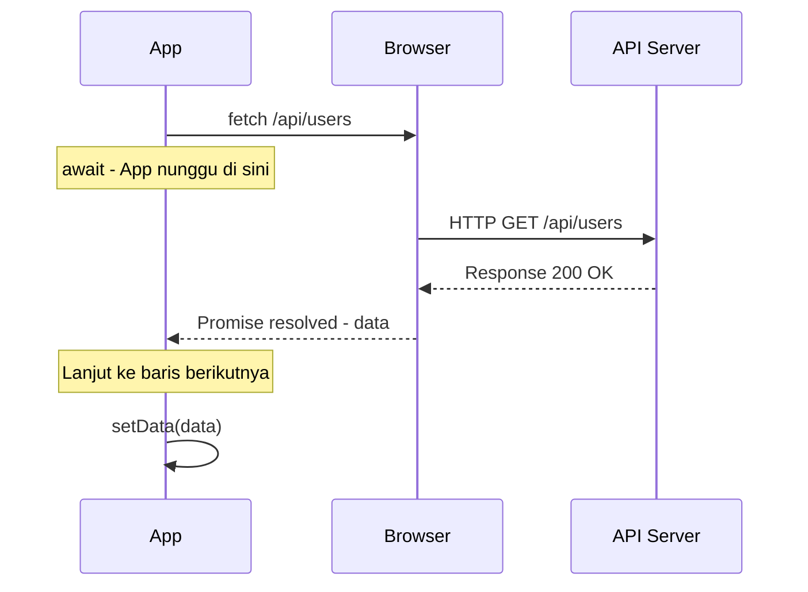
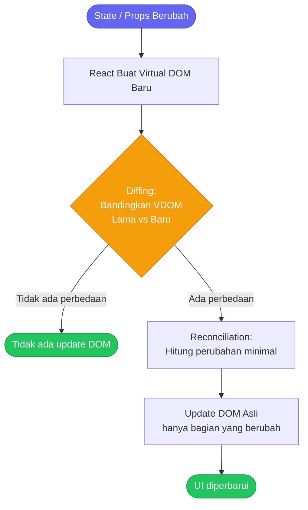
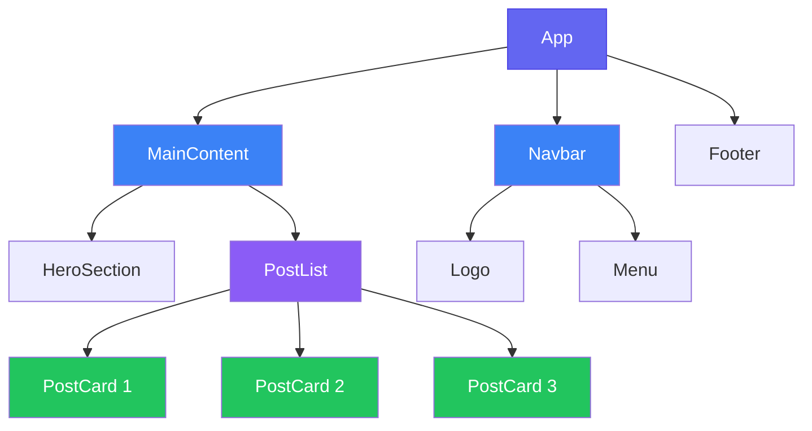
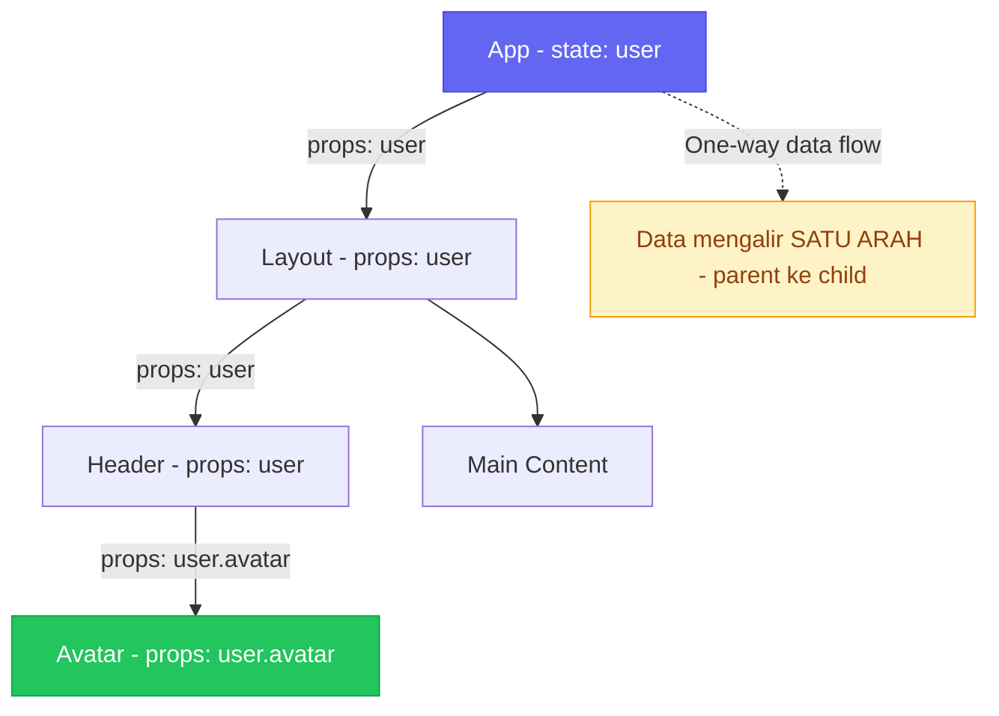
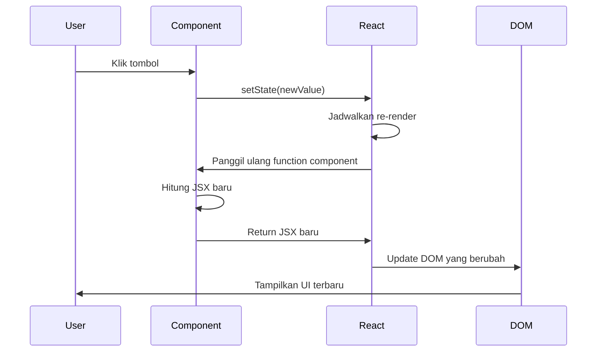
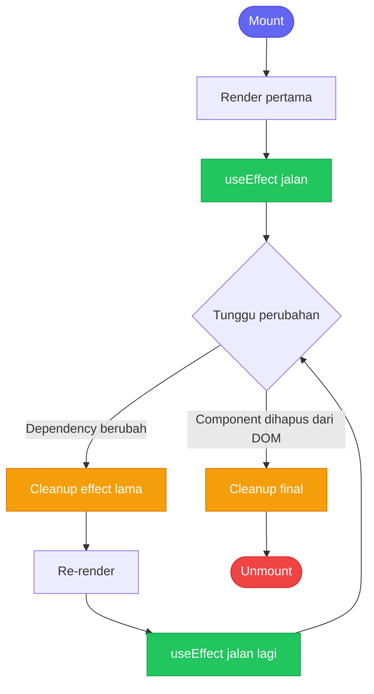
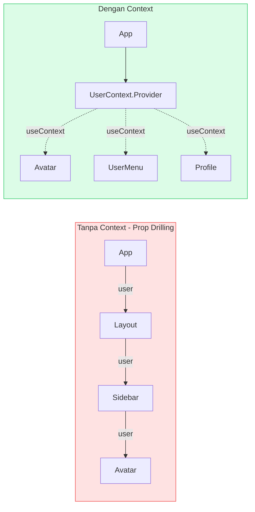
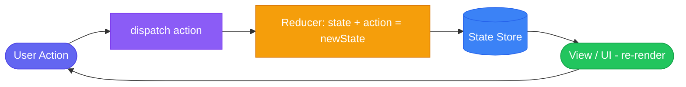
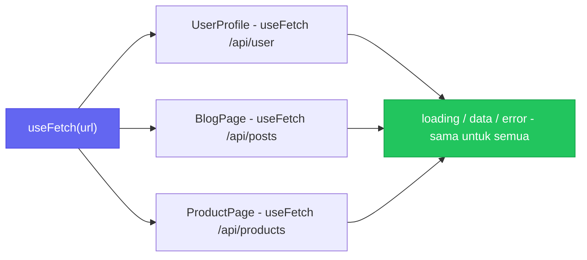
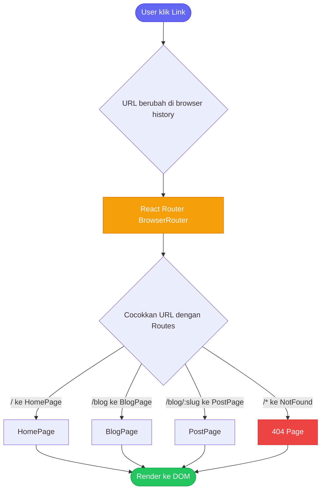

React adalah library JavaScript yang saat ini paling banyak dipakai untuk membangun user interface di web. Tapi sebelum terjun ke React, ada beberapa hal fundamental dari JavaScript modern yang perlu dipahami dulu — karena React sangat bergantung pada fitur-fitur tersebut.

Catatan ini disusun sebagai panduan belajar mandiri yang bisa dijadikan referensi kapan saja. Kita mulai dari JavaScript-nya dulu, lalu masuk ke konsep inti React.

---

## Bagian 1: JavaScript untuk React

### Template Literal

**Template literal** adalah cara menulis string yang lebih fleksibel
> **Bayangkan** kamu ingin memasukkan nama seseorang ke dalam kartu ucapan. Dengan cara lama, kamu tulis "Halo, " + nama + "!". Dengan template literal, kamu cukup tulis `\`Halo, ${nama}!\`` — seperti mengisi form yang sudah disiapkan slot-nya.

 menggunakan backtick (`` ` ``), bukan tanda kutip biasa. Dengan template literal, kita bisa menyisipkan nilai JavaScript langsung di dalam string menggunakan syntax `${}`.

```javascript
// Cara lama (string concatenation)
const name = "Abyan";
const greeting = "Halo, " + name + "! Selamat datang.";

// Cara baru (template literal)
const greeting = `Halo, ${name}! Selamat datang.`;

// Bisa untuk ekspresi apapun
const a = 5, b = 3;
console.log(`Hasil penjumlahan: ${a + b}`); // "Hasil penjumlahan: 8"

// Multiline string
const html = `
  <div>
    <h1>${name}</h1>
    <p>Ini multiline string</p>
  </div>
`;
```

Di React, template literal sering dipakai untuk:
- Menyusun class name secara dinamis
- Membuat URL API yang berubah-ubah
- Pesan error yang memuat variabel

```jsx
// Contoh di React
const className = `button ${isActive ? 'active' : ''} ${size}`;
const apiUrl = `https://api.example.com/users/${userId}/posts`;
```

---

### Shorthand Property Name

Ketika kita membuat object dan nama propertinya sama dengan nama variabelnya, kita bisa menulis lebih singkat.

```javascript
// Cara lama
const name = "Abyan";
const age = 24;
const city = "Jakarta";

const user = {
  name: name,
  age: age,
  city: city
};

// Shorthand — jauh lebih ringkas
const user = { name, age, city };
```

Di React, shorthand property sering muncul saat:

```jsx
// Membuat object dari state values
const formData = { username, email, password };

// Passing object ke function
const response = await createUser({ name, email, role });

// Membuat slice state
return { ...state, loading, error, data };
```

---

### Arrow Function

**Arrow function** adalah sintaks alternatif untuk menulis fungsi di JavaScript
> **Analoginya:** Arrow function itu seperti shorthand di kalkulator — ketimbang menulis "ambil angka, proses, kembalikan hasilnya" step by step, kamu langsung tulis `x => x * 2`. Sama hasilnya, tapi jauh lebih ringkas.

, lebih ringkas dari function biasa. Ada beberapa perbedaan penting yang perlu dipahami.

```javascript
// Function biasa
function tambah(a, b) {
  return a + b;
}

// Arrow function
const tambah = (a, b) => a + b;

// Kalau hanya satu parameter, kurung bisa dihilangkan
const double = x => x * 2;

// Kalau return lebih dari satu ekspresi, pakai kurung kurawal
const hitung = (a, b) => {
  const hasil = a * b;
  return hasil + 10;
};

// Return object — perlu dibungkus tanda kurung
const buatUser = (name, age) => ({ name, age });
```

**Perbedaan paling penting:** Arrow function tidak punya `this` sendiri — ia menggunakan `this` dari scope induknya. Ini kenapa arrow function sangat sering dipakai untuk callback di React.

```jsx
// Di React, arrow function sangat umum untuk event handler
const MyComponent = () => {
  const handleClick = () => {
    console.log("Button diklik!");
  };

  return <button onClick={handleClick}>Klik</button>;
};

// Dan untuk callback di dalam JSX
<button onClick={() => setCount(count + 1)}>+</button>
```

---

### Object & Array Destructuring

**Destructuring** adalah cara mengekstrak nilai dari object atau array
> **Analoginya:** Bayangkan kamu pesan paket online — isinya ada HP, charger, earphone. Tanpa destructuring, kamu buka paket → ambil HP → taruh. Buka lagi → ambil charger → taruh. Dengan destructuring, kamu buka sekali dan langsung "ambil semuanya sekaligus" dalam satu baris.

 ke dalam variabel-variabel terpisah dengan sintaks yang lebih bersih.

**Object Destructuring:**

```javascript
const user = {
  name: "Abyan",
  age: 24,
  role: "developer",
  address: {
    city: "Jakarta",
    province: "DKI Jakarta"
  }
};

// Tanpa destructuring
const name = user.name;
const age = user.age;

// Dengan destructuring
const { name, age, role } = user;

// Destructuring dengan rename
const { name: userName, age: userAge } = user;

// Nested destructuring
const { address: { city, province } } = user;

// Default value — kalau propertinya tidak ada
const { name, phone = "Tidak ada" } = user;
```

**Array Destructuring:**

```javascript
const colors = ["merah", "hijau", "biru"];

// Tanpa destructuring
const first = colors[0];
const second = colors[1];

// Dengan destructuring
const [first, second, third] = colors;

// Skip elemen — pakai koma kosong
const [, , third] = colors;

// Dengan default value
const [a, b, c = "putih"] = ["merah", "hijau"];
```

Di React, destructuring adalah teknik yang paling sering dipakai, hampir di setiap komponen:

```jsx
// Props destructuring
const UserCard = ({ name, age, avatar }) => {
  return <div>{name}</div>;
};

// useState destructuring
const [count, setCount] = useState(0);
const [user, setUser] = useState(null);

// Hook return value destructuring
const { data, loading, error } = useFetch('/api/users');
```

---

### Rest dan Spread Operator

Keduanya menggunakan syntax `...` tapi fungsinya berbeda.
> **Analoginya untuk Spread:** Kamu punya toples isi kacang (array), lalu kamu "tuangkan" ke mangkok besar. `[...arr1, ...arr2]` = tuang toples pertama, lalu tuang toples kedua ke mangkok yang sama.
>
> **Analoginya untuk Rest:** Di konter kasir, kasir ambil item pertama (first), kedua (second), lalu `...rest` = "sisanya taruh di sini saja, saya hitung nanti".


**Spread Operator** — "menyebar" elemen array atau properti object:

```javascript
// Spread array
const arr1 = [1, 2, 3];
const arr2 = [4, 5, 6];
const gabungan = [...arr1, ...arr2]; // [1, 2, 3, 4, 5, 6]

// Spread object — salin & modifikasi
const user = { name: "Abyan", age: 24 };
const updatedUser = { ...user, age: 25 }; // Salin user, timpa age

// Clone array
const copyArr = [...originalArr];

// Clone object
const copyObj = { ...originalObj };
```

**Rest Parameter** — "mengumpulkan" sisa argumen atau properti:

```javascript
// Rest di function parameter
const sum = (first, second, ...rest) => {
  console.log(first);  // 1
  console.log(second); // 2
  console.log(rest);   // [3, 4, 5]
};
sum(1, 2, 3, 4, 5);

// Rest di destructuring — ambil sisanya
const { name, age, ...otherProps } = user;
```

Di React, spread operator sangat penting untuk immutable state update:

```jsx
// Update state object tanpa mutate langsung
const [user, setUser] = useState({ name: "Abyan", age: 24 });

// SALAH — mutate langsung
user.age = 25; // React tidak akan re-render!

// BENAR — buat object baru
setUser({ ...user, age: 25 });

// Spread props ke child component
const buttonProps = { onClick: handleClick, disabled: isLoading };
return <button {...buttonProps}>Submit</button>;

// Update array state
const [items, setItems] = useState([]);
setItems([...items, newItem]); // tambah item baru
```

---

### ECMAScript Module (ES Modules)

ES Modules adalah sistem standar untuk membagi kode JavaScript menjadi
> **Analoginya:** Bayangkan project React kamu seperti restoran besar. Daripada satu chef mengerjakan segalanya di satu dapur besar (satu file panjang), setiap chef (file) punya specialitynya masing-masing. Chef A ahli saus (utils.js), Chef B ahli pastry (components/Button.jsx). Mereka "impor" bahan dari satu sama lain lewat sistem yang terorganisir.

 file-file terpisah yang bisa saling menggunakan satu sama lain.

**Export:**

```javascript
// Named export — bisa banyak per file
export const PI = 3.14159;
export function tambah(a, b) { return a + b; }
export const formatDate = (date) => new Date(date).toLocaleDateString();

// Default export — hanya satu per file
export default function MainComponent() {
  return <div>Hello</div>;
}

// Export di akhir file
const helper1 = () => {};
const helper2 = () => {};
export { helper1, helper2 };
```

**Import:**

```javascript
// Import named export
import { PI, tambah, formatDate } from './utils';

// Import default export — nama bebas
import MainComponent from './MainComponent';

// Import keduanya sekaligus
import MyComponent, { helper1, helper2 } from './components';

// Import semuanya ke dalam satu namespace
import * as Utils from './utils';
Utils.tambah(1, 2);

// Rename saat import
import { tambah as add, kurang as subtract } from './math';
```

Di React, setiap file komponen biasanya memiliki satu default export (komponen utama) dan mungkin beberapa named export (tipe, konstanta, helper):

```jsx
// components/Button.jsx
export const BUTTON_VARIANTS = ['primary', 'secondary', 'danger'];

export const ButtonIcon = ({ icon }) => <span>{icon}</span>;

export default function Button({ children, variant = 'primary' }) {
  return <button className={`btn btn-${variant}`}>{children}</button>;
}

// Di file lain
import Button, { BUTTON_VARIANTS, ButtonIcon } from './components/Button';
```

---

### Ternary Operator

**Ternary operator** adalah cara menulis kondisi `if-else` dalam satu baris. Formatnya: `kondisi ? nilai_jika_benar : nilai_jika_salah`.

```javascript
// If-else biasa
let pesan;
if (isLoggedIn) {
  pesan = "Selamat datang!";
} else {
  pesan = "Silakan login.";
}

// Ternary — jauh lebih singkat
const pesan = isLoggedIn ? "Selamat datang!" : "Silakan login.";

// Nested ternary — sebaiknya dihindari karena susah dibaca
const status = score >= 90 ? "A" : score >= 80 ? "B" : score >= 70 ? "C" : "D";
```

Di React, ternary operator adalah **satu-satunya cara** untuk rendering kondisional di dalam JSX, karena JSX adalah ekspresi yang harus mengembalikan nilai:

```jsx
const MyComponent = ({ isLoggedIn, user }) => {
  return (
    <div>
      {/* Render komponen berbeda berdasarkan kondisi */}
      {isLoggedIn ? <UserDashboard user={user} /> : <LoginForm />}

      {/* Show/hide elemen */}
      {isLoading ? <Spinner /> : <Content />}

      {/* Conditional class */}
      <button className={isActive ? "btn-active" : "btn-inactive"}>
        Klik
      </button>

      {/* Render hanya jika kondisi terpenuhi — pakai && */}
      {isAdmin && <AdminPanel />}

      {/* Render kalau tidak null */}
      {user?.name ?? "Guest"}
    </div>
  );
};
```

---

### Array Method

Array method adalah fungsi-fungsi built-in yang tersedia di setiap array JavaScript. Inilah yang paling sering dipakai di React.

#### `find` — Menemukan satu elemen

```javascript
const users = [
  { id: 1, name: "Abyan" },
  { id: 2, name: "Dimas" },
  { id: 3, name: "Anton" }
];

// Cari user dengan id = 2
const user = users.find(u => u.id === 2);
// Hasil: { id: 2, name: "Dimas" }

// Kalau tidak ketemu, hasilnya undefined
const notFound = users.find(u => u.id === 99);
// Hasil: undefined
```

#### `some` — Apakah ada yang memenuhi?

```javascript
const numbers = [1, 3, 5, 7, 8];

// Apakah ada angka genap?
const adaGenap = numbers.some(n => n % 2 === 0);
// Hasil: true (karena ada angka 8)

// Apakah ada user yang role-nya admin?
const adaAdmin = users.some(u => u.role === 'admin');
```

#### `every` — Apakah semua memenuhi?

```javascript
const ages = [18, 21, 25, 30];

// Apakah semua sudah 18 tahun ke atas?
const semuaDewasa = ages.every(age => age >= 18);
// Hasil: true

// Validasi form — semua field harus terisi
const allFilled = formFields.every(field => field.value.trim() !== '');
```

#### `includes` — Apakah nilai ada di dalam array?

```javascript
const fruits = ["apel", "mangga", "jeruk"];

console.log(fruits.includes("mangga")); // true
console.log(fruits.includes("pisang")); // false

// Di React — cek apakah item sudah ada di selectedItems
const isSelected = selectedItems.includes(itemId);
```

#### `map` — Transformasi setiap elemen

`map` adalah yang **paling sering dipakai di React**. Ia membuat array baru dengan mentransformasi setiap elemen.

```javascript
const numbers = [1, 2, 3, 4, 5];

// Kalikan setiap angka dengan 2
const doubled = numbers.map(n => n * 2);
// Hasil: [2, 4, 6, 8, 10]

// Transform object
const users = [
  { firstName: "Abyan", lastName: "Dimas" },
  { firstName: "John", lastName: "Doe" }
];

const fullNames = users.map(u => `${u.firstName} ${u.lastName}`);
// Hasil: ["Abyan Dimas", "John Doe"]
```

Di React, `map` dipakai untuk render list:

```jsx
const UserList = ({ users }) => {
  return (
    <ul>
      {users.map(user => (
        <li key={user.id}>
          <strong>{user.name}</strong> — {user.email}
        </li>
      ))}
    </ul>
  );
};
```

#### `filter` — Buat array baru hanya dengan elemen yang memenuhi kondisi

```javascript
const products = [
  { name: "Laptop", price: 15000000, category: "elektronik" },
  { name: "Buku React", price: 150000, category: "buku" },
  { name: "Keyboard", price: 800000, category: "elektronik" },
];

// Ambil hanya produk elektronik
const elektronik = products.filter(p => p.category === 'elektronik');

// Ambil produk di bawah 1 juta
const murah = products.filter(p => p.price < 1000000);

// Gabungkan filter dan map
const namaElektronik = products
  .filter(p => p.category === 'elektronik')
  .map(p => p.name);
```

Di React, `filter` sering dipakai untuk pencarian dan delete:

```jsx
// Search
const filteredItems = items.filter(item =>
  item.name.toLowerCase().includes(searchQuery.toLowerCase())
);

// Delete item dari state
const handleDelete = (id) => {
  setItems(items.filter(item => item.id !== id));
};
```

---

### Nullish Coalescing Operator (`??`)

Operator `??` mengembalikan sisi kanan **hanya jika** sisi kiri adalah `null` atau `undefined`. Ini berbeda dari `||` yang juga aktif untuk nilai falsy lain seperti `0`, `""`, `false`.

```javascript
// Masalah dengan || operator
const count = 0;
console.log(count || "Tidak ada"); // "Tidak ada" — SALAH! 0 itu valid

// Solusi dengan ?? operator
console.log(count ?? "Tidak ada"); // 0 — BENAR

// Contoh lain
const name = null;
console.log(name ?? "Guest"); // "Guest"

const age = 0;
console.log(age ?? "Tidak diketahui"); // 0 (bukan "Tidak diketahui")

const text = "";
console.log(text ?? "Default"); // "" (string kosong itu valid)
```

Di React:

```jsx
// Menampilkan nilai atau fallback
<p>{user.bio ?? "Bio belum diisi"}</p>

// Default value untuk props
const limit = props.limit ?? 10;

// Dari API response
const username = response.data?.user?.displayName ?? response.data?.user?.email ?? "Anonymous";
```

---

### Optional Chaining (`?.`)

Optional chaining memungkinkan kita mengakses properti nested dari sebuah object tanpa khawatir error kalau salah satu node di tengah jalan adalah `null` atau `undefined`.

```javascript
const user = {
  profile: {
    address: {
      city: "Jakarta"
    }
  }
};

// Tanpa optional chaining — rawan error
const city = user.profile.address.city; // OK
const street = user.profile.address.street; // undefined — OK
const zip = user.profile.location.zip; // TypeError: Cannot read properties of undefined

// Dengan optional chaining — aman
const city = user?.profile?.address?.city; // "Jakarta"
const zip = user?.profile?.location?.zip; // undefined (tidak error)

// Memanggil method yang mungkin tidak ada
user?.sendEmail?.(); // Hanya dipanggil kalau sendEmail ada

// Dengan array
const firstTag = post?.tags?.[0];
```

Di React, optional chaining sering muncul ketika data dari API belum tiba:

```jsx
// Data mungkin null saat loading
const UserCard = ({ user }) => {
  return (
    <div>
      
      <h3>{user?.profile?.displayName ?? user?.email}</h3>
      <p>{user?.profile?.bio ?? "Belum ada bio"}</p>
    </div>
  );
};
```

---

### Async/Await

JavaScript bersifat **asynchronous** — artinya beberapa operasi
> **Analoginya:** Bayangkan kamu di warung kopi. Kamu pesan kopi (`fetch('/api/data')`), tapi kopinya butuh 3 menit dibuat. Tanpa async/await (callback hell = cara lama), kamu harus berdiri di kasir terus nungguin — menghalangi orang lain antri. Dengan async/await, kamu **ambil nomor antrian** dan duduk dulu, lalu dipanggil kalau sudah siap — browser bebas mengerjakan hal lain selagi menunggu.
>
> 
`await` = "tunggu di sini dulu, jangan lanjut sebelum ini selesai"




 (seperti fetch data dari API, baca file, dll.) tidak selesai secara instan. `async/await` adalah cara modern untuk menangani operasi asynchronous dengan kode yang terbaca seperti synchronous.

```javascript
// Tanpa async/await (menggunakan Promise chain)
function fetchUser(id) {
  return fetch(`/api/users/${id}`)
    .then(response => response.json())
    .then(data => {
      console.log(data);
      return data;
    })
    .catch(error => {
      console.error(error);
    });
}

// Dengan async/await — jauh lebih bersih
async function fetchUser(id) {
  try {
    const response = await fetch(`/api/users/${id}`);
    const data = await response.json();
    console.log(data);
    return data;
  } catch (error) {
    console.error("Gagal fetch user:", error);
  }
}
```

**Aturan penting:**
- Keyword `await` hanya boleh dipakai di dalam fungsi `async`
- `await` "menunggu" sebuah Promise selesai sebelum lanjut ke baris berikutnya
- Selalu gunakan `try/catch` untuk menangani error

```javascript
// Fetch beberapa data bersamaan (paralel)
async function fetchDashboardData() {
  try {
    const [users, posts, stats] = await Promise.all([
      fetch('/api/users').then(r => r.json()),
      fetch('/api/posts').then(r => r.json()),
      fetch('/api/stats').then(r => r.json()),
    ]);

    return { users, posts, stats };
  } catch (error) {
    throw new Error(`Gagal memuat data: ${error.message}`);
  }
}
```

Di React, async/await dipakai di dalam `useEffect` untuk fetch data:

```jsx
const [data, setData] = useState(null);
const [loading, setLoading] = useState(true);
const [error, setError] = useState(null);

useEffect(() => {
  // useEffect tidak bisa async langsung, jadi buat fungsi async di dalamnya
  const fetchData = async () => {
    try {
      setLoading(true);
      const response = await fetch('/api/posts');
      if (!response.ok) throw new Error('Request gagal');
      const result = await response.json();
      setData(result);
    } catch (err) {
      setError(err.message);
    } finally {
      setLoading(false);
    }
  };

  fetchData();
}, []);
```

---


---

### 📺 Referensi Video — JavaScript untuk React

Video-video berikut sangat direkomendasikan sebagai pelengkap materi JavaScript sebelum belajar React. Semuanya gratis di YouTube.

| Video | Channel | Durasi | Catatan |
|-------|---------|--------|---------|
| [JavaScript ES6+ Full Course](https://www.youtube.com/watch?v=nZ1DMMsyVyI) | Fireship | 12 mnt | Ringkas, padat, visual |
| [Async JS Crash Course (Callbacks, Promises, Async Await)](https://www.youtube.com/watch?v=PoRJizFvM7s) | Traversy Media | 25 mnt | Paling jelas untuk async |
| [Array Methods You Must Know](https://www.youtube.com/watch?v=R8rmfD9Y5-c) | Web Dev Simplified | 15 mnt | map, filter, reduce, dll |
| [JavaScript Destructuring in 10 minutes](https://www.youtube.com/watch?v=-vR3a11Wzt0) | Web Dev Simplified | 10 mnt | Object & array destructuring |
| [ES6 Modules Explained](https://www.youtube.com/watch?v=cRHQNNkYi58) | Web Dev Simplified | 10 mnt | Import/export |
| [JavaScript in 100 Seconds](https://www.youtube.com/watch?v=DHjqpvDnNGE) | Fireship | 2 mnt | Overview cepat |

> 💡 **Tips:** Kalau belum pernah belajar JavaScript sama sekali, tonton dulu **"JavaScript Full Course for Beginners"** dari freeCodeCamp di YouTube (12+ jam, lengkap banget). Setelah paham dasar, baru panteng materi di atas.

---

## Bagian 2: React Fundamental


### Mengapa React? Masalah Apa yang Ia Selesaikan?

Sebelum React, ketika kita ingin memperbarui tampilan web berdasarkan perubahan data, kita harus melakukannya secara manual lewat **DOM Manipulation** menggunakan vanilla JavaScript atau jQuery.

```javascript
// Cara lama — manual DOM manipulation
function updateUserProfile(user) {
  document.getElementById('user-name').textContent = user.name;
  document.getElementById('user-avatar').src = user.avatar;
  document.getElementById('user-bio').textContent = user.bio;
  document.querySelector('.friend-count').textContent = user.friends.length;
  
  // Kalau ada banyak elemen, ini jadi rumit dan mudah salah
}
```

Masalahnya:
1. **Susah di-maintain** — kode jadi panjang dan tidak terorganisir
2. **Mudah error** — harus ingat semua elemen yang perlu diupdate
3. **Performa** — akses DOM berulang kali itu mahal
4. **Tidak scalable** — semakin kompleks aplikasi, semakin berantakan kodenya

React hadir dengan pendekatan berbeda: **"Deklaratif"** — kita cukup mendeskripsikan *bagaimana tampilan harusnya terlihat* berdasarkan data, dan React yang mengurus bagaimana UI-nya diupdate.

---

### DOM dan Virtual DOM

**DOM (Document Object Model)** adalah representasi HTML page sebagai tree struktur yang bisa dimanipulasi dengan JavaScript. Setiap elemen HTML (`<div>`, `<p>`, `<button>`, dst.) adalah "node" di tree ini.

Masalah DOM asli: operasi DOM itu lambat karena setiap perubahan bisa menyebabkan browser me-*reflow* dan *repaint* seluruh halaman.

**Virtual DOM** adalah solusi React — sebuah representasi DOM yang lebih ringan


> **Analoginya:** Bayangkan kamu arsitek yang ingin renovasi rumah (DOM). Cara lama: langsung dobrak dinding, pasang batu bata, cat — brisik dan mahal. Cara React: kamu buat **dulu sketsa perubahan di kertas** (Virtual DOM), bandingkan sketsa lama vs baru, tentukan part mana yang benar-benar berubah, **baru** kirim pekerja untuk ubah bagian itu saja. Lebih efisien karena kerja fisik (operasi DOM nyata) diminimalkan.

, disimpan di memori JavaScript (bukan di browser). Alurnya:

1. State berubah → React membuat Virtual DOM baru
2. React membandingkan Virtual DOM baru vs Virtual DOM lama (**proses ini disebut "diffing"**)
3. React mencari perbedaannya (mana node yang berubah)
4. React hanya mengupdate bagian DOM asli yang benar-benar berubah (**reconciliation**)


Hasilnya jauh lebih efisien karena operasi di DOM asli seminimal mungkin.




---

### React API — Cara React Bekerja di Balik Layar

Sebelum ada JSX, React punya cara "mentah" untuk membuat element menggunakan `React.createElement()`:

```javascript
// Membuat element <h1>Hello World</h1>
const element = React.createElement(
  'h1',           // tipe element
  { className: 'title' }, // attributes/props
  'Hello World'   // children (isi)
);

// Element yang nested
const element = React.createElement(
  'div',
  { className: 'container' },
  React.createElement('h1', null, 'Judul'),
  React.createElement('p', null, 'Konten paragraf'),
  React.createElement(
    'ul',
    null,
    React.createElement('li', null, 'Item 1'),
    React.createElement('li', null, 'Item 2'),
  )
);
```

`React.createElement()` mengembalikan sebuah **plain JavaScript object** yang mendeskripsikan element:

```javascript
{
  type: 'h1',
  props: {
    className: 'title',
    children: 'Hello World'
  }
}
```

Objek inilah yang disebut **React Element** — ini adalah Virtual DOM.

---

### JSX — Syntax Sugar di Atas React.createElement

Menulis `React.createElement()` terus-menerus itu melelahkan.
> **Analoginya:** `React.createElement()` itu seperti menulis instruksi merakit IKEA dalam bahasa mesin — semua detail ada, tapi sangat verbose. JSX adalah "gambar rakitannya" — lebih visual, intuitif, dan manusiawi. Di balik layar Babel tetap menerjemahkannya ke instruksi mesin tadi.

 Tim React menciptakan **JSX (JavaScript XML)** — syntax yang terlihat seperti HTML tapi sebenarnya adalah JavaScript.

```jsx
// JSX
const element = (
  <div className="container">
    <h1>Judul</h1>
    <p>Konten paragraf</p>
  </div>
);

// Setelah dikompilasi oleh Babel, menjadi:
const element = React.createElement(
  'div',
  { className: 'container' },
  React.createElement('h1', null, 'Judul'),
  React.createElement('p', null, 'Konten paragraf')
);
```

**Aturan penting JSX:**
1. Setiap JSX harus memiliki satu root element
2. Semua tag harus ditutup (termasuk tag self-closing seperti ``, `<br />`)
3. Gunakan `className` bukan `class` (karena `class` adalah reserved word di JavaScript)
4. Gunakan `htmlFor` bukan `for`
5. Semua atribut ditulis dalam camelCase (`onClick`, `backgroundColor`, dst.)

```jsx
// SALAH — dua root element
return (
  <h1>Judul</h1>
  <p>Paragraf</p>
);

// BENAR — dibungkus dalam satu root
return (
  <div>
    <h1>Judul</h1>
    <p>Paragraf</p>
  </div>
);
```

---

### Babel — Penerjemah JSX

**Babel** adalah JavaScript compiler yang mengubah kode JavaScript modern (termasuk JSX) menjadi kode yang bisa dimengerti semua browser.

JSX bukan JavaScript — browser tidak mengerti JSX secara native. Itulah kenapa setiap project React membutuhkan build tool (Vite, Webpack, dll.) yang menjalankan Babel di belakang layar untuk menerjemahkan JSX → `React.createElement()` → JavaScript biasa.

Proses yang terjadi saat development:
```
Kode JSX kamu → Babel → JavaScript murni → Browser
```

Sebelum React 17, setiap file yang menggunakan JSX **wajib** mengimport React:
```jsx
import React from 'react'; // Wajib sebelum React 17!
```

Mulai React 17+, ada **JSX Transform** baru yang otomatis mengimport yang dibutuhkan, jadi kita tidak perlu import React lagi di setiap file.

---

### Menulis JavaScript di dalam JSX

Di dalam JSX, kita bisa menyisipkan ekspresi JavaScript menggunakan kurung kurawal `{}`:

```jsx
const name = "Abyan";
const age = 24;
const isLoggedIn = true;

const element = (
  <div>
    {/* Ini komen di JSX */}
    <h1>Halo, {name}!</h1>
    <p>Usiamu: {age} tahun</p>
    <p>Status: {isLoggedIn ? "Online" : "Offline"}</p>
    <p>Lahir tahun: {new Date().getFullYear() - age}</p>
    
    {/* Panggil fungsi */}
    <p>{formatDate(new Date())}</p>
    
    {/* Render bersyarat */}
    {isLoggedIn && <button>Logout</button>}
  </div>
);
```

**Yang TIDAK bisa langsung ditampilkan di JSX:**
- Object JavaScript: `{user}` akan error — harus akses propertinya: `{user.name}`
- `true`, `false`, `null`, `undefined` (tidak akan muncul, tapi tidak error)
- Function

---

### Component

**Component** adalah unit terkecil di React — seperti fungsi JavaScript


> **Analoginya:** Component itu seperti **Lego**. Setiap blok Lego (component) punya bentuk sendiri, bisa dipakai berulang kali, dan bisa digabung-gabung untuk membentuk struktur yang lebih besar. `<Button>` adalah satu blok. `<Card>` adalah blok lain. `<Layout>` adalah susunan dari banyak blok. Ubah satu blok, semua tempat yang pakai blok itu otomatis berubah.

 yang mengembalikan JSX. Component membuat code menjadi **reusable** (bisa dipakai berulang) dan **komposabel** (bisa digabung-gabung).

```jsx
// Function Component (cara modern)
function UserCard({ name, email, avatar }) {
  return (
    <div className="user-card">
      
      <h3>{name}</h3>
      <p>{email}</p>
    </div>
  );
}

// Penggunaan — seperti HTML tag biasa
function App() {
  return (
    <div>
      <UserCard name="Abyan" email="abyan@mail.com" avatar="/avatar.jpg" />
      <UserCard name="Dimas" email="dimas@mail.com" avatar="/avatar2.jpg" />
    </div>
  );
}
```


**Aturan penamaan component:** selalu diawali huruf kapital.


 Kalau lowercase, React menganggapnya sebagai HTML element biasa:
- `<usercard />` → React menganggap ini HTML tag `usercard`
- `<UserCard />` → React menganggap ini React Component

---

### React Fragment

Component React hanya bisa mengembalikan satu root element. Tapi kadang kita tidak ingin menambahkan `<div>` ekstra ke DOM — gunakan **React Fragment**:

```jsx
import { Fragment } from 'react';

// Cara 1: Fragment lengkap
function MyComponent() {
  return (
    <Fragment>
      <h1>Judul</h1>
      <p>Paragraf</p>
    </Fragment>
  );
}

// Cara 2: Shorthand syntax (paling sering dipakai)
function MyComponent() {
  return (
    <>
      <h1>Judul</h1>
      <p>Paragraf</p>
    </>
  );
}

// Fragment di dalam list (perlu key, harus pakai Fragment lengkap)
function ItemList({ items }) {
  return (
    <dl>
      {items.map(item => (
        <Fragment key={item.id}>
          <dt>{item.term}</dt>
          <dd>{item.definition}</dd>
        </Fragment>
      ))}
    </dl>
  );
}
```

---

### Props

**Props (Properties)** adalah cara meneruskan data dari parent component ke child component. Props bersifat **read-only** — child component tidak boleh mengubah props yang diterimanya.

> **Analoginya:** Props itu seperti **parameter fungsi**, atau seperti mengisi formulir sebelum mencetak kartu nama. "Tolong cetakkan kartu nama dengan nama='Abyan', email='abyan@mail.com', jabatan='Developer'". Cetakan (component) tidak bisa mengubah sendiri apa yang tertulis di formulir yang sudah diberikan — itu tugas si peminta (parent).



```jsx
// Parent — mengirim props
function App() {
  const user = { name: "Abyan", age: 24 };

  return (
    <UserProfile
      name={user.name}
      age={user.age}
      isVerified={true}
      onFollow={() => console.log("Follow!")}
    />
  );
}

// Child — menerima props
function UserProfile({ name, age, isVerified, onFollow }) {
  return (
    <div className="profile">
      <h2>{name} {isVerified && "✓"}</h2>
      <p>Usia: {age} tahun</p>
      <button onClick={onFollow}>Follow</button>
    </div>
  );
}
```

**Default props:**

```jsx
function Button({ label, variant = "primary", size = "medium", onClick }) {
  return (
    <button
      className={`btn btn-${variant} btn-${size}`}
      onClick={onClick}
    >
      {label}
    </button>
  );
}

// Penggunaan — tidak perlu masukkan semua props
<Button label="Submit" onClick={handleSubmit} />
// variant akan "primary", size akan "medium"
```

**Props children** — untuk konten yang ditempatkan di antara tag:

```jsx
function Card({ title, children }) {
  return (
    <div className="card">
      <h3 className="card-title">{title}</h3>
      <div className="card-body">
        {children}
      </div>
    </div>
  );
}

// Penggunaan
<Card title="Informasi User">
  <p>Nama: Abyan</p>
  <p>Email: abyan@mail.com</p>
  <button>Edit Profil</button>
</Card>
```

---

### Key Props

Ketika kita render list menggunakan `map`, React membutuhkan **key**
> **Analoginya:** Bayangkan 100 anak murid berdiri dalam barisan (list). Guru (React) perlu tahu mana murid yang datang baru, mana yang pulang, mana yang pindah tempat. Tanpa absen/nomor punggung (**key**), guru harus bandingkan semua wajah dari awal — lambat. Dengan nomor punggung unik, guru langsung tahu "murid nomor 42 keluar dari barisan" tanpa scan semua.

 untuk mengidentifikasi setiap item secara unik. Tanpa key, React tidak bisa tahu mana item yang berubah, ditambah, atau dihapus.

```jsx
// TANPA KEY — React akan warning dan performa buruk
function BadList({ items }) {
  return (
    <ul>
      {items.map(item => (
        <li>{item.name}</li> // Warning: Each child in a list should have a unique "key" prop
      ))}
    </ul>
  );
}

// DENGAN KEY — benar
function GoodList({ items }) {
  return (
    <ul>
      {items.map(item => (
        <li key={item.id}>{item.name}</li>
      ))}
    </ul>
  );
}
```

**Aturan key:**
- Harus unik di antara sibling (tidak perlu global)
- Harus stabil (tidak berubah-ubah) — jangan pakai index array sebagai key kalau list bisa diurutkan ulang atau item bisa dihapus
- Key tidak bisa diakses sebagai props dari dalam component

```jsx
// BURUK — index sebagai key
{items.map((item, index) => (
  <ListItem key={index} data={item} /> // Masalah saat item dihapus/diurutkan
))}

// BAIK — ID yang unik dari data
{items.map(item => (
  <ListItem key={item.id} data={item} />
))}
```

---

### Prop Types — Validasi Props

**PropTypes** adalah library untuk memvalidasi tipe data props yang diterima sebuah component. Ini membantu mendeteksi bug lebih awal saat development.

```bash
npm install prop-types
```

```jsx
import PropTypes from 'prop-types';

function UserCard({ name, age, email, isVerified, onFollow, tags }) {
  return (
    <div>
      <h3>{name}</h3>
      {/* ... */}
    </div>
  );
}

UserCard.propTypes = {
  name: PropTypes.string.isRequired,        // String, wajib ada
  age: PropTypes.number,                     // Number, opsional
  email: PropTypes.string.isRequired,        // String, wajib ada
  isVerified: PropTypes.bool,               // Boolean
  onFollow: PropTypes.func.isRequired,      // Function, wajib ada
  tags: PropTypes.arrayOf(PropTypes.string), // Array of string
};

UserCard.defaultProps = {
  age: 0,
  isVerified: false,
  tags: [],
};
```

> **Catatan:** Di project modern dengan TypeScript, PropTypes sering digantikan oleh TypeScript types/interfaces yang lebih powerful. Tapi untuk project JavaScript biasa, PropTypes tetap berguna.

---

### Styling di React

Ada beberapa cara untuk styling di React:

**1. Global CSS — paling tradisional**

```css
/* styles/globals.css */
.button {
  background: blue;
  color: white;
  padding: 8px 16px;
}
```

```jsx
import './styles/globals.css';

function Button() {
  return <button className="button">Klik</button>;
}
```

**2. CSS Modules — lokal dan aman dari konflik**

```css
/* Button.module.css */
.button {
  background: blue;
  color: white;
}

.buttonPrimary {
  background: royalblue;
}
```

```jsx
import styles from './Button.module.css';

function Button({ variant }) {
  return (
    <button className={`${styles.button} ${variant === 'primary' ? styles.buttonPrimary : ''}`}>
      Klik
    </button>
  );
}
```

**3. CSS-in-JS (Styled Components)**

```jsx
import styled from 'styled-components';

const StyledButton = styled.button`
  background: ${props => props.primary ? 'royalblue' : 'gray'};
  color: white;
  padding: 8px 16px;
  border: none;
  border-radius: 4px;
  cursor: pointer;

  &:hover {
    opacity: 0.9;
  }
`;

function App() {
  return (
    <div>
      <StyledButton primary>Primary Button</StyledButton>
      <StyledButton>Default Button</StyledButton>
    </div>
  );
}
```

**4. Utility Classes (Tailwind CSS)**

```jsx
function Button({ children, primary }) {
  return (
    <button
      className={`px-4 py-2 rounded font-medium ${
        primary
          ? 'bg-blue-600 text-white hover:bg-blue-700'
          : 'bg-gray-200 text-gray-800 hover:bg-gray-300'
      }`}
    >
      {children}
    </button>
  );
}
```

---

### Form di React

Ada dua pendekatan untuk mengelola form input di React: **Controlled** dan **Uncontrolled**.

#### Controlled Component

Di controlled component, nilai input dikelola oleh React state. Setiap perubahan input di-handle melalui event handler yang mengupdate state.

```jsx
import { useState } from 'react';

function LoginForm() {
  const [formData, setFormData] = useState({
    email: '',
    password: '',
    rememberMe: false,
  });
  const [errors, setErrors] = useState({});

  const handleChange = (e) => {
    const { name, value, type, checked } = e.target;
    setFormData(prev => ({
      ...prev,
      [name]: type === 'checkbox' ? checked : value,
    }));
  };

  const validate = () => {
    const newErrors = {};
    if (!formData.email) newErrors.email = 'Email wajib diisi';
    if (!formData.email.includes('@')) newErrors.email = 'Format email tidak valid';
    if (!formData.password) newErrors.password = 'Password wajib diisi';
    if (formData.password.length < 8) newErrors.password = 'Password minimal 8 karakter';
    return newErrors;
  };

  const handleSubmit = (e) => {
    e.preventDefault(); // Cegah default browser submit

    const validationErrors = validate();
    if (Object.keys(validationErrors).length > 0) {
      setErrors(validationErrors);
      return;
    }

    console.log('Form submitted:', formData);
  };

  return (
    <form onSubmit={handleSubmit}>
      <div>
        <label htmlFor="email">Email</label>
        <input
          id="email"
          type="email"
          name="email"
          value={formData.email}
          onChange={handleChange}
          placeholder="email@contoh.com"
        />
        {errors.email && <span className="error">{errors.email}</span>}
      </div>

      <div>
        <label htmlFor="password">Password</label>
        <input
          id="password"
          type="password"
          name="password"
          value={formData.password}
          onChange={handleChange}
        />
        {errors.password && <span className="error">{errors.password}</span>}
      </div>

      <div>
        <input
          type="checkbox"
          id="rememberMe"
          name="rememberMe"
          checked={formData.rememberMe}
          onChange={handleChange}
        />
        <label htmlFor="rememberMe">Ingat saya</label>
      </div>

      <button type="submit">Login</button>
    </form>
  );
}
```

#### Uncontrolled Component

Di uncontrolled component, nilai input dikelola oleh DOM sendiri. Kita menggunakan `ref` untuk mengakses nilainya saat dibutuhkan (biasanya saat form di-submit).

```jsx
import { useRef } from 'react';

function SimpleForm() {
  const emailRef = useRef(null);
  const passwordRef = useRef(null);

  const handleSubmit = (e) => {
    e.preventDefault();
    
    const email = emailRef.current.value;
    const password = passwordRef.current.value;
    
    console.log({ email, password });
  };

  return (
    <form onSubmit={handleSubmit}>
      <input
        ref={emailRef}
        type="email"
        defaultValue=""
        placeholder="Email"
      />
      <input
        ref={passwordRef}
        type="password"
        placeholder="Password"
      />
      <button type="submit">Submit</button>
    </form>
  );
}
```

#### Controlled vs Uncontrolled — Mana yang Lebih Baik?

| Aspek | Controlled | Uncontrolled |
|-------|-----------|--------------|
| Validasi real-time | ✅ Mudah | ❌ Sulit |
| Instant feedback | ✅ Bisa | ❌ Tidak bisa |
| Performa | ⚠️ Re-render setiap ketik | ✅ Lebih baik |
| Integrasi library | ✅ Mudah | ⚠️ Tergantung |
| Kode lebih banyak | ⚠️ Ya | ✅ Tidak |

**Rekomendasi praktis:** Untuk kebanyakan kasus, **gunakan controlled component**. Ia lebih React-idiomatic dan memberikan kontrol penuh atas form data. Gunakan uncontrolled hanya untuk form yang sangat sederhana atau ketika performa menjadi isu nyata.

---

## Ringkasan

Berikut poin-poin paling krusial yang perlu diingat:

**JavaScript untuk React:**
- **Template literal** — cara modern menulis string dengan ekspresi
- **Destructuring** — cara elegan mengekstrak nilai dari object/array
- **Spread/Rest** — cara immutable mengupdate data
- **Arrow function** — cara ringkas menulis fungsi
- **Array method** — `map`, `filter`, `find`, `some`, `every` adalah senjata utama
- **Async/await** — cara bersih menangani operasi asynchronous
- **Optional chaining (`?.`) dan Nullish (`??`)** — aman mengakses data nested

**React Fundamental:**
- React adalah library **deklaratif** — kita deskripsikan UI, bukan cara mengubahnya
- **Virtual DOM** membuat React efisien dalam update UI
- **JSX** adalah syntax sugar di atas `React.createElement()`
- **Component** adalah unit dasar React — selalu nama dengan huruf kapital
- **Props** mengalir satu arah dari parent ke child — selalu read-only
- **Key** wajib ada ketika render list — gunakan ID unik dari data
- **Controlled component** adalah cara terbaik mengelola form

---

## Referensi Lanjutan

- [React Official Documentation](https://react.dev)
- [JavaScript.info — Modern JavaScript](https://javascript.info)
- [MDN Web Docs — JavaScript](https://developer.mozilla.org/id/docs/Web/JavaScript)
- [React Beta Docs — Learn React](https://react.dev/learn)

---


---

### 📺 Referensi Video — React Fundamental

| Video | Channel | Durasi | Catatan |
|-------|---------|--------|---------|
| [React in 100 Seconds](https://www.youtube.com/watch?v=Tn6-PIqc4UM) | Fireship | 2 mnt | Hook pertama yang harus ditonton |
| [React JS Crash Course 2024](https://www.youtube.com/watch?v=LDB4uaJ87e0) | Traversy Media | 2 jam | Full intro, cocok untuk pemula |
| [React Full Course for Free](https://www.youtube.com/watch?v=CgkZ7MvWUAA) | Bro Code | 8 jam | Sangat lengkap |
| [Understanding the Virtual DOM](https://www.youtube.com/watch?v=BYbgopx44vo) | Academind | 10 mnt | Penjelasan visual Virtual DOM |
| [JSX — What and Why](https://www.youtube.com/watch?v=7fPXI_MnBOY) | Fireship | 5 mnt | JSX in depth |
| [React Component Lifecycle](https://www.youtube.com/watch?v=m_mtV4YaI8c) | Web Dev Simplified | 14 mnt | Mount, Update, Unmount |
| [Props vs State](https://www.youtube.com/watch?v=aLmwln09Tbs) | Web Dev Simplified | 13 mnt | Kapan pakai props, kapan pakai state |

> 💡 **Tips:** Setelah nonton crash course, langsung coba buat project kecil. Minimal todo list atau counter sederhana — coding langsung jauh lebih efektif daripada nonton terus.

---

## Bagian 3: React Hooks


**Hooks** adalah fungsi-fungsi khusus React yang memungkinkan kita menggunakan state dan fitur React lainnya di dalam function component. Sebelum Hooks (sebelum React 16.8), kita harus menggunakan class component untuk fitur-fitur ini.

**Aturan Hooks (Rules of Hooks):**
1. Hanya panggil Hooks di **level paling atas** function component — jangan di dalam kondisi, loop, atau fungsi bersarang
2. Hanya panggil Hooks di dalam **React function component** atau **custom hooks** — jangan di fungsi JavaScript biasa

---

### useState — Menyimpan State Lokal

`useState` adalah Hook yang paling sering dipakai.
> **Buat apa?** Menyimpan data yang bisa berubah di dalam component — dan ketika nilainya berubah, React otomatis memperbarui tampilan.
>
> **Analoginya:** `useState` seperti **papan tulis di dalam component**. React selalu mengawasi papan tulis itu. Kalau ada yang nulis sesuatu yang baru (`setState`), React langsung tahu dan render ulang tampilan. Kalau cuma baca saja tanpa `setState`, React tidak tahu dan tidak akan update tampilan.
>
> ```
> [count, setCount] = useState(0)
>  ↑                  ↑
>  Baca papan tulis   Tulis ke papan tulis
> ```


 Ia memungkinkan function component menyimpan dan memperbarui data yang ketika berubah akan menyebabkan component re-render.

```jsx
import { useState } from 'react';

// Syntax dasar
const [state, setState] = useState(initialValue);
// state       = nilai saat ini
// setState     = fungsi untuk mengubah nilai
// initialValue = nilai awal (dipakai hanya sekali, saat pertama render)
```

**Contoh counter sederhana:**

```jsx
import { useState } from 'react';

function Counter() {
  const [count, setCount] = useState(0);

  return (
    <div>
      <p>Jumlah: {count}</p>
      <button onClick={() => setCount(count + 1)}>Tambah</button>
      <button onClick={() => setCount(count - 1)}>Kurang</button>
      <button onClick={() => setCount(0)}>Reset</button>
    </div>
  );
}
```

**State dengan object:**

```jsx
function UserForm() {
  const [user, setUser] = useState({
    name: '',
    email: '',
    age: 0,
  });

  const handleChange = (field, value) => {
    // PENTING: selalu spread state lama saat update object
    setUser(prev => ({ ...prev, [field]: value }));
  };

  return (
    <form>
      <input
        value={user.name}
        onChange={e => handleChange('name', e.target.value)}
        placeholder="Nama"
      />
      <input
        value={user.email}
        onChange={e => handleChange('email', e.target.value)}
        placeholder="Email"
      />
    </form>
  );
}
```

**State dengan array:**

```jsx
function TodoList() {
  const [todos, setTodos] = useState([]);
  const [input, setInput] = useState('');

  const addTodo = () => {
    if (!input.trim()) return;
    setTodos(prev => [
      ...prev,
      { id: Date.now(), text: input, done: false }
    ]);
    setInput('');
  };

  const toggleTodo = (id) => {
    setTodos(prev =>
      prev.map(todo =>
        todo.id === id ? { ...todo, done: !todo.done } : todo
      )
    );
  };

  const deleteTodo = (id) => {
    setTodos(prev => prev.filter(todo => todo.id !== id));
  };

  return (
    <div>
      <div>
        <input
          value={input}
          onChange={e => setInput(e.target.value)}
          onKeyDown={e => e.key === 'Enter' && addTodo()}
          placeholder="Tambah todo..."
        />
        <button onClick={addTodo}>Tambah</button>
      </div>
      <ul>
        {todos.map(todo => (
          <li key={todo.id} style={{ textDecoration: todo.done ? 'line-through' : 'none' }}>
            <span onClick={() => toggleTodo(todo.id)}>{todo.text}</span>
            <button onClick={() => deleteTodo(todo.id)}>Hapus</button>
          </li>
        ))}
      </ul>
      <p>Total: {todos.length} | Selesai: {todos.filter(t => t.done).length}</p>
    </div>
  );
}
```


**Functional update (`prev =>`)** — wajib dipakai saat update state bergantung pada nilai state sebelumnya:




```jsx
// BERMASALAH — bisa menggunakan nilai state yang sudah stale
setCount(count + 1);

// BENAR — selalu pakai nilai terbaru
setCount(prev => prev + 1);

// Contoh kasus: 3 kali increment dalam satu event
const tripleIncrement = () => {
  setCount(prev => prev + 1); // pakai nilai terbaru secara berurutan
  setCount(prev => prev + 1);
  setCount(prev => prev + 1);
  // Hasil: +3 ✅

  // vs versi salah:
  setCount(count + 1); // ketiga baris ini menggunakan nilai 'count' yang sama!
  setCount(count + 1);
  setCount(count + 1);
  // Hasil: +1 hanya ❌
};
```

**Lazy initial state** — untuk initial value yang mahal dihitung:

```jsx
// BAD — fungsi ini dipanggil setiap render!
const [data, setData] = useState(expensiveComputation());

// GOOD — fungsi hanya dipanggil sekali saat mount
const [data, setData] = useState(() => expensiveComputation());
```

---

### useEffect — Side Effects di React

`useEffect` adalah Hook untuk menjalankan **side effects**
> **Buat apa?** Menjalankan kode yang "keluar" dari dunia React — seperti fetch data dari API, subscribe ke WebSocket, set timer (setTimeout/setInterval), atau manipulasi DOM langsung.
>
> **Analoginya:** Setelah kamu selesai masuk ke toko (component mount), kamu pasang nomor antrean (effect). Kalau kamu keluar toko (unmount), kamu kembalikan nomor antrean itu (cleanup). Kalau barang yang kamu cari berubah (dependency berubah), kamu cabut antrean lama dan ambil antrean baru.
>
> ```
> komponen tampil → effect jalan
> dependency berubah → cleanup → effect jalan lagi
> komponen hilang → cleanup terakhir
> ```

 — operasi yang "keluar" dari dunia React seperti fetch data API, subscribe ke event, manipulasi DOM, atau set timer.

```jsx
import { useEffect } from 'react';

// Syntax dasar
useEffect(() => {
  // kode yang dijalankan setelah render
  
  return () => {
    // cleanup function (opsional)
    // dijalankan sebelum effect berikutnya atau saat component unmount
  };
}, [dependencies]); // array dependency
```


**Kapan useEffect dijalankan?**




```jsx
// 1. Tanpa dependency array — dijalankan setiap selesai render
useEffect(() => {
  console.log('Dijalankan setiap render');
});

// 2. Dependency array kosong — dijalankan hanya sekali saat mount
useEffect(() => {
  console.log('Dijalankan hanya sekali (componentDidMount)');
}, []);

// 3. Dengan dependency — dijalankan saat dependency berubah
useEffect(() => {
  console.log('userId berubah:', userId);
}, [userId]);

// 4. Dengan cleanup
useEffect(() => {
  const subscription = someAPI.subscribe(userId);
  
  return () => {
    subscription.unsubscribe(); // cleanup saat userId berubah atau unmount
  };
}, [userId]);
```

**Fetch data dengan useEffect:**

```jsx
import { useState, useEffect } from 'react';

function UserProfile({ userId }) {
  const [user, setUser] = useState(null);
  const [loading, setLoading] = useState(true);
  const [error, setError] = useState(null);

  useEffect(() => {
    let cancelled = false; // flag untuk mencegah race condition

    const fetchUser = async () => {
      try {
        setLoading(true);
        setError(null);
        
        const response = await fetch(`https://api.example.com/users/${userId}`);
        if (!response.ok) throw new Error(`HTTP error! status: ${response.status}`);
        
        const data = await response.json();
        
        if (!cancelled) { // hanya update state kalau belum di-cancel
          setUser(data);
        }
      } catch (err) {
        if (!cancelled) {
          setError(err.message);
        }
      } finally {
        if (!cancelled) {
          setLoading(false);
        }
      }
    };

    fetchUser();

    return () => {
      cancelled = true; // cancel saat userId berubah atau unmount
    };
  }, [userId]); // re-fetch setiap userId berubah

  if (loading) return <div>Loading...</div>;
  if (error) return <div>Error: {error}</div>;
  if (!user) return null;

  return (
    <div>
      <h2>{user.name}</h2>
      <p>{user.email}</p>
    </div>
  );
}
```

**useEffect untuk event listener:**

```jsx
function WindowSize() {
  const [size, setSize] = useState({
    width: window.innerWidth,
    height: window.innerHeight,
  });

  useEffect(() => {
    const handleResize = () => {
      setSize({ width: window.innerWidth, height: window.innerHeight });
    };

    window.addEventListener('resize', handleResize);

    // Cleanup — hapus listener saat unmount
    return () => window.removeEventListener('resize', handleResize);
  }, []); // hanya sekali mount

  return (
    <p>Window: {size.width} x {size.height}</p>
  );
}
```

**useEffect untuk timer:**

```jsx
function Countdown({ seconds }) {
  const [timeLeft, setTimeLeft] = useState(seconds);

  useEffect(() => {
    if (timeLeft <= 0) return;

    const timer = setInterval(() => {
      setTimeLeft(prev => prev - 1);
    }, 1000);

    return () => clearInterval(timer); // cleanup saat timeLeft berubah atau unmount
  }, [timeLeft]);

  return <p>Waktu tersisa: {timeLeft} detik</p>;
}
```

---

### useRef — Referensi Mutable yang Tidak Menyebabkan Re-render

`useRef` mengembalikan object `{ current: value }` yang bisa dimodifikasi
> **Buat apa?** Ada dua kegunaan utama:
> 1. **Akses DOM element langsung** (focus input, ukur lebar elemen, integrasikan library eksternal)
> 2. **Simpan nilai yang tidak perlu memicu re-render** (ID timer, nilai counter yang tidak ditampilkan, previous value)
>
> **Analoginya:** `useRef` itu seperti **sticky note yang ditempel di luar papan tulis**. React tidak memantaunya — mengubah `.current` tidak akan menyebabkan React render ulang. Berbeda dengan `useState` yang selalu diawasi React.

 tanpa menyebabkan re-render. Ada dua kegunaan utama:

**1. Akses DOM element secara langsung:**

```jsx
import { useRef, useEffect } from 'react';

function AutoFocusInput() {
  const inputRef = useRef(null);

  useEffect(() => {
    inputRef.current?.focus(); // focus otomatis saat mount
  }, []);

  return <input ref={inputRef} placeholder="Input ini auto-focus" />;
}

// Scroll ke element tertentu
function ChatRoom({ messages }) {
  const bottomRef = useRef(null);

  useEffect(() => {
    bottomRef.current?.scrollIntoView({ behavior: 'smooth' });
  }, [messages]); // scroll ke bawah setiap kali pesan baru masuk

  return (
    <div className="chat">
      {messages.map(msg => <div key={msg.id}>{msg.text}</div>)}
      <div ref={bottomRef} />
    </div>
  );
}
```

**2. Menyimpan nilai mutable yang tidak perlu menyebabkan re-render:**

```jsx
import { useState, useRef, useEffect } from 'react';

function Stopwatch() {
  const [time, setTime] = useState(0);
  const [isRunning, setIsRunning] = useState(false);
  const intervalRef = useRef(null); // simpan interval ID

  const start = () => {
    if (isRunning) return;
    setIsRunning(true);
    intervalRef.current = setInterval(() => {
      setTime(prev => prev + 1);
    }, 100);
  };

  const stop = () => {
    clearInterval(intervalRef.current);
    setIsRunning(false);
  };

  const reset = () => {
    clearInterval(intervalRef.current);
    setIsRunning(false);
    setTime(0);
  };

  useEffect(() => {
    return () => clearInterval(intervalRef.current); // cleanup saat unmount
  }, []);

  return (
    <div>
      <p>{(time / 10).toFixed(1)} detik</p>
      <button onClick={start} disabled={isRunning}>Mulai</button>
      <button onClick={stop} disabled={!isRunning}>Stop</button>
      <button onClick={reset}>Reset</button>
    </div>
  );
}
```

**3. Menyimpan nilai previous:**

```jsx
function usePrevious(value) {
  const prevRef = useRef(undefined);

  useEffect(() => {
    prevRef.current = value;
  });

  return prevRef.current; // nilai sebelum render ini
}

function PriceTracker({ price }) {
  const prevPrice = usePrevious(price);

  return (
    <div>
      <p>Harga sekarang: {price}</p>
      {prevPrice !== undefined && (
        <p style={{ color: price > prevPrice ? 'green' : 'red' }}>
          {price > prevPrice ? '▲' : '▼'} Sebelumnya: {prevPrice}
        </p>
      )}
    </div>
  );
}
```

---

### useCallback — Memoize Fungsi

`useCallback` mengembalikan versi memoized dari fungsi
> **Buat apa?** Mencegah pembuatan fungsi baru di setiap render. Paling berguna ketika fungsi tersebut diteruskan sebagai props ke child component yang dibungkus `React.memo`.
>
> **Analoginya:** Bayangkan setiap kali kamu refresh halaman, kamu harus "buat ulang" tombol baru dari 0 padahal tombolnya tetap sama. `useCallback` bilang: "kalau bahan pembuatannya (dependency) tidak berubah, pakai tombol yang sudah ada — jangan buat lagi."

 yang hanya berubah kalau dependencynya berubah. Berguna untuk mencegah child component re-render yang tidak perlu.

```jsx
import { useState, useCallback } from 'react';

function ParentComponent() {
  const [count, setCount] = useState(0);
  const [text, setText] = useState('');

  // Tanpa useCallback — fungsi baru dibuat setiap render
  const handleClick = () => {
    console.log('clicked');
  };

  // Dengan useCallback — fungsi sama digunakan selama tidak ada dependency yang berubah
  const handleClickMemo = useCallback(() => {
    console.log('clicked');
  }, []); // tidak ada dependency, fungsi tidak pernah berubah

  const handleSearch = useCallback((query) => {
    // Fungsi ini hanya dibuat ulang kalau 'text' berubah
    console.log(`Search: ${query} in context of: ${text}`);
  }, [text]);

  return (
    <div>
      <input value={text} onChange={e => setText(e.target.value)} />
      <ChildComponent onAction={handleClickMemo} />
      <p>Count: {count}</p>
      <button onClick={() => setCount(c => c + 1)}>Increment</button>
    </div>
  );
}

// Bungkus dengan React.memo agar benar-benar skip re-render
const ChildComponent = React.memo(({ onAction }) => {
  console.log('ChildComponent render'); // hanya muncul jika onAction berubah
  return <button onClick={onAction}>Action</button>;
});
```

---

### useMemo — Memoize Hasil Komputasi

`useMemo` menyimpan hasil komputasi yang mahal
> **Buat apa?** Menyimpan **hasil** komputasi berat agar tidak dihitung ulang setiap render — hanya dihitung ulang saat input datanya berubah.
>
> **Analoginya:** Kamu punya mesin kalkulator yang lambat untuk menghitung pajak dari 10.000 produk. `useMemo` seperti **mesin fotokopi hasil kalkulasinya** — kalau daftar produk tidak berubah, pakai hasil fotokopi saja. Baru hitung ulang kalau daftar produknya berubah.
>
> Perbedaan `useCallback` vs `useMemo`:
> - `useCallback(fn, deps)` → memoize **fungsi**
> - `useMemo(() => fn(), deps)` → memoize **hasil** dari fungsi

 dan hanya menghitung ulang jika dependencynya berubah.

```jsx
import { useMemo, useState } from 'react';

function ProductList({ products, searchQuery, sortBy }) {
  // Tanpa useMemo — kalkulasi ini dijalankan setiap kali component render
  // Dengan useMemo — hanya kalkulasi ulang saat products, searchQuery, atau sortBy berubah
  const processedProducts = useMemo(() => {
    console.log('Menghitung ulang produk...'); // akan muncul sesekali saja

    let result = products.filter(p =>
      p.name.toLowerCase().includes(searchQuery.toLowerCase())
    );

    if (sortBy === 'price-asc') result.sort((a, b) => a.price - b.price);
    if (sortBy === 'price-desc') result.sort((a, b) => b.price - a.price);
    if (sortBy === 'name') result.sort((a, b) => a.name.localeCompare(b.name));

    return result;
  }, [products, searchQuery, sortBy]); // dependency array

  return (
    <ul>
      {processedProducts.map(p => (
        <li key={p.id}>{p.name} - Rp {p.price.toLocaleString()}</li>
      ))}
    </ul>
  );
}
```

**Kapan perlu pakai useMemo?**
- Komputasi yang memproses ribuan item
- Filter/sort array besar
- Transformasi data kompleks yang hasilnya dipakai banyak tempat

**Kapan TIDAK perlu:**
- Komputasi sederhana (penjumlahan, format string)
- State update sederhana
- Component kecil yang render-nya cepat

---

### useContext — Context API untuk Shared State

Context adalah cara untuk berbagi data ke banyak component
> **Buat apa?** Berbagi data (user login, tema, bahasa) ke banyak component tanpa harus teruskan manual lewat props satu per satu ke setiap level.
>
> **Analoginya:** Bayangkan kamu punya **siaran radio** (Context). Siapa saja yang punya radio dan tune ke frekuensi yang benar (`useContext`) bisa dengar siarannya — tanpa perlu ada orang yang secara fisik jalan dari satu orang ke orang lain menyampaikan pesan (prop drilling).
>
> 
Context cocok untuk data yang benar-benar **global**: user authentication, tema, bahasa. Untuk state component biasa, tetap pakai `useState`.




 tanpa harus melewatkan props satu per satu melalui setiap level (**prop drilling**).

**Masalah Prop Drilling:**

```jsx
// Tanpa Context — harus teruskan user ke setiap level
function App() {
  const [user, setUser] = useState({ name: "Abyan" });
  return <Layout user={user} />;
}
function Layout({ user }) {
  return <Sidebar user={user} />;
}
function Sidebar({ user }) {
  return <UserAvatar user={user} />; // baru dipakai di sini!
}
function UserAvatar({ user }) {
  return ;
}
```

**Solusi dengan Context:**

```jsx
import { createContext, useContext, useState } from 'react';

// 1. Buat Context
const UserContext = createContext(null);

// 2. Buat Provider — bungkus component yang butuh akses
function UserProvider({ children }) {
  const [user, setUser] = useState({ name: "Abyan", role: "admin" });

  const login = (userData) => setUser(userData);
  const logout = () => setUser(null);

  return (
    <UserContext.Provider value={{ user, login, logout }}>
      {children}
    </UserContext.Provider>
  );
}

// 3. Custom hook untuk kemudahan akses
function useUser() {
  const context = useContext(UserContext);
  if (!context) throw new Error('useUser harus dipakai di dalam UserProvider');
  return context;
}

// 4. Gunakan di component manapun dalam tree
function UserAvatar() {
  const { user } = useUser(); // langsung ambil, tanpa prop drilling!
  if (!user) return null;
  return ;
}

function LogoutButton() {
  const { logout } = useUser();
  return <button onClick={logout}>Logout</button>;
}

// 5. Pasang Provider di root
function App() {
  return (
    <UserProvider>
      <Layout />
    </UserProvider>
  );
}
```

**Contoh Theme Context (dark/light mode):**

```jsx
import { createContext, useContext, useState, useEffect } from 'react';

const ThemeContext = createContext('light');

function ThemeProvider({ children }) {
  const [theme, setTheme] = useState(() => {
    return localStorage.getItem('theme') ?? 'light';
  });

  useEffect(() => {
    localStorage.setItem('theme', theme);
    document.documentElement.setAttribute('data-theme', theme);
  }, [theme]);

  const toggleTheme = () => setTheme(t => t === 'light' ? 'dark' : 'light');

  return (
    <ThemeContext.Provider value={{ theme, toggleTheme }}>
      {children}
    </ThemeContext.Provider>
  );
}

function useTheme() {
  return useContext(ThemeContext);
}

function ThemeToggle() {
  const { theme, toggleTheme } = useTheme();
  return (
    <button onClick={toggleTheme}>
      {theme === 'light' ? '🌙 Dark' : '☀️ Light'}
    </button>
  );
}
```

---

### useReducer — State Management yang Lebih Terstruktur

`useReducer` adalah alternatif `useState` untuk state yang kompleks
> **Buat apa?** Mengelola state yang kompleks dengan banyak jenis perubahan — terutama ketika banyak action yang mengubah state dengan cara berbeda-beda.
>
> **Analoginya:** `useState` seperti **lampu yang bisa dinyalakan/dimatikan** — simple, dua state. `useReducer` seperti **panel kontrol pesawat** — ada banyak tombol (action) yang masing-masing melakukan sesuatu yang spesifik. Pilot tidak langsung utak-atik kabel (mutate state), tapi menekan tombol (dispatch action) → sistem otomatis tahu apa yang harus berubah.
>
> ```
> dispatch({ type: 'ADD_TODO', payload: 'Belajar React' })
>    ↓
> reducer(state, action) → newState
>    ↓
> React render ulang dengan state baru
> ```



adalah alternatif `useState` untuk state yang kompleks dengan banyak transisi. Terinspirasi dari pattern Redux.

```jsx
// Syntax
const [state, dispatch] = useReducer(reducer, initialState);

// reducer adalah fungsi (state, action) => newState
// dispatch adalah fungsi untuk mengirim action
```

**Contoh todo list dengan useReducer:**

```jsx
import { useReducer } from 'react';

// 1. Definisikan initial state
const initialState = {
  todos: [],
  filter: 'all', // 'all' | 'active' | 'completed'
};

// 2. Definisikan reducer — pure function, tidak boleh mutate state!
function todoReducer(state, action) {
  switch (action.type) {
    case 'ADD_TODO':
      return {
        ...state,
        todos: [...state.todos, {
          id: Date.now(),
          text: action.payload,
          completed: false,
        }],
      };
    
    case 'TOGGLE_TODO':
      return {
        ...state,
        todos: state.todos.map(todo =>
          todo.id === action.payload
            ? { ...todo, completed: !todo.completed }
            : todo
        ),
      };
    
    case 'DELETE_TODO':
      return {
        ...state,
        todos: state.todos.filter(todo => todo.id !== action.payload),
      };
    
    case 'SET_FILTER':
      return { ...state, filter: action.payload };
    
    case 'CLEAR_COMPLETED':
      return {
        ...state,
        todos: state.todos.filter(todo => !todo.completed),
      };
    
    default:
      return state;
  }
}

// 3. Pakai di component
function TodoApp() {
  const [state, dispatch] = useReducer(todoReducer, initialState);
  
  const filteredTodos = state.todos.filter(todo => {
    if (state.filter === 'active') return !todo.completed;
    if (state.filter === 'completed') return todo.completed;
    return true;
  });

  return (
    <div>
      <input
        onKeyDown={e => {
          if (e.key === 'Enter' && e.target.value) {
            dispatch({ type: 'ADD_TODO', payload: e.target.value });
            e.target.value = '';
          }
        }}
      />

      {filteredTodos.map(todo => (
        <div key={todo.id}>
          <input
            type="checkbox"
            checked={todo.completed}
            onChange={() => dispatch({ type: 'TOGGLE_TODO', payload: todo.id })}
          />
          <span>{todo.text}</span>
          <button onClick={() => dispatch({ type: 'DELETE_TODO', payload: todo.id })}>
            Hapus
          </button>
        </div>
      ))}

      <div>
        {['all', 'active', 'completed'].map(f => (
          <button key={f} onClick={() => dispatch({ type: 'SET_FILTER', payload: f })}>
            {f}
          </button>
        ))}
        <button onClick={() => dispatch({ type: 'CLEAR_COMPLETED' })}>
          Hapus Selesai
        </button>
      </div>
    </div>
  );
}
```

**Kapan pakai useReducer vs useState?**

| Situasi | useState | useReducer |
|---------|----------|------------|
| State sederhana (string, number, boolean) | ✅ | ❌ |
| State object/array dengan sedikit perubahan | ✅ | ✅ |
| State dengan banyak jenis perubahan (>3-4 kasus) | ❌ | ✅ |
| Logic update yang kompleks | ❌ | ✅ |
| State yang berkaitan satu sama lain | ⚠️ | ✅ |
| Debugging mudah diperlukan | ⚠️ | ✅ |

---

### Custom Hooks — Reusability Logic

**Custom hooks** adalah fungsi JavaScript biasa yang namanya dimulai
> **Buat apa?** Mengekstrak dan mendaur ulang **logika** yang sama di banyak component. Prinsipnya sama dengan membuat fungsi utility, tapi untuk logika yang pakai hooks.
>

> **Analoginya:** Bayangkan kamu sering perlu "cek cuaca lalu tampilkan loading → data → error"


 di banyak halaman. Daripada salin-tempel logika yang sama 10 kali, kamu ekstrak jadi `useWeather()`. Kapanpun butuh data cuaca di component manapun, cukup panggil satu hook itu — bersih, reusable, dan kalau ada bug tinggal fix di satu tempat.

 dengan `use` dan bisa memanggil hooks lain di dalamnya. Custom hooks memungkinkan kita mengekstrak dan berbagi **logika stateful** antar component.

**Custom hook untuk fetch data:**

```jsx
import { useState, useEffect } from 'react';

function useFetch(url) {
  const [data, setData] = useState(null);
  const [loading, setLoading] = useState(true);
  const [error, setError] = useState(null);

  useEffect(() => {
    let cancelled = false;

    const fetchData = async () => {
      try {
        setLoading(true);
        setError(null);
        const response = await fetch(url);
        if (!response.ok) throw new Error(`HTTP ${response.status}`);
        const result = await response.json();
        if (!cancelled) setData(result);
      } catch (err) {
        if (!cancelled) setError(err.message);
      } finally {
        if (!cancelled) setLoading(false);
      }
    };

    fetchData();
    return () => { cancelled = true; };
  }, [url]);

  return { data, loading, error };
}

// Pemakaian
function UserProfile({ userId }) {
  const { data: user, loading, error } = useFetch(`/api/users/${userId}`);
  
  if (loading) return <p>Loading...</p>;
  if (error) return <p>Error: {error}</p>;
  return <h2>{user?.name}</h2>;
}
```

**Custom hook untuk localStorage:**

```jsx
import { useState, useEffect } from 'react';

function useLocalStorage(key, defaultValue) {
  const [value, setValue] = useState(() => {
    try {
      const item = localStorage.getItem(key);
      return item ? JSON.parse(item) : defaultValue;
    } catch {
      return defaultValue;
    }
  });

  useEffect(() => {
    try {
      localStorage.setItem(key, JSON.stringify(value));
    } catch (err) {
      console.error('Gagal menyimpan ke localStorage:', err);
    }
  }, [key, value]);

  return [value, setValue];
}

// Pemakaian
function Settings() {
  const [theme, setTheme] = useLocalStorage('theme', 'light');
  const [language, setLanguage] = useLocalStorage('language', 'id');

  return (
    <div>
      <select value={theme} onChange={e => setTheme(e.target.value)}>
        <option value="light">Light</option>
        <option value="dark">Dark</option>
      </select>
      <select value={language} onChange={e => setLanguage(e.target.value)}>
        <option value="id">Indonesia</option>
        <option value="en">English</option>
      </select>
    </div>
  );
}
```

**Custom hook untuk debounce (menunda eksekusi):**

```jsx
import { useState, useEffect } from 'react';

function useDebounce(value, delay = 500) {
  const [debouncedValue, setDebouncedValue] = useState(value);

  useEffect(() => {
    const timer = setTimeout(() => {
      setDebouncedValue(value);
    }, delay);

    return () => clearTimeout(timer); // cancel timer kalau value berubah sebelum delay
  }, [value, delay]);

  return debouncedValue;
}

// Pemakaian — search input tanpa spam API call
function SearchComponent() {
  const [query, setQuery] = useState('');
  const debouncedQuery = useDebounce(query, 300);

  useEffect(() => {
    if (!debouncedQuery) return;
    // Fetch hanya dipanggil 300ms setelah user berhenti mengetik
    fetch(`/api/search?q=${debouncedQuery}`)
      .then(r => r.json())
      .then(console.log);
  }, [debouncedQuery]);

  return (
    <input
      value={query}
      onChange={e => setQuery(e.target.value)}
      placeholder="Cari..."
    />
  );
}
```

**Custom hook untuk media query:**

```jsx
import { useState, useEffect } from 'react';

function useMediaQuery(query) {
  const [matches, setMatches] = useState(() => {
    return window.matchMedia(query).matches;
  });

  useEffect(() => {
    const mediaQuery = window.matchMedia(query);
    const handler = (e) => setMatches(e.matches);
    mediaQuery.addEventListener('change', handler);
    return () => mediaQuery.removeEventListener('change', handler);
  }, [query]);

  return matches;
}

// Pemakaian
function ResponsiveNav() {
  const isMobile = useMediaQuery('(max-width: 768px)');

  return isMobile ? <MobileNav /> : <DesktopNav />;
}
```


---


---

### 📺 Referensi Video — React Hooks

| Video | Channel | Durasi | Catatan |
|-------|---------|--------|---------|
| [React Hooks Explained](https://www.youtube.com/watch?v=TNhaISOUy6Q) | Fireship | 13 mnt | Semua hooks dalam satu video |
| [useState Hook](https://www.youtube.com/watch?v=O6P86uwfdR0) | Web Dev Simplified | 11 mnt | Sangat detail |
| [useEffect Hook](https://www.youtube.com/watch?v=0ZJgIjIuY7U) | Web Dev Simplified | 17 mnt | Paling lengkap soal useEffect |
| [useRef Hook](https://www.youtube.com/watch?v=t2ypzz6gJm0) | Web Dev Simplified | 11 mnt | Kapan dan kenapa pakai useRef |
| [useMemo and useCallback](https://www.youtube.com/watch?v=_AyFP5s69N4) | Web Dev Simplified | 13 mnt | Kapan perlu memoization |
| [useReducer Hook](https://www.youtube.com/watch?v=kK_Wqx3RnHk) | Web Dev Simplified | 17 mnt | Redux-like state management |
| [Custom React Hooks](https://www.youtube.com/watch?v=6ThXsUwLWvc) | Web Dev Simplified | 12 mnt | Cara buat custom hook |
| [React useContext Tutorial](https://www.youtube.com/watch?v=5LrDIWkK_Bc) | Web Dev Simplified | 13 mnt | Context API lengkap |

> 💡 **Tips:** Kuasai `useState` dan `useEffect` dulu sebelum lanjut ke hook lainnya — 80% pekerjaan sehari-hari di React hanya butuh dua hook ini.

---

## Bagian 4: Event Handling di React

**Event handling** di React mirip dengan HTML biasa, tapi ada beberapa perbedaan penting:
- Event menggunakan camelCase (bukan lowercase): `onClick`, `onChange`, `onSubmit`
- Event handler adalah fungsi (bukan string): `onClick={handleClick}`, bukan `onclick="handleClick()"`
- Untuk mencegah default behavior: `e.preventDefault()`, bukan `return false`

### Event Dasar

```jsx
function EventExamples() {
  // Click event
  const handleClick = (e) => {
    console.log('Element diklik:', e.target);
    console.log('Info event:', e.type, e.clientX, e.clientY);
  };

  // Input change event
  const handleChange = (e) => {
    console.log('Nilai baru:', e.target.value);
    console.log('Nama field:', e.target.name);
  };

  // Form submit
  const handleSubmit = (e) => {
    e.preventDefault(); // PENTING: cegah page reload
    const formData = new FormData(e.target);
    console.log('Data form:', Object.fromEntries(formData));
  };

  // Keyboard events
  const handleKeyDown = (e) => {
    console.log('Tombol ditekan:', e.key, e.code);
    if (e.key === 'Enter') console.log('Enter ditekan!');
    if (e.ctrlKey && e.key === 's') {
      e.preventDefault();
      console.log('Ctrl+S - Save!');
    }
  };

  // Mouse events
  const handleMouseEnter = () => console.log('Mouse masuk');
  const handleMouseLeave = () => console.log('Mouse keluar');

  // Focus events
  const handleFocus = () => console.log('Input focused');
  const handleBlur = () => console.log('Input blur (kehilangan focus)');

  return (
    <div>
      <button
        onClick={handleClick}
        onMouseEnter={handleMouseEnter}
        onMouseLeave={handleMouseLeave}
      >
        Hover & Klik
      </button>

      <input
        onChange={handleChange}
        onKeyDown={handleKeyDown}
        onFocus={handleFocus}
        onBlur={handleBlur}
      />

      <form onSubmit={handleSubmit}>
        <input name="email" type="email" />
        <button type="submit">Submit</button>
      </form>
    </div>
  );
}
```

### Meneruskan Argumen ke Event Handler

```jsx
function ProductList({ products }) {
  // Cara 1: Arrow function di JSX
  return (
    <ul>
      {products.map(product => (
        <li key={product.id}>
          {product.name}
          <button onClick={() => handleDelete(product.id)}>Hapus</button>
          <button onClick={() => handleEdit(product.id, product.name)}>Edit</button>
        </li>
      ))}
    </ul>
  );
}

// Cara 2: Currying (lebih performant, tidak buat fungsi baru tiap render)
function ProductItem({ product, onDelete, onEdit }) {
  const handleDelete = useCallback(() => onDelete(product.id), [product.id, onDelete]);
  const handleEdit = useCallback(() => onEdit(product.id), [product.id, onEdit]);

  return (
    <li>
      {product.name}
      <button onClick={handleDelete}>Hapus</button>
      <button onClick={handleEdit}>Edit</button>
    </li>
  );
}
```

### Event Bubbling dan Stopping Propagation

Di JavaScript (dan React), event "bubble" dari element yang diklik ke atas sampai ke root. Kita bisa menghentikannya dengan `stopPropagation()`:

```jsx
function Modal({ onClose, children }) {
  const handleBackdropClick = (e) => {
    onClose(); // tutup modal saat backdrop diklik
  };

  const handleContentClick = (e) => {
    e.stopPropagation(); // jangan bubble ke backdrop
  };

  return (
    <div className="modal-backdrop" onClick={handleBackdropClick}>
      <div className="modal-content" onClick={handleContentClick}>
        {children}
        <button onClick={onClose}>Tutup</button>
      </div>
    </div>
  );
}
```

### Synthetic Events

React membungkus native DOM events ke dalam **SyntheticEvent** — wrapper yang memiliki interface yang sama di semua browser. Ini memastikan event handling kita konsisten di Chrome, Firefox, Safari, Edge, dll.

```jsx
function InputExample() {
  const handleChange = (e) => {
    // e adalah SyntheticEvent
    // e.nativeEvent adalah native DOM event sebenarnya
    console.log(e.target.value);      // akses nilai input
    console.log(e.type);              // jenis event: 'change'
    console.log(e.nativeEvent);       // native DOM event
  };

  return <input onChange={handleChange} />;
}
```

---

## Bagian 5: Conditional Rendering

React memberikan beberapa cara untuk render UI secara kondisional.

### Operator && (Short-circuit)

```jsx
function Notification({ messages }) {
  return (
    <div>
      {/* Hanya render badge kalau ada pesan */}
      {messages.length > 0 && (
        <span className="badge">{messages.length}</span>
      )}

      {/* HATI-HATI: 0 adalah falsy tapi React akan merender angka 0! */}
      {messages.length && <Inbox messages={messages} />}  {/* BUG: render '0' kalau kosong */}
      {messages.length > 0 && <Inbox messages={messages} />}  {/* BENAR */}
    </div>
  );
}
```

### Ternary Operator

```jsx
function AuthButton({ isLoggedIn, user }) {
  return (
    <div>
      {isLoggedIn ? (
        <div>
          <span>Halo, {user.name}!</span>
          <button>Logout</button>
        </div>
      ) : (
        <button>Login</button>
      )}
    </div>
  );
}
```

### If-else di Luar Return

```jsx
function UserStatus({ user, loading, error }) {
  // Early return pattern — lebih mudah dibaca
  if (loading) return <Spinner />;
  if (error) return <ErrorMessage message={error} />;
  if (!user) return <p>User tidak ditemukan</p>;

  // Happy path — user ada
  return (
    <div>
      <h2>{user.name}</h2>
      <p>{user.email}</p>
    </div>
  );
}
```

### Switch Statement untuk Banyak Kondisi

```jsx
function ContentRenderer({ type, data }) {
  const renderContent = () => {
    switch (type) {
      case 'text':
        return <p>{data.content}</p>;
      case 'image':
        return ;
      case 'video':
        return <video src={data.url} controls />;
      case 'code':
        return <pre><code>{data.snippet}</code></pre>;
      default:
        return <p>Tipe konten tidak dikenal: {type}</p>;
    }
  };

  return <div className="content">{renderContent()}</div>;
}
```

---

## Bagian 6: Lifting State Up

Ketika dua component perlu berbagi state, kita **angkat (lift)** state ke parent component terdekat yang menjadi leluhur keduanya.

```jsx
// SEBELUM: masing-masing component nyimpan state sendiri — tidak sinkron
function TemperatureA() {
  const [celsius, setCelsius] = useState(0);
  return <input value={celsius} onChange={e => setCelsius(e.target.value)} />;
}

function TemperatureB() {
  const [fahrenheit, setFahrenheit] = useState(32);
  return <input value={fahrenheit} onChange={e => setFahrenheit(e.target.value)} />;
}

// SESUDAH: state dilift ke parent — kedua input sinkron
function TemperatureConverter() {
  const [celsius, setCelsius] = useState(0);
  const fahrenheit = (celsius * 9/5) + 32;

  return (
    <div>
      <label>
        Celsius:
        <input
          type="number"
          value={celsius}
          onChange={e => setCelsius(Number(e.target.value))}
        />
      </label>
      <label>
        Fahrenheit:
        <input
          type="number"
          value={fahrenheit}
          onChange={e => setCelsius((Number(e.target.value) - 32) * 5/9)}
        />
      </label>
    </div>
  );
}
```

---


---

### 📺 Referensi Video — Form, Events, dan Conditional Rendering

| Video | Channel | Durasi | Catatan |
|-------|---------|--------|---------|
| [React Forms Tutorial](https://www.youtube.com/watch?v=SdzMBWT2CDQ) | Web Dev Simplified | 20 mnt | Controlled & uncontrolled |
| [React Hook Form in 30 min](https://www.youtube.com/watch?v=UN9W6qBE_YA) | Traversy Media | 30 mnt | Library form terbaik |
| [Conditional Rendering in React](https://www.youtube.com/watch?v=vz2jDpUJFPE) | Web Dev Simplified | 9 mnt | Semua teknik conditional |
| [Event Handling in React](https://www.youtube.com/watch?v=Znqv84xi8Vs) | Academind | 12 mnt | Synthetic events explained |

---

## Bagian 7: Performance Optimization di React


### React.memo — Skip Re-render yang Tidak Perlu

Secara default, React me-render ulang semua child component setiap kali parent render — meskipun props-nya tidak berubah. `React.memo` adalah Higher Order Component (HOC) yang mencegah re-render jika props tidak berubah.

```jsx
import { memo, useState } from 'react';

// NORMAL — akan re-render setiap parent render
function ExpensiveChild({ name }) {
  console.log(`${name} render`);
  return <div>{name}</div>;
}

// MEMOIZED — hanya re-render kalau 'name' berubah
const MemoizedChild = memo(function ExpensiveChild({ name }) {
  console.log(`${name} render`);
  return <div>{name}</div>;
});

// Dengan comparison function kustom
const MemoizedUser = memo(
  function User({ user }) {
    return <div>{user.name}</div>;
  },
  (prevProps, nextProps) => {
    // Return true = sama (skip render), false = berbeda (render ulang)
    return prevProps.user.id === nextProps.user.id &&
           prevProps.user.name === nextProps.user.name;
  }
);

function Parent() {
  const [count, setCount] = useState(0);
  const [name] = useState("Abyan");

  return (
    <div>
      <button onClick={() => setCount(c => c + 1)}>Increment: {count}</button>
      <MemoizedChild name={name} /> {/* Tidak akan re-render saat count berubah */}
    </div>
  );
}
```

### Code Splitting dengan React.lazy dan Suspense

**Code splitting** adalah teknik memecah bundle JavaScript menjadi bagian-bagian lebih kecil yang hanya di-load saat dibutuhkan. Ini sangat berguna untuk halaman atau komponen yang besar dan jarang diakses.

```jsx
import { lazy, Suspense } from 'react';

// Import biasa — semua masuk satu bundle besar
// import HeavyChart from './HeavyChart';
// import AdminPanel from './AdminPanel';

// Lazy import — hanya di-download saat pertama kali dibutuhkan
const HeavyChart = lazy(() => import('./HeavyChart'));
const AdminPanel = lazy(() => import('./AdminPanel'));

function Dashboard({ user }) {
  const [showChart, setShowChart] = useState(false);

  return (
    <div>
      <Suspense fallback={<div>Memuat grafik...</div>}>
        {/* HeavyChart hanya di-download saat showChart true */}
        {showChart && <HeavyChart data={user.data} />}
      </Suspense>

      <Suspense fallback={<div>Memuat panel admin...</div>}>
        {/* AdminPanel hanya di-download kalau user adalah admin */}
        {user.role === 'admin' && <AdminPanel />}
      </Suspense>
    </div>
  );
}
```

**Route-based code splitting** (paling umum dipakai):

```jsx
import { lazy, Suspense } from 'react';
import { BrowserRouter, Route, Routes } from 'react-router-dom';

const HomePage = lazy(() => import('./pages/Home'));
const BlogPage = lazy(() => import('./pages/Blog'));
const AboutPage = lazy(() => import('./pages/About'));
const AdminPage = lazy(() => import('./pages/Admin'));

function App() {
  return (
    <BrowserRouter>
      <Suspense fallback={<PageLoader />}>
        <Routes>
          <Route path="/" element={<HomePage />} />
          <Route path="/blog" element={<BlogPage />} />
          <Route path="/about" element={<AboutPage />} />
          <Route path="/admin" element={<AdminPage />} />
        </Routes>
      </Suspense>
    </BrowserRouter>
  );
}
```

### Optimasi List Rendering

Untuk list yang sangat panjang (ribuan item), gunakan **virtualization** — hanya render item yang terlihat di viewport:

```jsx
// Tanpa virtualization — semua 10.000 item di-render sekaligus (lambat!)
function SlowList({ items }) {
  return (
    <ul>
      {items.map(item => <li key={item.id}>{item.name}</li>)}
    </ul>
  );
}

// Dengan react-window — hanya render item yang terlihat di layar
import { FixedSizeList } from 'react-window';

function VirtualizedList({ items }) {
  const Row = ({ index, style }) => (
    <div style={style}>
      {items[index].name}
    </div>
  );

  return (
    <FixedSizeList
      height={600}
      itemCount={items.length}
      itemSize={50}
      width="100%"
    >
      {Row}
    </FixedSizeList>
  );
}
```

---


---

### 📺 Referensi Video — Performance Optimization

| Video | Channel | Durasi | Catatan |
|-------|---------|--------|---------|
| [React Performance Optimization](https://www.youtube.com/watch?v=shbcEBDn8gs) | Jack Herrington | 22 mnt | Deep dive profiling |
| [React.memo & useMemo](https://www.youtube.com/watch?v=DEPwA3mv_R8) | Cosden Solutions | 15 mnt | Kapan memoize diperlukan |
| [Code Splitting with React.lazy](https://www.youtube.com/watch?v=I-sNZHbRSI8) | Jack Herrington | 12 mnt | Dynamic import & Suspense |
| [React Profiler](https://www.youtube.com/watch?v=0qud5bfAVr4) | Academind | 18 mnt | Gunakan DevTools profiler |
| [Why Your React App is Slow](https://www.youtube.com/watch?v=7UstS0hsHgI) | Theo (t3.gg) | 18 mnt | Root cause analisis |

> 💡 **Penting:** Jangan premature optimize. Ukur dulu dengan React DevTools Profiler — baru optimalkan yang benar-benar lambat.

---

## Bagian 8: Error Boundaries

**Error boundary** adalah component yang menangkap JavaScript error
> **Buat apa?** Mencegah satu komponen yang crash merusak seluruh halaman. Seperti circuit breaker di instalasi listrik — kalau ada korsleting di satu ruangan, hanya ruangan itu yang mati, bukan seluruh rumah.
>

> **Analoginya:** Bayangkan kamu punya sidebar, konten utama, dan footer.

```mermaid
flowchart TD
    APP["App"]

    subgraph EB1["ErrorBoundary 1"]
        SB["Sidebar - ERROR!"]
        FBK["Fallback UI: Sidebar tidak bisa ditampilkan"]
Sidebar sementara tidak
bisa ditampilkan"]
    end

    subgraph EB2["ErrorBoundary 2"]
        MAIN["Main Content - Tetap jalan normal"]
    end

    FOOTER["Footer - Tetap jalan"]

    APP --> EB1
    APP --> EB2
    APP --> FOOTER
    SB -->|"Error!"| FBK

    style SB fill:#ef4444,color:#fff,stroke:#dc2626
    style FBK fill:#f59e0b,color:#fff,stroke:#d97706
    style MAIN fill:#22c55e,color:#fff,stroke:#16a34a
    style FOOTER fill:#22c55e,color:#fff,stroke:#16a34a
    style EB1 fill:#fee2e2,stroke:#ef4444
    style EB2 fill:#dcfce7,stroke:#22c55e
```
 Tanpa Error Boundary, kalau sidebar crash karena data rusak, seluruh halaman ikut blank. Dengan Error Boundary membungkus sidebar, sidebar akan tampilkan pesan error — tapi konten utama dan footer tetap jalan normal.

 di component tree di bawahnya, log error tersebut, dan menampilkan fallback UI alih-alih component tree yang crash.

> Catatan: Error boundaries **hanya bisa dibuat dengan class component** (hook belum mendukung `componentDidCatch`). Tapi kita bisa membungkus class component tersebut.

```jsx
import { Component } from 'react';

class ErrorBoundary extends Component {
  constructor(props) {
    super(props);
    this.state = { hasError: false, error: null };
  }

  static getDerivedStateFromError(error) {
    // Update state untuk render fallback UI
    return { hasError: true, error };
  }

  componentDidCatch(error, errorInfo) {
    // Log error ke service monitoring (Sentry, dll.)
    console.error('Error:', error);
    console.error('Error Info:', errorInfo.componentStack);
  }

  render() {
    if (this.state.hasError) {
      return this.props.fallback || (
        <div className="error-container">
          <h2>Terjadi kesalahan</h2>
          <p>{this.state.error?.message}</p>
          <button onClick={() => this.setState({ hasError: false, error: null })}>
            Coba Lagi
          </button>
        </div>
      );
    }

    return this.props.children;
  }
}

// Pemakaian
function App() {
  return (
    <div>
      <ErrorBoundary fallback={<h2>Sidebar error</h2>}>
        <Sidebar />
      </ErrorBoundary>

      <ErrorBoundary>
        <MainContent />
      </ErrorBoundary>
    </div>
  );
}
```

---

## Bagian 9: Pola dan Best Practice

### Compound Components Pattern

Pattern ini dipakai library seperti Radix UI, Headless UI — memungkinkan komponen yang sangat fleksibel dan dapat dikustomisasi.

```jsx
// Buat context untuk share state internal
const TabsContext = createContext(null);

function Tabs({ defaultTab, children }) {
  const [activeTab, setActiveTab] = useState(defaultTab);

  return (
    <TabsContext.Provider value={{ activeTab, setActiveTab }}>
      <div className="tabs">{children}</div>
    </TabsContext.Provider>
  );
}

function TabList({ children }) {
  return <div role="tablist" className="tab-list">{children}</div>;
}

function Tab({ value, children }) {
  const { activeTab, setActiveTab } = useContext(TabsContext);
  const isActive = activeTab === value;

  return (
    <button
      role="tab"
      aria-selected={isActive}
      className={`tab ${isActive ? 'tab-active' : ''}`}
      onClick={() => setActiveTab(value)}
    >
      {children}
    </button>
  );
}

function TabPanel({ value, children }) {
  const { activeTab } = useContext(TabsContext);
  if (activeTab !== value) return null;
  return <div role="tabpanel">{children}</div>;
}

// Attach sub-komponen ke parent
Tabs.List = TabList;
Tabs.Tab = Tab;
Tabs.Panel = TabPanel;

// Pemakaian — API yang clean dan intuitif
function ProfilePage() {
  return (
    <Tabs defaultTab="overview">
      <Tabs.List>
        <Tabs.Tab value="overview">Overview</Tabs.Tab>
        <Tabs.Tab value="posts">Posts</Tabs.Tab>
        <Tabs.Tab value="settings">Settings</Tabs.Tab>
      </Tabs.List>

      <Tabs.Panel value="overview"><OverviewContent /></Tabs.Panel>
      <Tabs.Panel value="posts"><PostsList /></Tabs.Panel>
      <Tabs.Panel value="settings"><SettingsForm /></Tabs.Panel>
    </Tabs>
  );
}
```

### Render Props Pattern

Cara berbagi logika antar component menggunakan fungsi sebagai props.

```jsx
// Component MouseTracker yang berbagi koordinat mouse
function MouseTracker({ render }) {
  const [coords, setCoords] = useState({ x: 0, y: 0 });

  const handleMouseMove = (e) => {
    setCoords({ x: e.clientX, y: e.clientY });
  };

  return (
    <div onMouseMove={handleMouseMove} style={{ height: '400px' }}>
      {render(coords)} {/* memanggil fungsi render dengan koordinat */}
    </div>
  );
}

// Pemakaian
function App() {
  return (
    <MouseTracker
      render={({ x, y }) => (
        <h2>Mouse di posisi: ({x}, {y})</h2>
      )}
    />
  );
}
```

### Higher Order Component (HOC)

HOC adalah fungsi yang menerima component dan mengembalikan component baru dengan fitur tambahan.

```jsx
// HOC untuk menambahkan loading state
function withLoading(WrappedComponent) {
  return function WithLoadingComponent({ isLoading, ...props }) {
    if (isLoading) return <div>Loading...</div>;
    return <WrappedComponent {...props} />;
  };
}

// HOC untuk authentication guard
function withAuth(WrappedComponent) {
  return function AuthenticatedComponent(props) {
    const { user } = useUser();
    if (!user) return <Navigate to="/login" />;
    return <WrappedComponent {...props} />;
  };
}

// Pemakaian
const UserListWithLoading = withLoading(UserList);
const ProtectedDashboard = withAuth(Dashboard);

function App() {
  return (
    <div>
      <UserListWithLoading isLoading={loading} users={users} />
      <ProtectedDashboard />
    </div>
  );
}
```

### Prinsip Composition vs Inheritance

React sangat menyarankan **composition** (menggabungkan komponen) daripada **inheritance** (mewariskan dari class parent).

```jsx
// BURUK — inheritance
class FancyButton extends Button {
  render() { /* ... */ }
}

// BAIK — composition
function FancyButton({ children, ...props }) {
  return (
    <button
      {...props}
      className={`fancy-button ${props.className ?? ''}`}
    >
      ✨ {children}
    </button>
  );
}

// Container/Wrapper pattern
function BorderedBox({ children, title }) {
  return (
    <div className="bordered-box">
      {title && <h3 className="box-title">{title}</h3>}
      <div className="box-content">{children}</div>
    </div>
  );
}

// Specialization
function ErrorBox({ children }) {
  return <BorderedBox title="⚠️ Error">{children}</BorderedBox>;
}

function SuccessBox({ children }) {
  return <BorderedBox title="✅ Berhasil">{children}</BorderedBox>;
}
```

---


---

### 📺 Referensi Video — Pola & Arsitektur React

| Video | Channel | Durasi | Catatan |
|-------|---------|--------|---------|
| [React Design Patterns](https://www.youtube.com/watch?v=WV0UUcSPk-0) | Jack Herrington | 16 mnt | HOC, Render Props, Compound |
| [Compound Components Pattern](https://www.youtube.com/watch?v=npGibo9_S04) | Jack Herrington | 20 mnt | Real-world pattern |
| [React Folder Structure](https://www.youtube.com/watch?v=UUga4-z7b6s) | Web Dev Simplified | 12 mnt | Cara organisir project |
| [Composition vs Inheritance](https://www.youtube.com/watch?v=TdcQMmN7XBo) | Software Craft Co. | 10 mnt | Mengapa composition lebih baik |

---

## Bagian 10: Struktur Folder Project React

Tidak ada aturan baku untuk struktur folder React, tapi berikut beberapa pattern yang umum dipakai:

### Feature-based Structure (Direkomendasikan untuk project menengah-besar)

```
src/
├── components/          # Komponen reusable global
│   ├── ui/              # Komponen UI dasar (Button, Input, Modal, dll.)
│   │   ├── Button.jsx
│   │   ├── Button.module.css
│   │   └── index.js
│   ├── layout/          # Layout komponen (Header, Footer, Sidebar)
│   └── shared/          # Komponen yang dipakai di banyak fitur
│
├── features/            # Fitur-fitur aplikasi
│   ├── auth/
│   │   ├── components/  # Komponen khusus auth (LoginForm, RegisterForm)
│   │   ├── hooks/       # Custom hooks khusus auth (useAuth, useLogin)
│   │   ├── api.js       # API calls untuk auth
│   │   └── index.js     # Re-export yang dipakai dari luar
│   ├── users/
│   │   ├── components/
│   │   ├── hooks/
│   │   └── api.js
│   └── posts/
│       ├── components/
│       ├── hooks/
│       └── api.js
│
├── hooks/               # Global custom hooks
│   ├── useFetch.js
│   ├── useLocalStorage.js
│   └── useDebounce.js
│
├── context/             # React Context providers
│   ├── AuthContext.jsx
│   └── ThemeContext.jsx
│
├── lib/                 # Utility functions, helpers
│   ├── api.js           # Axios/fetch instance
│   ├── format.js        # Format tanggal, angka, dll.
│   └── validate.js      # Fungsi validasi
│
├── pages/               # Route components (kalau pakai React Router)
│   ├── Home.jsx
│   ├── Blog.jsx
│   └── Profile.jsx
│
├── assets/              # Gambar, font, icon statis
│   ├── images/
│   └── icons/
│
├── constants/           # Konstanta aplikasi
│   └── index.js
│
└── App.jsx
```

### Aturan Import yang Baik

```jsx
// DIREKOMENDASIKAN — urutkan import:
// 1. React & library eksternal
import { useState, useEffect, useCallback } from 'react';
import { Link, useNavigate } from 'react-router-dom';
import axios from 'axios';

// 2. Komponen internal
import { Button, Modal } from '@/components/ui';
import { UserCard } from '@/features/users';

// 3. Hooks
import { useFetch } from '@/hooks/useFetch';
import { useAuth } from '@/context/AuthContext';

// 4. Utilities & constants
import { formatDate, formatCurrency } from '@/lib/format';
import { API_ENDPOINTS } from '@/constants';

// 5. Styles (paling akhir)
import styles from './MyComponent.module.css';
```

---

## Bagian 11: TypeScript dengan React

TypeScript sangat direkomendasikan untuk project React yang serius karena memberikan type safety dan autocomplete yang jauh lebih baik.

### Typing Props

```tsx
// Dengan interface
interface UserCardProps {
  name: string;
  email: string;
  age?: number;           // opsional
  role: 'admin' | 'user' | 'moderator'; // union type
  onFollow?: () => void;  // fungsi opsional
  tags: string[];
  metadata?: Record<string, unknown>; // object dengan key string arbitrer
}

// Dengan type
type ButtonProps = {
  children: React.ReactNode; // bisa apa saja yang bisa di-render React
  variant?: 'primary' | 'secondary' | 'danger';
  size?: 'sm' | 'md' | 'lg';
  disabled?: boolean;
  onClick?: React.MouseEventHandler<HTMLButtonElement>;
} & React.ButtonHTMLAttributes<HTMLButtonElement>; // extends HTML button attributes

function Button({ children, variant = 'primary', ...rest }: ButtonProps) {
  return (
    <button className={`btn btn-${variant}`} {...rest}>
      {children}
    </button>
  );
}
```

### Typing useState

```tsx
// TypeScript bisa inferensi dari initial value
const [count, setCount] = useState(0);          // number
const [name, setName] = useState('');           // string
const [isOpen, setIsOpen] = useState(false);    // boolean

// Tapi untuk null/undefined, harus eksplisit
const [user, setUser] = useState<User | null>(null);
const [items, setItems] = useState<string[]>([]);

// Interface untuk object state
interface FormState {
  username: string;
  email: string;
  password: string;
}

const [form, setForm] = useState<FormState>({
  username: '',
  email: '',
  password: '',
});
```

### Typing useRef

```tsx
// Untuk DOM element
const inputRef = useRef<HTMLInputElement>(null);
const divRef = useRef<HTMLDivElement>(null);
const buttonRef = useRef<HTMLButtonElement>(null);

// Untuk nilai mutable (bukan DOM)
const countRef = useRef<number>(0);
const timerRef = useRef<NodeJS.Timeout | null>(null);
```

### Typing Event Handlers

```tsx
function Form() {
  const handleInputChange = (e: React.ChangeEvent<HTMLInputElement>) => {
    console.log(e.target.value);
  };

  const handleSelectChange = (e: React.ChangeEvent<HTMLSelectElement>) => {
    console.log(e.target.value);
  };

  const handleSubmit = (e: React.FormEvent<HTMLFormElement>) => {
    e.preventDefault();
    // handle submit
  };

  const handleClick = (e: React.MouseEvent<HTMLButtonElement>) => {
    console.log(e.currentTarget);
  };

  const handleKeyDown = (e: React.KeyboardEvent<HTMLInputElement>) => {
    if (e.key === 'Enter') {
      // handle enter
    }
  };

  return (
    <form onSubmit={handleSubmit}>
      <input onChange={handleInputChange} onKeyDown={handleKeyDown} />
      <select onChange={handleSelectChange}></select>
      <button onClick={handleClick}>Submit</button>
    </form>
  );
}
```

### Generic Components

```tsx
// Component yang bekerja dengan berbagai tipe data
interface ListProps<T> {
  items: T[];
  keyExtractor: (item: T) => string | number;
  renderItem: (item: T) => React.ReactNode;
  emptyMessage?: string;
}

function List<T>({ items, keyExtractor, renderItem, emptyMessage = 'Kosong' }: ListProps<T>) {
  if (items.length === 0) return <p>{emptyMessage}</p>;

  return (
    <ul>
      {items.map(item => (
        <li key={keyExtractor(item)}>{renderItem(item)}</li>
      ))}
    </ul>
  );
}

// Pemakaian — TypeScript otomatis inferensi tipe T
interface User { id: number; name: string; email: string; }
interface Post { id: number; title: string; author: string; }

const users: User[] = [{ id: 1, name: "Abyan", email: "a@b.com" }];
const posts: Post[] = [{ id: 1, title: "Hello", author: "Abyan" }];

function App() {
  return (
    <>
      <List
        items={users}
        keyExtractor={u => u.id}
        renderItem={u => <span>{u.name} - {u.email}</span>}
      />
      <List
        items={posts}
        keyExtractor={p => p.id}
        renderItem={p => <strong>{p.title}</strong>}
      />
    </>
  );
}
```

---


---


---

### 📺 Referensi Video — TypeScript dengan React

| Video | Channel | Durasi | Catatan |
|-------|---------|--------|---------|
| [TypeScript for React Developers](https://www.youtube.com/watch?v=TPACABQTHvM) | Traversy Media | 2 jam | Paling lengkap untuk pemula |
| [TypeScript Crash Course](https://www.youtube.com/watch?v=BCg4U1FzODs) | Traversy Media | 1.5 jam | TypeScript dari dasar |
| [React TypeScript Cheatsheet](https://www.youtube.com/watch?v=37PafxU_uzQ) | Jack Herrington | 20 mnt | Tips praktis |
| [Typing React Hooks](https://www.youtube.com/watch?v=5v5STt41c7Y) | Matt Pocock | 15 mnt | useState, useRef, useCallback |

> 💡 **Tips:** Untuk project serius, selalu pakai TypeScript. Error yang biasanya baru ketahuan saat runtime, dengan TypeScript langsung ketahuan saat nulis kode.

---

## Bagian 12: React Router

React itu sendiri tidak menyediakan routing.
> **Buat apa?** Navigasi antar "halaman" di Single Page Application (SPA) — tanpa reload browser. URL berubah, tampilan berubah, tapi halaman tidak di-refresh dari nol.
>

> **Analoginya:** React Router itu seperti **resepsionis hotel**.


 Tamu datang dengan permintaan ("saya mau ke kamar 302" = `/blog/react-hooks`), resepsionis tahu harus tunjukkan tampilan yang mana tanpa harus "menelepon pusat" (server) setiap saat.


 Untuk navigasi antar halaman di Single Page Application, kita butuh library terpisah. Yang paling banyak dipakai adalah **React Router**, saat ini di versi 6.

```bash
npm install react-router-dom
```

### Setup Dasar

```jsx
import { BrowserRouter, Routes, Route } from 'react-router-dom';
import HomePage from './pages/Home';
import BlogPage from './pages/Blog';
import BlogPostPage from './pages/BlogPost';
import NotFoundPage from './pages/NotFound';

function App() {
  return (
    <BrowserRouter>
      <Routes>
        <Route path="/" element={<HomePage />} />
        <Route path="/blog" element={<BlogPage />} />
        <Route path="/blog/:slug" element={<BlogPostPage />} />
        <Route path="*" element={<NotFoundPage />} />
      </Routes>
    </BrowserRouter>
  );
}
```

### Link dan NavLink

Jangan pakai `<a href>` untuk navigasi internal — itu akan me-reload seluruh halaman. Gunakan `<Link>` dari React Router:

```jsx
import { Link, NavLink } from 'react-router-dom';

function Navigation() {
  return (
    <nav>
      {/* Link biasa */}
      <Link to="/">Home</Link>
      <Link to="/blog">Blog</Link>
      <Link to="/about">About</Link>

      {/* NavLink — otomatis tambah class 'active' saat route sesuai */}
      <NavLink
        to="/blog"
        className={({ isActive }) => isActive ? 'nav-active' : 'nav-link'}
      >
        Blog
      </NavLink>

      {/* Link ke halaman external — tetap pakai <a> */}
      <a href="https://react.dev" target="_blank" rel="noreferrer">
        React Docs
      </a>
    </nav>
  );
}
```

### useParams — Baca URL Parameter

```jsx
import { useParams } from 'react-router-dom';

// Route: /blog/:slug
// URL: /blog/belajar-react-dari-nol

function BlogPostPage() {
  const { slug } = useParams();
  // slug = "belajar-react-dari-nol"

  const [post, setPost] = useState(null);

  useEffect(() => {
    fetch(`/api/posts/${slug}`)
      .then(r => r.json())
      .then(setPost);
  }, [slug]);

  if (!post) return <div>Loading...</div>;

  return (
    <article>
      <h1>{post.title}</h1>
      <p>{post.content}</p>
    </article>
  );
}
```

### useNavigate — Navigasi Programatik

```jsx
import { useNavigate } from 'react-router-dom';

function LoginForm() {
  const navigate = useNavigate();

  const handleSubmit = async (e) => {
    e.preventDefault();
    const success = await login(formData);

    if (success) {
      navigate('/dashboard');             // navigasi ke halaman lain
      navigate('/dashboard', { replace: true }); // ganti history entry (tidak bisa back)
      navigate(-1);                       // back (seperti browser back button)
      navigate(1);                        // forward
    }
  };

  return <form onSubmit={handleSubmit}>...</form>;
}
```

### useSearchParams — Query String

```jsx
import { useSearchParams } from 'react-router-dom';

// URL: /blog?category=react&page=2

function BlogPage() {
  const [searchParams, setSearchParams] = useSearchParams();

  const category = searchParams.get('category') ?? 'all';
  const page = Number(searchParams.get('page') ?? '1');

  const handleCategoryChange = (newCategory) => {
    setSearchParams({ category: newCategory, page: '1' });
  };

  const handlePageChange = (newPage) => {
    setSearchParams({ category, page: String(newPage) });
  };

  return (
    <div>
      <select value={category} onChange={e => handleCategoryChange(e.target.value)}>
        <option value="all">Semua</option>
        <option value="react">React</option>
        <option value="javascript">JavaScript</option>
      </select>
      {/* ... */}
    </div>
  );
}
```

### Nested Routes dan Outlet

```jsx
function App() {
  return (
    <BrowserRouter>
      <Routes>
        {/* Layout route — semua child merender di dalam Layout */}
        <Route path="/" element={<Layout />}>
          <Route index element={<HomePage />} />   {/* path: "/" */}
          <Route path="blog" element={<BlogPage />} />
          <Route path="blog/:slug" element={<BlogPostPage />} />

          {/* Nested admin routes */}
          <Route path="admin" element={<AdminLayout />}>
            <Route index element={<AdminDashboard />} />
            <Route path="users" element={<AdminUsers />} />
            <Route path="posts" element={<AdminPosts />} />
          </Route>
        </Route>

        <Route path="*" element={<NotFound />} />
      </Routes>
    </BrowserRouter>
  );
}

// Layout.jsx — menggunakan <Outlet /> sebagai placeholder untuk child route
import { Outlet } from 'react-router-dom';

function Layout() {
  return (
    <div>
      <Header />
      <main>
        <Outlet /> {/* child route akan dirender di sini */}
      </main>
      <Footer />
    </div>
  );
}
```

### Protected Routes (Auth Guard)

```jsx
import { Navigate, Outlet } from 'react-router-dom';

function ProtectedRoute({ redirectTo = '/login' }) {
  const { user, loading } = useAuth();

  if (loading) return <PageLoader />;
  if (!user) return <Navigate to={redirectTo} replace />;

  return <Outlet />;
}

// Pemakaian di routes
function App() {
  return (
    <BrowserRouter>
      <Routes>
        <Route path="/login" element={<LoginPage />} />

        {/* Semua route di dalam ini butuh login */}
        <Route element={<ProtectedRoute />}>
          <Route path="/dashboard" element={<Dashboard />} />
          <Route path="/profile" element={<Profile />} />
        </Route>

        {/* Hanya admin */}
        <Route element={<ProtectedRoute redirectTo="/" />}>
          <Route path="/admin" element={<AdminLayout />}>
            <Route index element={<AdminDashboard />} />
          </Route>
        </Route>
      </Routes>
    </BrowserRouter>
  );
}
```

### useLocation — Info URL Saat Ini

```jsx
import { useLocation } from 'react-router-dom';

function PageTracker() {
  const location = useLocation();
  // location.pathname = "/blog/react-hooks"
  // location.search   = "?category=react"
  // location.hash     = "#useState"
  // location.state    = data yang dikirim lewat navigate()

  useEffect(() => {
    // Log page view setiap kali URL berubah
    analytics.trackPageView(location.pathname);
  }, [location]);

  return null;
}

// Kirim state lewat navigate
navigate('/login', { state: { from: location.pathname } });

// Baca state di halaman tujuan
const location = useLocation();
const from = location.state?.from ?? '/';
```

---


---

### 📺 Referensi Video — React Router

| Video | Channel | Durasi | Catatan |
|-------|---------|--------|---------|
| [React Router 6 Crash Course](https://www.youtube.com/watch?v=59IXY5IDrBA) | Web Dev Simplified | 35 mnt | React Router v6 lengkap |
| [React Router Tutorial 2024](https://www.youtube.com/watch?v=oTIJunBa6MA) | Traversy Media | 1 jam | Termasuk nested routes |
| [Protected Routes in React](https://www.youtube.com/watch?v=2k8NleFjG7I) | Web Dev Simplified | 12 mnt | Auth guard implementation |
| [Nested Routes React Router](https://www.youtube.com/watch?v=ui2HBeATJLw) | Web Dev Simplified | 12 mnt | Layout + Outlet |

---

## Bagian 13: React 18 — Fitur Terbaru

React 18 memperkenalkan beberapa hooks dan API baru yang penting untuk dipahami.

### useTransition — Non-urgent Updates

`useTransition` memungkinkan kita menandai update state tertentu sebagai "tidak mendesak"
> **Buat apa?** Mencegah update yang berat (filter ribuan item) memblokir interaksi yang butuh respon segera (input ketik).
>
> **Analoginya:** Di kasir supermarket, ada antrian reguler dan antrian priority. `startTransition` = "taruh pekerjaan ini di antrian reguler". Input user (mengetik) selalu di antrian priority — tidak pernah tertunda.

 (non-urgent). React akan memprioritaskan update yang lebih penting (seperti input user) sambil memproses update bertanda transisi di background.

```jsx
import { useState, useTransition } from 'react';

function FilterableList({ items }) {
  const [query, setQuery] = useState('');
  const [filteredItems, setFilteredItems] = useState(items);
  const [isPending, startTransition] = useTransition();

  const handleSearch = (e) => {
    const value = e.target.value;
    setQuery(value); // update segera — input tetap responsif

    // update ini ditandai sebagai non-urgent
    startTransition(() => {
      // komputasi berat — bisa diinterrupt kalau ada update lebih penting
      const filtered = items.filter(item =>
        item.name.toLowerCase().includes(value.toLowerCase())
      );
      setFilteredItems(filtered);
    });
  };

  return (
    <div>
      <input value={query} onChange={handleSearch} placeholder="Cari..." />

      {isPending && <p>Memperbarui hasil...</p>}

      <ul style={{ opacity: isPending ? 0.6 : 1 }}>
        {filteredItems.map(item => (
          <li key={item.id}>{item.name}</li>
        ))}
      </ul>
    </div>
  );
}
```

### useDeferredValue — Defer Nilai yang Lambat

Mirip dengan `useTransition`, tapi khusus untuk men-defer **nilai** bukan **fungsi**. Berguna ketika menerima props dari parent dan ingin menampilkan versi "stale" sambil menunggu update baru selesai.

```jsx
import { useState, useDeferredValue, memo } from 'react';

const HeavyList = memo(function HeavyList({ query }) {
  // Komponen ini lambat karena me-render banyak item
  const filtered = filterItems(query); // operasi berat
  return <ul>{filtered.map(item => <li key={item.id}>{item.name}</li>)}</ul>;
});

function SearchPage({ items }) {
  const [query, setQuery] = useState('');
  const deferredQuery = useDeferredValue(query);
  // deferredQuery akan "ketinggalan" dari query saat UI sedang sibuk
  // HeavyList tetap responsif dan tidak memblokir input

  const isStale = query !== deferredQuery;

  return (
    <div>
      <input value={query} onChange={e => setQuery(e.target.value)} />
      <div style={{ opacity: isStale ? 0.7 : 1 }}>
        <HeavyList query={deferredQuery} />
      </div>
    </div>
  );
}
```

### useId — Generate ID yang Unik dan Konsisten

`useId` menghasilkan ID yang unik dan stabil antara server dan client (untuk Server-Side Rendering). Jangan gunakan untuk key dalam list.

```jsx
import { useId } from 'react';

// MASALAH tanpa useId: ID tidak konsisten antara SSR dan client → hydration error
function InputField({ label }) {
  const id = useId(); // misal: ":r0:"

  return (
    <div>
      <label htmlFor={id}>{label}</label>
      <input id={id} type="text" />
    </div>
  );
}

// Bisa dipakai untuk multiple elemen dalam satu komponen
function Accordion({ title, content }) {
  const id = useId();
  const headerId = `${id}-header`;
  const panelId = `${id}-panel`;

  return (
    <div>
      <button id={headerId} aria-controls={panelId}>
        {title}
      </button>
      <div id={panelId} aria-labelledby={headerId}>
        {content}
      </div>
    </div>
  );
}
```

### Automatic Batching

Sebelum React 18, state updates hanya di-batch (dikumpulkan jadi satu render) di dalam event handler React. Di React 18, **semua** state updates otomatis di-batch — termasuk yang ada di dalam `setTimeout`, `Promise`, atau native event handler.

```jsx
function Counter() {
  const [count, setCount] = useState(0);
  const [flag, setFlag] = useState(false);

  // React 17: ini akan menyebabkan 2x render
  // React 18: otomatis di-batch, hanya 1x render
  setTimeout(() => {
    setCount(c => c + 1);
    setFlag(f => !f);
  }, 1000);

  // Kalau butuh opt-out dari batching:
  import { flushSync } from 'react-dom';
  flushSync(() => setCount(c => c + 1)); // langsung render
  flushSync(() => setFlag(f => !f));     // langsung render lagi
}
```

---


---

### 📺 Referensi Video — React 18 & Concurrent Features

| Video | Channel | Durasi | Catatan |
|-------|---------|--------|---------|
| [React 18 New Features](https://www.youtube.com/watch?v=lEMwxTmFJss) | Web Dev Simplified | 12 mnt | Overview React 18 |
| [useTransition & useDeferredValue](https://www.youtube.com/watch?v=N5R6NL3UE7I) | Jack Herrington | 18 mnt | Concurrent features deep dive |
| [Automatic Batching in React 18](https://www.youtube.com/watch?v=Ayd_MTBYeUo) | Academind | 10 mnt | Kenapa ini penting |
| [React Suspense Explained](https://www.youtube.com/watch?v=NTDJ-NQ32_E) | Jack Herrington | 15 mnt | Suspense + lazy loading |

---

## Bagian 14: forwardRef dan useImperativeHandle

### forwardRef

Secara default, `ref` tidak bisa diteruskan ke child component seperti props biasa.
> **Buat apa?** Membuat sebuah component yang bisa menerima `ref` layaknya DOM element native. Sering dipakai untuk membuat reusable input, button, atau container yang perlu dikontrol dari luar.
>
> **Analoginya:** Biasanya kalau kamu mau fokus sebuah input dari halaman lain, kamu tidak bisa karena "pintu" ke input itu tertutup. `forwardRef` seperti membuat "jendela kaca" di pintu — kamu bisa tunjuk dari luar (`ref.current.focus()`), dan inputnya akan merespon.

 Kita butuh `forwardRef` untuk ini.

```jsx
import { forwardRef } from 'react';

// Tanpa forwardRef — ref tidak sampai ke input
function Input({ label, ...props }) {
  return (
    <div>
      <label>{label}</label>
      <input {...props} />
    </div>
  );
}

// Dengan forwardRef — ref diteruskan ke input
const Input = forwardRef(function Input({ label, ...props }, ref) {
  return (
    <div>
      <label>{label}</label>
      <input ref={ref} {...props} />
    </div>
  );
});

// Pemakaian
function Form() {
  const emailRef = useRef(null);

  const handleSubmit = () => {
    emailRef.current?.focus();
  };

  return (
    <form>
      <Input ref={emailRef} label="Email" type="email" />
      <button type="button" onClick={handleSubmit}>
        Focus Email
      </button>
    </form>
  );
}
```

### useImperativeHandle — Kustomisasi Ref yang Terekspos

`useImperativeHandle` memungkinkan kita mengontrol apa yang terekspos ke parent melalui ref — bukan seluruh DOM node, tapi hanya fungsi-fungsi yang kita izinkan.

```jsx
import { forwardRef, useRef, useImperativeHandle } from 'react';

const VideoPlayer = forwardRef(function VideoPlayer({ src }, ref) {
  const videoRef = useRef(null);

  // Hanya ekspos fungsi tertentu ke parent
  useImperativeHandle(ref, () => ({
    play() {
      videoRef.current.play();
    },
    pause() {
      videoRef.current.pause();
    },
    seek(time) {
      videoRef.current.currentTime = time;
    },
    // Parent tidak bisa akses videoRef.current secara langsung
  }));

  return <video ref={videoRef} src={src} />;
});

// Parent
function App() {
  const playerRef = useRef(null);

  return (
    <div>
      <VideoPlayer ref={playerRef} src="/video.mp4" />
      <button onClick={() => playerRef.current.play()}>Play</button>
      <button onClick={() => playerRef.current.pause()}>Pause</button>
      <button onClick={() => playerRef.current.seek(0)}>Restart</button>
    </div>
  );
}
```

---

## Bagian 15: Portals

**Portal** memungkinkan kita merender child ke node DOM yang berada di luar
> **Buat apa?** Merender komponen (biasanya modal, tooltip, dropdown) ke luar dari container parent-nya di DOM. Ini penting ketika parent punya `overflow: hidden` atau `z-index` yang membatasi.
>
> **Analoginya:** Bayangkan kamu tinggal di apartemen (parent component) yang punya aturan tidak boleh ada bendera di balkon (overflow:hidden). Tapi kamu tetap ingin pasang bendera — jadi kamu taruh bendera di atap gedung (document.body) langsung. Bendera tetap "milikmu" (tetap di component tree React), tapi fisiknya ada di luar apartemenmu.

 hierarki DOM parent component. Sangat berguna untuk modal, tooltip, dropdown yang butuh keluar dari container yang punya `overflow: hidden` atau `z-index` terbatas.

```jsx
import { createPortal } from 'react-dom';

function Modal({ isOpen, onClose, children }) {
  if (!isOpen) return null;

  return createPortal(
    <div className="modal-overlay" onClick={onClose}>
      <div className="modal-content" onClick={e => e.stopPropagation()}>
        <button className="modal-close" onClick={onClose}>×</button>
        {children}
      </div>
    </div>,
    document.body // merender langsung ke body, bukan di dalam parent
  );
}

// Pemakaian
function ProductCard({ product }) {
  const [showModal, setShowModal] = useState(false);

  return (
    <div className="card" style={{ overflow: 'hidden' }}> {/* overflow hidden tidak masalah! */}
      <h3>{product.name}</h3>
      <button onClick={() => setShowModal(true)}>Detail</button>

      <Modal isOpen={showModal} onClose={() => setShowModal(false)}>
        <h2>{product.name}</h2>
        <p>{product.description}</p>
        <p>Harga: Rp {product.price.toLocaleString()}</p>
      </Modal>
    </div>
  );
}
```

Modal dengan keyboard support:

```jsx
function Modal({ isOpen, onClose, title, children }) {
  const modalRef = useRef(null);

  // Fokus ke modal saat terbuka
  useEffect(() => {
    if (isOpen) {
      modalRef.current?.focus();
    }
  }, [isOpen]);

  // Tutup dengan Escape
  useEffect(() => {
    if (!isOpen) return;
    const handleKey = (e) => {
      if (e.key === 'Escape') onClose();
    };
    document.addEventListener('keydown', handleKey);
    return () => document.removeEventListener('keydown', handleKey);
  }, [isOpen, onClose]);

  // Lock scroll
  useEffect(() => {
    if (isOpen) {
      document.body.style.overflow = 'hidden';
    } else {
      document.body.style.overflow = '';
    }
    return () => { document.body.style.overflow = ''; };
  }, [isOpen]);

  if (!isOpen) return null;

  return createPortal(
    <div
      role="dialog"
      aria-modal="true"
      aria-label={title}
      className="modal-backdrop"
      onClick={onClose}
    >
      <div
        ref={modalRef}
        tabIndex={-1}
        className="modal-box"
        onClick={e => e.stopPropagation()}
      >
        <header>
          <h2>{title}</h2>
          <button aria-label="Tutup" onClick={onClose}>×</button>
        </header>
        <section>{children}</section>
      </div>
    </div>,
    document.getElementById('modal-root') ?? document.body
  );
}
```

---

## Bagian 16: Mengelola Form dengan React Hook Form

Untuk form yang kompleks, library **react-hook-form** memberikan performa dan developer experience jauh lebih baik dari controlled component biasa. Ia menggunakan uncontrolled component di bawah tapi tetap memberikan semua fitur validasi yang kita butuhkan.

```bash
npm install react-hook-form
npm install @hookform/resolvers zod  # untuk schema validation
```

### Penggunaan Dasar

```jsx
import { useForm } from 'react-hook-form';

function RegisterForm() {
  const {
    register,         // fungsi untuk mendaftarkan input
    handleSubmit,     // wrapper untuk form submit
    formState: { errors, isSubmitting }, // state form
    watch,            // pantau nilai field
    reset,            // reset form
  } = useForm({
    defaultValues: {
      username: '',
      email: '',
      password: '',
      confirmPassword: '',
    },
  });

  const password = watch('password'); // pantau nilai password

  const onSubmit = async (data) => {
    // data otomatis berisi semua nilai form
    console.log(data);
    await submitToAPI(data);
    reset(); // reset form setelah submit
  };

  return (
    <form onSubmit={handleSubmit(onSubmit)}>
      <div>
        <label>Username</label>
        <input
          {...register('username', {
            required: 'Username wajib diisi',
            minLength: { value: 3, message: 'Minimal 3 karakter' },
            maxLength: { value: 20, message: 'Maksimal 20 karakter' },
            pattern: {
              value: /^[a-zA-Z0-9_]+$/,
              message: 'Hanya huruf, angka, dan underscore',
            },
          })}
        />
        {errors.username && <span>{errors.username.message}</span>}
      </div>

      <div>
        <label>Email</label>
        <input
          type="email"
          {...register('email', {
            required: 'Email wajib diisi',
            pattern: {
              value: /^[^\s@]+@[^\s@]+\.[^\s@]+$/,
              message: 'Format email tidak valid',
            },
          })}
        />
        {errors.email && <span>{errors.email.message}</span>}
      </div>

      <div>
        <label>Password</label>
        <input
          type="password"
          {...register('password', {
            required: 'Password wajib diisi',
            minLength: { value: 8, message: 'Minimal 8 karakter' },
          })}
        />
        {errors.password && <span>{errors.password.message}</span>}
      </div>

      <div>
        <label>Konfirmasi Password</label>
        <input
          type="password"
          {...register('confirmPassword', {
            required: 'Konfirmasi password wajib diisi',
            validate: value => value === password || 'Password tidak cocok',
          })}
        />
        {errors.confirmPassword && <span>{errors.confirmPassword.message}</span>}
      </div>

      <button type="submit" disabled={isSubmitting}>
        {isSubmitting ? 'Mendaftar...' : 'Daftar'}
      </button>
    </form>
  );
}
```

### Validasi dengan Zod Schema

Zod memberikan type-safe validation yang lebih terstruktur dan reusable:

```jsx
import { useForm } from 'react-hook-form';
import { zodResolver } from '@hookform/resolvers/zod';
import { z } from 'zod';

// Definisikan schema validasi
const registerSchema = z.object({
  username: z
    .string()
    .min(3, 'Minimal 3 karakter')
    .max(20, 'Maksimal 20 karakter')
    .regex(/^[a-zA-Z0-9_]+$/, 'Hanya huruf, angka, dan underscore'),
  email: z
    .string()
    .email('Format email tidak valid'),
  password: z
    .string()
    .min(8, 'Minimal 8 karakter')
    .regex(/[A-Z]/, 'Harus ada huruf kapital')
    .regex(/[0-9]/, 'Harus ada angka'),
  confirmPassword: z.string(),
}).refine(data => data.password === data.confirmPassword, {
  message: 'Password tidak cocok',
  path: ['confirmPassword'],
});

type RegisterFormData = z.infer<typeof registerSchema>;

function RegisterForm() {
  const { register, handleSubmit, formState: { errors } } = useForm<RegisterFormData>({
    resolver: zodResolver(registerSchema),
  });

  const onSubmit = (data: RegisterFormData) => {
    console.log(data);
  };

  return (
    <form onSubmit={handleSubmit(onSubmit)}>
      <input {...register('username')} />
      {errors.username && <p>{errors.username.message}</p>}
      {/* ... */}
    </form>
  );
}
```

---


---

### 📺 Referensi Video — Form & Validasi

| Video | Channel | Durasi | Catatan |
|-------|---------|--------|---------|
| [React Hook Form Tutorial](https://www.youtube.com/watch?v=bU_eq8qyjic) | Traversy Media | 45 mnt | react-hook-form lengkap |
| [React Hook Form + Zod](https://www.youtube.com/watch?v=4zt1eOKvLxU) | ByteGrad | 25 mnt | Schema validation best practice |
| [React Form Validation](https://www.youtube.com/watch?v=SdzMBWT2CDQ) | Web Dev Simplified | 20 mnt | Controlled forms |
| [Zod Tutorial](https://www.youtube.com/watch?v=L6BE-U3oy80) | Web Dev Simplified | 17 mnt | Zod dari dasar |

---

## Bagian 17: Data Fetching dengan TanStack Query

**TanStack Query** (dulu React Query) adalah library untuk mengelola **server state**
> **Buat apa?** Mengelola data dari API: otomatis cache, refetch di background, invalidate saat data berubah, retry saat error, dan masih banyak lagi — semua hal yang membosankan kalau diurus manual.
>

> **Analoginya:** Bayangkan setiap kali kamu pindah halaman dan balik lagi, kamu harus fetch ulang data dari awal.

```mermaid
flowchart TD
    Q{["useQuery(['posts'])"]} --> CACHE{Cache
ada data?}

    CACHE -->|"Tidak ada"| FETCH1["Fetch dari API"]
    FETCH1 --> STORE[Simpan ke cache]
    STORE --> FRESH["Data Fresh - ditampilkan"]
ditampilkan]

    CACHE -->|"Ada dan masih segar"| SHOW["Tampilkan data cache"]
data cache]
    SHOW --> BG["Background refetch untuk update"]
untuk update]
    BG --> STORE

    CACHE -->|"Ada tapi stale"| STALE["Tampilkan data stale dulu"]
    STALE --> FETCH2[Fetch ulang di background]
    FETCH2 --> STORE

    FRESH --> W{Tunggu}
    W -->|"staleTime habis"| STALE
    W -->|"Window refocus"| FETCH2

    style Q fill:#6366f1,color:#fff,stroke:#4f46e5
    style FRESH fill:#22c55e,color:#fff,stroke:#16a34a
    style SHOW fill:#22c55e,color:#fff,stroke:#16a34a
    style STALE fill:#f59e0b,color:#fff,stroke:#d97706
```
 TanStack Query seperti asisten yang **ingat** data apa yang sudah pernah di-fetch. Kalau data itu masih segar (belum kadaluarsa), langsung tampilkan dari memori — sambil diam-diam cek ke server apakah ada yang baru. Kalau sudah kadaluarsa, fetch ulang secara otomatis.
>
> Perbedaan **Client State** vs **Server State**:
> | | Client State | Server State |
> |---|---|---|
> | Contoh | `isModalOpen`, `theme`, `count` | Data user, daftar produk, notifikasi |
> | Penyimpanan | useState, Zustand | TanStack Query, SWR |
> | Sumber kebenaran | Aplikasimu sendiri | Server/database |

 — data yang berasal dari API dan perlu disinkronkan dengan server. Ia menangani caching, background refetching, invalidation, dan banyak hal lain yang sangat melelahkan kalau kita urus sendiri.

```bash
npm install @tanstack/react-query
npm install @tanstack/react-query-devtools  # untuk development
```

### Setup

```jsx
import { QueryClient, QueryClientProvider } from '@tanstack/react-query';
import { ReactQueryDevtools } from '@tanstack/react-query-devtools';

const queryClient = new QueryClient({
  defaultOptions: {
    queries: {
      staleTime: 60 * 1000,      // data dianggap segar selama 1 menit
      retry: 2,                   // coba lagi 2 kali kalau gagal
      refetchOnWindowFocus: true, // refetch saat tab difocus
    },
  },
});

function App() {
  return (
    <QueryClientProvider client={queryClient}>
      <MainApp />
      <ReactQueryDevtools initialIsOpen={false} />
    </QueryClientProvider>
  );
}
```

### useQuery — Fetch Data

```jsx
import { useQuery } from '@tanstack/react-query';

// Fetch function biasa (tidak perlu hook)
const fetchUsers = async () => {
  const response = await fetch('/api/users');
  if (!response.ok) throw new Error('Gagal fetch users');
  return response.json();
};

function UserList() {
  const {
    data: users,
    isLoading,
    isError,
    error,
    isFetching,  // true saat background refetch
    refetch,     // fungsi untuk trigger manual refetch
  } = useQuery({
    queryKey: ['users'],    // unique key untuk caching
    queryFn: fetchUsers,
    staleTime: 5 * 60 * 1000, // override default: 5 menit
  });

  if (isLoading) return <Spinner />;
  if (isError) return <p>Error: {error.message}</p>;

  return (
    <div>
      {isFetching && <p>Memperbarui data...</p>}
      <ul>
        {users.map(user => (
          <li key={user.id}>{user.name}</li>
        ))}
      </ul>
      <button onClick={() => refetch()}>Refresh</button>
    </div>
  );
}
```

### Query dengan Parameter (Dependent Queries)

```jsx
function UserPosts({ userId }) {
  // Query ini hanya jalan kalau userId ada (enabled: false = skip)
  const { data: posts } = useQuery({
    queryKey: ['posts', 'user', userId],
    queryFn: () => fetch(`/api/users/${userId}/posts`).then(r => r.json()),
    enabled: !!userId, // hanya fetch kalau userId truthy
  });

  return (
    <ul>
      {posts?.map(post => (
        <li key={post.id}>{post.title}</li>
      ))}
    </ul>
  );
}
```

### useMutation — Create, Update, Delete

```jsx
import { useMutation, useQueryClient } from '@tanstack/react-query';

function CreatePostForm() {
  const queryClient = useQueryClient();

  const createPost = useMutation({
    mutationFn: async (newPost) => {
      const response = await fetch('/api/posts', {
        method: 'POST',
        headers: { 'Content-Type': 'application/json' },
        body: JSON.stringify(newPost),
      });
      if (!response.ok) throw new Error('Gagal membuat post');
      return response.json();
    },

    onSuccess: () => {
      // Invalidate dan refetch semua query yang key-nya dimulai dengan 'posts'
      queryClient.invalidateQueries({ queryKey: ['posts'] });
    },

    onError: (error) => {
      alert(`Error: ${error.message}`);
    },
  });

  const handleSubmit = (formData) => {
    createPost.mutate(formData);
  };

  return (
    <form onSubmit={handleSubmit}>
      {/* ... */}
      <button type="submit" disabled={createPost.isPending}>
        {createPost.isPending ? 'Menyimpan...' : 'Simpan'}
      </button>
    </form>
  );
}
```

### Optimistic Updates

Optimistic update adalah teknik menampilkan perubahan UI sebelum server merespons, untuk pengalaman yang lebih responsif:

```jsx
const toggleTodo = useMutation({
  mutationFn: async ({ id, completed }) => {
    const response = await fetch(`/api/todos/${id}`, {
      method: 'PATCH',
      body: JSON.stringify({ completed }),
    });
    return response.json();
  },

  onMutate: async ({ id, completed }) => {
    // Cancel outgoing refetch agar tidak overwrite optimistic update
    await queryClient.cancelQueries({ queryKey: ['todos'] });

    // Snapshot nilai sebelumnya untuk rollback
    const previousTodos = queryClient.getQueryData(['todos']);

    // Update cache langsung (optimistic)
    queryClient.setQueryData(['todos'], (old) =>
      old.map(todo => todo.id === id ? { ...todo, completed } : todo)
    );

    return { previousTodos };
  },

  onError: (err, variables, context) => {
    // Rollback kalau error
    queryClient.setQueryData(['todos'], context.previousTodos);
  },

  onSettled: () => {
    // Selalu refetch setelah error atau sukses
    queryClient.invalidateQueries({ queryKey: ['todos'] });
  },
});
```

---


---

### 📺 Referensi Video — Data Fetching & Server State

| Video | Channel | Durasi | Catatan |
|-------|---------|--------|---------|
| [React Query in 100 Seconds](https://www.youtube.com/watch?v=novnyCaa7To) | Fireship | 2 mnt | Overview cepat |
| [TanStack Query (React Query) Tutorial](https://www.youtube.com/watch?v=8K1N3fE-cDs) | ByteGrad | 1 jam | Paling lengkap |
| [Mastering React Query](https://www.youtube.com/watch?v=OrliU0e09io) | Jack Herrington | 30 mnt | Advanced patterns |
| [React Query vs useEffect](https://www.youtube.com/watch?v=e3dJoKm_aps) | Web Dev Simplified | 12 mnt | Kenapa tidak pakai useEffect saja |
| [Optimistic Updates with React Query](https://www.youtube.com/watch?v=pu9o6bm2-2E) | Jack Herrington | 15 mnt | Real-world optimistic updates |

---

## Bagian 18: State Management Global dengan Zustand

Untuk aplikasi besar yang banyak component butuh akses state yang sama
> **Buat apa?** State management global yang simpel — untuk state yang perlu diakses dari banyak component berbeda di seluruh aplikasi (keranjang belanja, user yang sedang login, preferensi aplikasi).
>
> **Analoginya:** Zustand seperti **Google Drive** untuk state. Semua orang (component) bisa baca dan tulis ke file yang sama, dari mana saja, tanpa harus "dikirim" dari satu ke yang lain. Context API juga bisa melakukan ini, tapi Zustand lebih efisien karena component hanya re-render kalau bagian yang mereka gunakan yang berubah.

, Context API kadang terasa kurang praktis karena re-render yang tidak efisien. **Zustand** adalah library manajemen state yang simpel tapi powerful.

```bash
npm install zustand
```

### Store Dasar

```jsx
import { create } from 'zustand';

// Buat store
const useCounterStore = create((set) => ({
  count: 0,
  increment: () => set((state) => ({ count: state.count + 1 })),
  decrement: () => set((state) => ({ count: state.count - 1 })),
  reset: () => set({ count: 0 }),
  setCount: (value) => set({ count: value }),
}));

// Pakai di component manapun — tanpa Provider!
function Counter() {
  const count = useCounterStore((state) => state.count);
  const increment = useCounterStore((state) => state.increment);

  return (
    <div>
      <p>{count}</p>
      <button onClick={increment}>+</button>
    </div>
  );
}

// Hanya subscribe ke bagian yang dibutuhkan — performa optimal
function CountDisplay() {
  const count = useCounterStore((state) => state.count);
  return <p>Count: {count}</p>;  // hanya re-render saat count berubah
}

function CountActions() {
  const { increment, decrement, reset } = useCounterStore();
  return (
    <div>
      <button onClick={increment}>+</button>
      <button onClick={decrement}>-</button>
      <button onClick={reset}>Reset</button>
    </div>
  );
}
```

### Store yang Lebih Kompleks

```jsx
import { create } from 'zustand';
import { persist } from 'zustand/middleware'; // simpan ke localStorage

const useCartStore = create(
  persist(
    (set, get) => ({
      items: [],
      isOpen: false,

      // Getter (computed value)
      get totalItems() {
        return get().items.reduce((sum, item) => sum + item.quantity, 0);
      },
      get totalPrice() {
        return get().items.reduce((sum, item) => sum + item.price * item.quantity, 0);
      },

      // Actions
      addItem: (product) => set((state) => {
        const existing = state.items.find(i => i.id === product.id);
        if (existing) {
          return {
            items: state.items.map(i =>
              i.id === product.id ? { ...i, quantity: i.quantity + 1 } : i
            ),
          };
        }
        return { items: [...state.items, { ...product, quantity: 1 }] };
      }),

      removeItem: (id) => set((state) => ({
        items: state.items.filter(i => i.id !== id),
      })),

      updateQuantity: (id, quantity) => set((state) => ({
        items: quantity <= 0
          ? state.items.filter(i => i.id !== id)
          : state.items.map(i => i.id === id ? { ...i, quantity } : i),
      })),

      clearCart: () => set({ items: [] }),
      toggleCart: () => set((state) => ({ isOpen: !state.isOpen })),
    }),
    {
      name: 'shopping-cart', // key di localStorage
      partialize: (state) => ({ items: state.items }), // hanya persist items
    }
  )
);

// Pemakaian di berbagai component
function CartButton() {
  const totalItems = useCartStore((s) => s.totalItems);
  const toggleCart = useCartStore((s) => s.toggleCart);

  return (
    <button onClick={toggleCart}>
      Keranjang {totalItems > 0 && <span>({totalItems})</span>}
    </button>
  );
}

function ProductCard({ product }) {
  const addItem = useCartStore((s) => s.addItem);

  return (
    <div>
      <h3>{product.name}</h3>
      <button onClick={() => addItem(product)}>+ Keranjang</button>
    </div>
  );
}
```

---


---

### 📺 Referensi Video — State Management

| Video | Channel | Durasi | Catatan |
|-------|---------|--------|---------|
| [Zustand Tutorial](https://www.youtube.com/watch?v=_ngCLZ5Iz-0) | Jack Herrington | 15 mnt | Zustand dari nol |
| [Zustand State Management](https://www.youtube.com/watch?v=AYO4qHAnLQI) | Cosden Solutions | 20 mnt | Advanced Zustand |
| [Context API vs Zustand](https://www.youtube.com/watch?v=5-1LM2NySR0) | ByteGrad | 12 mnt | Kapan pakai yang mana |
| [Redux vs Zustand vs Jotai](https://www.youtube.com/watch?v=TSmMypKBdp0) | Lama Dev | 18 mnt | Perbandingan state managers |

> 💡 **Rekomendasi:** Untuk project baru, coba Zustand dulu. Kalau tim sudah besar dan butuh DevTools yang kuat, pertimbangkan Redux Toolkit.

---

## Bagian 19: Accessibility (a11y) di React

Aksesibilitas bukan fitur tambahan
> Setiap orang yang mengakses internet tidak semuanya menggunakan mouse dan melihat layar normal. Ada yang menggunakan screen reader karena tunanetra. Ada yang navigasi keyboard saja karena keterbatasan motorik. Ada yang butuh kontras tinggi karena gangguan penglihatan. Membangun dengan accessibility berarti kita membangun untuk semua orang — dan seringkali meningkatkan pengalaman semua pengguna, bukan hanya yang berkebutuhan khusus.

 — ini adalah bagian dari kualitas software. Aplikasi yang accessible bisa digunakan oleh semua orang, termasuk pengguna dengan disabilitas yang memakai screen reader, keyboard-only navigation, atau perangkat bantu lain.

### Semantic HTML Tetap yang Utama

HTML semantik sudah accessible secara default. Sebelum menambahkan ARIA, pastikan sudah pakai element HTML yang tepat:

```jsx
// BURUK — div untuk button
<div onClick={handleClick} className="btn">Submit</div>

// BAIK — pakai button
<button onClick={handleClick}>Submit</button>

// BURUK — div tanpa struktur
<div className="nav">
  <div onClick={() => navigate('/')}>Home</div>
</div>

// BAIK — semantic nav dengan link
<nav aria-label="Navigasi utama">
  <Link to="/">Home</Link>
</nav>
```

### ARIA Attributes

ARIA (Accessible Rich Internet Applications) menyediakan atribut tambahan untuk menyampaikan informasi ke assistive technology:

```jsx
// aria-label — label untuk element tanpa teks terlihat
<button aria-label="Tutup dialog" onClick={onClose}>
  <Icon name="x" />
</button>

// aria-labelledby — referensi ke element lain sebagai label
<div role="dialog" aria-labelledby="dialog-title">
  <h2 id="dialog-title">Konfirmasi Hapus</h2>
  <p>Apakah kamu yakin ingin menghapus item ini?</p>
</div>

// aria-expanded — state panel/accordion
function Accordion({ title, content }) {
  const [isOpen, setIsOpen] = useState(false);
  const id = useId();

  return (
    <div>
      <button
        aria-expanded={isOpen}
        aria-controls={id}
        onClick={() => setIsOpen(o => !o)}
      >
        {title}
      </button>
      <div id={id} hidden={!isOpen}>
        {content}
      </div>
    </div>
  );
}

// aria-live — announce perubahan dinamis ke screen reader
function Toast({ message, type }) {
  return (
    <div role="alert" aria-live="polite">
      {message}
    </div>
  );
}

// aria-busy — loading state
<div aria-busy={isLoading} aria-label="Memuat data pengguna">
  {isLoading ? <Spinner /> : <UserList users={users} />}
</div>
```

### Keyboard Navigation

Semua interaksi yang bisa dilakukan dengan mouse harus bisa dilakukan dengan keyboard:

```jsx
function DropdownMenu({ options, onSelect }) {
  const [isOpen, setIsOpen] = useState(false);
  const [focusedIndex, setFocusedIndex] = useState(-1);
  const menuRef = useRef(null);

  const handleKeyDown = (e) => {
    switch (e.key) {
      case 'Enter':
      case ' ':
        e.preventDefault();
        setIsOpen(o => !o);
        break;
      case 'Escape':
        setIsOpen(false);
        break;
      case 'ArrowDown':
        e.preventDefault();
        setFocusedIndex(i => Math.min(i + 1, options.length - 1));
        break;
      case 'ArrowUp':
        e.preventDefault();
        setFocusedIndex(i => Math.max(i - 1, 0));
        break;
    }
  };

  return (
    <div>
      <button
        aria-haspopup="listbox"
        aria-expanded={isOpen}
        onKeyDown={handleKeyDown}
        onClick={() => setIsOpen(o => !o)}
      >
        Pilih opsi
      </button>

      {isOpen && (
        <ul role="listbox" ref={menuRef}>
          {options.map((option, index) => (
            <li
              key={option.value}
              role="option"
              aria-selected={focusedIndex === index}
              tabIndex={focusedIndex === index ? 0 : -1}
              onClick={() => {
                onSelect(option);
                setIsOpen(false);
              }}
            >
              {option.label}
            </li>
          ))}
        </ul>
      )}
    </div>
  );
}
```

### Focus Management

Setelah membuka dialog atau modal, fokus harus dipindahkan ke dalamnya:

```jsx
function Modal({ isOpen, onClose, children }) {
  const firstFocusableRef = useRef(null);
  const lastActiveFocusRef = useRef(null);

  useEffect(() => {
    if (isOpen) {
      // Simpan element yang sedang difokus sebelum modal dibuka
      lastActiveFocusRef.current = document.activeElement;
      // Fokus ke element pertama di modal
      firstFocusableRef.current?.focus();
    } else {
      // Kembalikan fokus ke element sebelumnya
      lastActiveFocusRef.current?.focus();
    }
  }, [isOpen]);

  return isOpen ? (
    <div role="dialog" aria-modal="true">
      <button ref={firstFocusableRef} onClick={onClose}>
        Tutup
      </button>
      {children}
    </div>
  ) : null;
}
```

---

## Bagian 20: Testing di React

Testing memastikan komponen kita bekerja sesuai yang diharapkan
> **Buat apa?** Testing adalah cara kita **membuktikan** bahwa kode kita bekerja seperti yang kita maksudkan — bukan sekedar "kayaknya sih jalan". Apalagi saat aplikasi berkembang, testing mencegah bug lama muncul kembali saat kita ubah kode baru.
>
> **Prinsip Testing Library:** Test **dari sudut pandang pengguna**, bukan implementasi internal. Jangan test "apakah state count berubah", tapi test "apakah angka di layar berubah setelah diklik". Ini membuat test lebih tahan terhadap refactoring.
>
> **Tiga jenis test yang paling umum:**
> - **Unit test** — test satu fungsi/komponen secara isolasi
> - **Integration test** — test beberapa komponen bekerja bersama
> - **E2E test** — test alur lengkap dari perspektif pengguna (Playwright/Cypress)


 dan tidak rusak saat kita ubah kode. Dua library yang paling umum:
- **Vitest** — test runner yang cepat, terintegrasi dengan Vite
- **Testing Library** — utilitas untuk test dari perspektif pengguna

```bash
npm install -D vitest @testing-library/react @testing-library/user-event @testing-library/jest-dom jsdom
```

### Setup Vitest

```typescript
// vitest.config.ts
import { defineConfig } from 'vitest/config';

export default defineConfig({
  test: {
    environment: 'jsdom',
    setupFiles: ['./src/test/setup.ts'],
    globals: true,
  },
});

// src/test/setup.ts
import '@testing-library/jest-dom';
```

### Test Komponen Sederhana

```jsx
// Button.jsx
export function Button({ children, onClick, disabled }) {
  return (
    <button onClick={onClick} disabled={disabled}>
      {children}
    </button>
  );
}

// Button.test.jsx
import { describe, it, expect, vi } from 'vitest';
import { render, screen } from '@testing-library/react';
import userEvent from '@testing-library/user-event';
import { Button } from './Button';

describe('Button', () => {
  it('merender teks children dengan benar', () => {
    render(<Button>Klik Saya</Button>);
    expect(screen.getByRole('button', { name: 'Klik Saya' })).toBeInTheDocument();
  });

  it('memanggil onClick saat diklik', async () => {
    const handleClick = vi.fn();
    const user = userEvent.setup();

    render(<Button onClick={handleClick}>Klik</Button>);
    await user.click(screen.getByRole('button'));

    expect(handleClick).toHaveBeenCalledTimes(1);
  });

  it('tidak bisa diklik saat disabled', async () => {
    const handleClick = vi.fn();
    const user = userEvent.setup();

    render(<Button onClick={handleClick} disabled>Klik</Button>);
    await user.click(screen.getByRole('button'));

    expect(handleClick).not.toHaveBeenCalled();
    expect(screen.getByRole('button')).toBeDisabled();
  });
});
```

### Test dengan State dan Interaksi

```jsx
// Counter.test.jsx
import { render, screen } from '@testing-library/react';
import userEvent from '@testing-library/user-event';
import { Counter } from './Counter';

describe('Counter', () => {
  it('nilai awal adalah 0', () => {
    render(<Counter />);
    expect(screen.getByText('Jumlah: 0')).toBeInTheDocument();
  });

  it('bertambah saat tombol + diklik', async () => {
    const user = userEvent.setup();
    render(<Counter />);

    await user.click(screen.getByRole('button', { name: 'Tambah' }));

    expect(screen.getByText('Jumlah: 1')).toBeInTheDocument();
  });

  it('kembali ke 0 saat reset', async () => {
    const user = userEvent.setup();
    render(<Counter />);

    await user.click(screen.getByRole('button', { name: 'Tambah' }));
    await user.click(screen.getByRole('button', { name: 'Tambah' }));
    await user.click(screen.getByRole('button', { name: 'Reset' }));

    expect(screen.getByText('Jumlah: 0')).toBeInTheDocument();
  });
});
```

### Test dengan Mock API

```jsx
// UserProfile.test.jsx
import { render, screen, waitFor } from '@testing-library/react';
import { vi } from 'vitest';
import { UserProfile } from './UserProfile';

// Mock global fetch
global.fetch = vi.fn();

describe('UserProfile', () => {
  afterEach(() => {
    vi.clearAllMocks();
  });

  it('menampilkan loading saat fetch berjalan', () => {
    fetch.mockResolvedValueOnce({
      ok: true,
      json: () => new Promise(() => {}), // promise yang tidak pernah resolve
    });

    render(<UserProfile userId="1" />);
    expect(screen.getByText('Loading...')).toBeInTheDocument();
  });

  it('menampilkan nama user setelah fetch berhasil', async () => {
    const mockUser = { id: 1, name: 'Abyan Dimas', email: 'abyan@mail.com' };

    fetch.mockResolvedValueOnce({
      ok: true,
      json: async () => mockUser,
    });

    render(<UserProfile userId="1" />);

    await waitFor(() => {
      expect(screen.getByText('Abyan Dimas')).toBeInTheDocument();
    });
  });

  it('menampilkan pesan error saat fetch gagal', async () => {
    fetch.mockResolvedValueOnce({ ok: false, status: 404 });

    render(<UserProfile userId="999" />);

    await waitFor(() => {
      expect(screen.getByText(/error/i)).toBeInTheDocument();
    });
  });
});
```

### Test Custom Hooks

```jsx
// useFetch.test.js
import { renderHook, waitFor } from '@testing-library/react';
import { vi } from 'vitest';
import { useFetch } from './useFetch';

global.fetch = vi.fn();

describe('useFetch', () => {
  it('mengembalikan loading: true saat awal', () => {
    fetch.mockResolvedValueOnce({
      ok: true,
      json: () => new Promise(() => {}),
    });

    const { result } = renderHook(() => useFetch('/api/data'));
    expect(result.current.loading).toBe(true);
    expect(result.current.data).toBe(null);
  });

  it('mengembalikan data setelah fetch berhasil', async () => {
    const mockData = [{ id: 1, name: 'Test' }];
    fetch.mockResolvedValueOnce({
      ok: true,
      json: async () => mockData,
    });

    const { result } = renderHook(() => useFetch('/api/data'));

    await waitFor(() => {
      expect(result.current.loading).toBe(false);
      expect(result.current.data).toEqual(mockData);
    });
  });
});
```

---


---

### 📺 Referensi Video — Testing

| Video | Channel | Durasi | Catatan |
|-------|---------|--------|---------|
| [React Testing Library Tutorial](https://www.youtube.com/watch?v=Flo268xRpV0) | Traversy Media | 1 jam | Testing dari nol |
| [Vitest Crash Course](https://www.youtube.com/watch?v=7f-71kYhK00) | Web Dev Simplified | 30 mnt | Setup + unit test |
| [Testing React Apps](https://www.youtube.com/watch?v=-ODPKHuFeFE) | Academind | 1.5 jam | Integration test |
| [Mock Service Worker (MSW)](https://www.youtube.com/watch?v=oMv5cYMTsGU) | Jack Herrington | 20 mnt | Mock API di test |
| [Testing Custom Hooks](https://www.youtube.com/watch?v=r51B9n-h-8Q) | ByteGrad | 15 mnt | renderHook explained |

> 💡 **Tips:** Mulai dari test yang paling sering rusak saat refactoring — biasanya logic bisnis di custom hooks. Itu ROI paling tinggi untuk testing.

---

## Bagian 21: Pola Folder Skala Besar dan Module Boundaries

Sebagai project tumbuh, struktur yang jelas menjadi krusial. Berikut pattern yang dipakai di banyak tim besar:

### Barrel Exports (index.js)

```javascript
// features/auth/index.js — "barrel file"
// Ini yang di-export keluar dari feature ini
export { LoginForm } from './components/LoginForm';
export { RegisterForm } from './components/RegisterForm';
export { useAuth } from './hooks/useAuth';
export { authSlice } from './store/authSlice';
export type { User, AuthState } from './types';

// File internal tidak perlu di-export di sini
// import LoginFormInner from './components/LoginFormInner'; — internal saja

// Di component lain, import dari barrel
import { LoginForm, useAuth } from '@/features/auth';
// bukan dari path dalam:
// import { LoginForm } from '@/features/auth/components/LoginForm'; // hindari ini
```

### Absolute Imports dengan Path Alias

```json
// tsconfig.json
{
  "compilerOptions": {
    "baseUrl": ".",
    "paths": {
      "@/*": ["./src/*"],
      "@components/*": ["./src/components/*"],
      "@features/*": ["./src/features/*"],
      "@hooks/*": ["./src/hooks/*"],
      "@lib/*": ["./src/lib/*"]
    }
  }
}
```

```jsx
// Import dengan alias — jelas dan tidak terpengaruh perpindahan file
import { Button } from '@components/ui';
import { useAuth } from '@features/auth';
import { useFetch } from '@hooks/useFetch';
import { formatCurrency } from '@lib/format';

// vs relative import yang rapuh:
import { Button } from '../../../components/ui';
import { useAuth } from '../../features/auth/hooks/useAuth';
```

### Lazy Loading per Feature

```jsx
// routes/index.jsx
import { lazy } from 'react';
import { Route, Routes } from 'react-router-dom';

// Setiap route/feature hanya di-load saat dibutuhkan
const DashboardFeature = lazy(() => import('@features/dashboard'));
const BlogFeature = lazy(() => import('@features/blog'));
const AdminFeature = lazy(() => import('@features/admin'));

export function AppRoutes() {
  return (
    <Suspense fallback={<PageLoader />}>
      <Routes>
        <Route path="/dashboard/*" element={<DashboardFeature />} />
        <Route path="/blog/*" element={<BlogFeature />} />
        <Route path="/admin/*" element={<AdminFeature />} />
      </Routes>
    </Suspense>
  );
}

// features/blog/index.jsx — bisa punya routes sendiri
import { Routes, Route } from 'react-router-dom';
import { BlogList } from './pages/BlogList';
import { BlogPost } from './pages/BlogPost';

export default function BlogFeature() {
  return (
    <Routes>
      <Route index element={<BlogList />} />
      <Route path=":slug" element={<BlogPost />} />
    </Routes>
  );
}
```

---

## Bagian 22: React dan Next.js

**Next.js** adalah framework React yang menambahkan fitur-fitur yang tidak ada di React murni:
- File-based routing
- Server-Side Rendering (SSR)
- Static Site Generation (SSG)
- API Routes
- Image Optimization
- App Router dengan React Server Components

### Perbedaan Client vs Server Component

Di Next.js App Router, semua component secara default adalah **Server Component** — dijalankan di server, tidak ada JavaScript yang dikirim ke client.

```jsx
// app/blog/page.tsx — Server Component (default)
// Bisa langsung async, bisa akses database, filesystem
async function BlogPage() {
  // Ini dijalankan di server — bukan di browser!
  const posts = await db.query('SELECT * FROM posts ORDER BY created_at DESC');

  return (
    <main>
      <h1>Blog</h1>
      <PostList posts={posts} />
    </main>
  );
}
```

```jsx
// 'use client' — ini baru jalan di browser
'use client';

import { useState } from 'react';

function LikeButton({ postId, initialLikes }) {
  const [likes, setLikes] = useState(initialLikes);

  const handleLike = async () => {
    setLikes(l => l + 1);
    await fetch(`/api/posts/${postId}/like`, { method: 'POST' });
  };

  return (
    <button onClick={handleLike}>
      ❤️ {likes}
    </button>
  );
}
```

Aturan penting:
- Server Component tidak bisa memakai hooks, event handlers, atau browser API
- Client Component bisa diimport ke Server Component — tapi bukan sebaliknya

### Data Fetching di Next.js

```jsx
// SSG (Static Generation) — di-build sekali, cached
// app/blog/[slug]/page.tsx
export async function generateStaticParams() {
  const posts = await fetchAllPosts();
  return posts.map(post => ({ slug: post.slug }));
}

async function BlogPostPage({ params }) {
  const post = await fetchPost(params.slug); // fetch saat build time
  return <article>{post.content}</article>;
}

export default BlogPostPage;

// SSR (Server-side Rendering) — di-render setiap request
// Cukup gunakan fetch tanpa cache
async function DashboardPage() {
  const data = await fetch('/api/realtime-data', {
    cache: 'no-store', // tidak di-cache
  }).then(r => r.json());

  return <Dashboard data={data} />;
}

// ISR (Incremental Static Regeneration) — static tapi diperbarui berkala
async function ProductsPage() {
  const products = await fetch('/api/products', {
    next: { revalidate: 60 }, // revalidate setiap 60 detik
  }).then(r => r.json());

  return <ProductGrid products={products} />;
}
```


---

## Bagian 26: Animasi di React dengan Framer Motion


Animasi yang baik bukan sekedar estetika — ia memberikan konteks dan feedback ke pengguna. Ada beberapa opsi untuk animasi di React:

1. **CSS Transitions/Animations** — cukup untuk animasi sederhana
2. **React Spring** — physics-based animations
3. **Framer Motion** — paling populer, declarative API yang sangat intuitif

### Setup Framer Motion

```bash
npm install framer-motion
```

### Animasi Dasar

`motion` adalah versi "animated" dari semua elemen HTML. Cukup ganti `<div>` dengan `<motion.div>` dan tambahkan props animasi:

```jsx
import { motion } from 'framer-motion';

function AnimatedBox() {
  return (
    <motion.div
      initial={{ opacity: 0, y: 20 }}     // posisi/state awal
      animate={{ opacity: 1, y: 0 }}      // posisi/state akhir
      exit={{ opacity: 0, y: -20 }}       // saat keluar dari DOM
      transition={{ duration: 0.4, ease: 'easeOut' }} // timing
      style={{ width: 100, height: 100, background: 'royalblue', borderRadius: 12 }}
    />
  );
}
```

### Hover dan Tap Animations

```jsx
function AnimatedButton({ children, onClick }) {
  return (
    <motion.button
      onClick={onClick}
      whileHover={{ scale: 1.05, boxShadow: '0 8px 30px rgba(0,0,0,0.2)' }}
      whileTap={{ scale: 0.97 }}
      transition={{ type: 'spring', stiffness: 400, damping: 17 }}
      style={{
        padding: '12px 24px',
        background: '#6366f1',
        color: 'white',
        border: 'none',
        borderRadius: 8,
        cursor: 'pointer',
        fontSize: 16,
      }}
    >
      {children}
    </motion.button>
  );
}
```

### AnimatePresence — Animasikan Komponen yang Keluar dari DOM

React tidak punya built-in cara untuk animasikan komponen saat di-unmount. `AnimatePresence` dari Framer Motion menyelesaikan ini:

```jsx
import { AnimatePresence, motion } from 'framer-motion';
import { useState } from 'react';

function ToggleModal() {
  const [isOpen, setIsOpen] = useState(false);

  return (
    <>
      <button onClick={() => setIsOpen(o => !o)}>
        {isOpen ? 'Tutup' : 'Buka'} Modal
      </button>

      <AnimatePresence>
        {isOpen && (
          <motion.div
            key="modal"
            initial={{ opacity: 0, scale: 0.9 }}
            animate={{ opacity: 1, scale: 1 }}
            exit={{ opacity: 0, scale: 0.9 }}    // ini dijalankan saat isOpen = false
            transition={{ duration: 0.25 }}
            style={{
              position: 'fixed', inset: 0,
              background: 'rgba(0,0,0,0.5)',
              display: 'flex', alignItems: 'center', justifyContent: 'center',
            }}
          >
            <motion.div
              style={{ background: 'white', padding: 32, borderRadius: 16 }}
              onClick={e => e.stopPropagation()}
            >
              <h2>Ini Modal</h2>
              <button onClick={() => setIsOpen(false)}>Tutup</button>
            </motion.div>
          </motion.div>
        )}
      </AnimatePresence>
    </>
  );
}
```

### Variants — Mengorganisir Animasi yang Kompleks

**Variants** memungkinkan kita mendefinisikan state animasi di luar komponen dan berbagi antara parent dan child:

```jsx
import { motion } from 'framer-motion';

const containerVariants = {
  hidden: { opacity: 0 },
  visible: {
    opacity: 1,
    transition: {
      staggerChildren: 0.1,    // delay 0.1s antara setiap child
      delayChildren: 0.2,
    },
  },
};

const itemVariants = {
  hidden: { opacity: 0, y: 20 },
  visible: {
    opacity: 1,
    y: 0,
    transition: { type: 'spring', stiffness: 300, damping: 24 },
  },
};

function AnimatedList({ items }) {
  return (
    <motion.ul
      variants={containerVariants}
      initial="hidden"
      animate="visible"
      style={{ listStyle: 'none', padding: 0, display: 'flex', flexDirection: 'column', gap: 8 }}
    >
      {items.map(item => (
        <motion.li
          key={item.id}
          variants={itemVariants}   // otomatis pakai parent variant
          style={{
            padding: '12px 16px',
            background: '#f1f5f9',
            borderRadius: 8,
          }}
        >
          {item.text}
        </motion.li>
      ))}
    </motion.ul>
  );
}
```

### Gesture Animations (Drag)

```jsx
import { motion } from 'framer-motion';
import { useRef } from 'react';

function DraggableCard() {
  const constraintsRef = useRef(null);

  return (
    <div
      ref={constraintsRef}
      style={{
        width: 400, height: 300,
        background: '#f1f5f9',
        borderRadius: 16,
        position: 'relative',
        overflow: 'hidden',
      }}
    >
      <motion.div
        drag                            // enable drag di semua arah
        dragConstraints={constraintsRef} // batas drag = parent container
        dragElastic={0.2}               // "karet" saat sampai batas
        whileDrag={{ scale: 1.05, boxShadow: '0 20px 60px rgba(0,0,0,0.3)' }}
        style={{
          width: 80, height: 80,
          background: '#6366f1',
          borderRadius: 12,
          position: 'absolute', top: '50%', left: '50%',
          transform: 'translate(-50%, -50%)',
          cursor: 'grab',
          display: 'flex', alignItems: 'center', justifyContent: 'center',
          color: 'white', fontWeight: 'bold',
        }}
      >
        Drag
      </motion.div>
    </div>
  );
}
```

### useAnimation — Kontrol Animasi Secara Programatik

```jsx
import { motion, useAnimation } from 'framer-motion';
import { useEffect } from 'react';
import { useInView } from 'framer-motion';
import { useRef } from 'react';

function ScrollReveal({ children }) {
  const ref = useRef(null);
  const isInView = useInView(ref, { once: true, amount: 0.3 });
  const controls = useAnimation();

  useEffect(() => {
    if (isInView) {
      controls.start('visible');
    }
  }, [isInView, controls]);

  return (
    <motion.div
      ref={ref}
      initial="hidden"
      animate={controls}
      variants={{
        hidden: { opacity: 0, y: 40 },
        visible: { opacity: 1, y: 0, transition: { duration: 0.6 } },
      }}
    >
      {children}
    </motion.div>
  );
}

// Pemakaian — elemen akan muncul dengan animasi saat masuk viewport
function LongPage() {
  return (
    <div>
      <ScrollReveal><Section1 /></ScrollReveal>
      <ScrollReveal><Section2 /></ScrollReveal>
      <ScrollReveal><Section3 /></ScrollReveal>
    </div>
  );
}
```

### Layout Animations

Framer Motion bisa otomatis animasikan perubahan layout (posisi dan ukuran) menggunakan `layout` prop:

```jsx
import { motion, AnimatePresence } from 'framer-motion';
import { useState } from 'react';

function ExpandableCard({ title, content }) {
  const [isExpanded, setIsExpanded] = useState(false);

  return (
    <motion.div
      layout                     // otomatis animasikan perubahan ukuran
      onClick={() => setIsExpanded(e => !e)}
      style={{
        background: 'white',
        borderRadius: 16,
        padding: 16,
        cursor: 'pointer',
        boxShadow: '0 2px 10px rgba(0,0,0,0.1)',
        overflow: 'hidden',
      }}
    >
      <motion.h3 layout="position">{title}</motion.h3>  {/* layout="position" untuk text */}

      <AnimatePresence>
        {isExpanded && (
          <motion.p
            initial={{ opacity: 0 }}
            animate={{ opacity: 1 }}
            exit={{ opacity: 0 }}
          >
            {content}
          </motion.p>
        )}
      </AnimatePresence>
    </motion.div>
  );
}
```

### 📺 Referensi Video — Animasi di React

| Video | Channel | Durasi | Catatan |
|-------|---------|--------|---------|
| [Framer Motion for React](https://www.youtube.com/watch?v=2V1WK-3HQNk) | Web Dev Simplified | 30 mnt | Terlengkap untuk pemula |
| [Framer Motion Crash Course](https://www.youtube.com/watch?v=znbCa4Rr054) | Traversy Media | 40 mnt | Practical examples |
| [React Spring Tutorial](https://www.youtube.com/watch?v=hXZSqb7jHPw) | Fireship | 10 mnt | Physics-based alternative |
| [Scroll Animations](https://www.youtube.com/watch?v=E5CYXKB5cPo) | Framer Motion | 15 mnt | useInView + scroll-linked |
| [Page Transition Animations](https://www.youtube.com/watch?v=FdrEjwymzdY) | Web Dev Simplified | 20 mnt | Route transitions |

---

## Bagian 27: Real-time Data dengan WebSockets dan React

Aplikasi modern sering membutuhkan data yang update secara real-time — chat, notifikasi live, dashboard monitoring, collaborative editing. WebSocket adalah protokol koneksi dua arah yang persisten antara browser dan server.

### Perbedaan HTTP vs WebSocket

**HTTP (Request-Response):**
```
Client → Server: "Ada data baru?"
Server → Client: "Tidak ada"
Client → Server: "Ada data baru?"   (polling interval)
Server → Client: "Iya ada, ini datanya"
```

**WebSocket:**
```
Client ⇄ Server: koneksi terbuka
Server → Client: "Ada data baru!" (kapanpun, tanpa perintah)
Server → Client: "Lagi ada data!"
Client → Server: "Kirim pesan ini"
```

### Custom Hook untuk WebSocket

```jsx
import { useState, useEffect, useRef, useCallback } from 'react';

function useWebSocket(url) {
  const [messages, setMessages] = useState([]);
  const [status, setStatus] = useState('disconnected'); // 'connecting' | 'connected' | 'disconnected' | 'error'
  const wsRef = useRef(null);
  const reconnectTimerRef = useRef(null);
  const reconnectCountRef = useRef(0);

  const connect = useCallback(() => {
    if (wsRef.current?.readyState === WebSocket.OPEN) return;

    setStatus('connecting');
    const ws = new WebSocket(url);
    wsRef.current = ws;

    ws.onopen = () => {
      setStatus('connected');
      reconnectCountRef.current = 0; // reset counter saat sukses
    };

    ws.onmessage = (event) => {
      try {
        const data = JSON.parse(event.data);
        setMessages(prev => [...prev, { ...data, receivedAt: Date.now() }]);
      } catch {
        setMessages(prev => [...prev, { text: event.data, receivedAt: Date.now() }]);
      }
    };

    ws.onclose = () => {
      setStatus('disconnected');
      // Auto-reconnect dengan exponential backoff
      const delay = Math.min(1000 * 2 ** reconnectCountRef.current, 30000);
      reconnectCountRef.current++;
      reconnectTimerRef.current = setTimeout(connect, delay);
    };

    ws.onerror = () => {
      setStatus('error');
      ws.close();
    };
  }, [url]);

  const sendMessage = useCallback((data) => {
    if (wsRef.current?.readyState === WebSocket.OPEN) {
      wsRef.current.send(typeof data === 'string' ? data : JSON.stringify(data));
    }
  }, []);

  const disconnect = useCallback(() => {
    clearTimeout(reconnectTimerRef.current);
    wsRef.current?.close();
  }, []);

  useEffect(() => {
    connect();
    return () => {
      clearTimeout(reconnectTimerRef.current);
      wsRef.current?.close();
    };
  }, [connect]);

  return { messages, status, sendMessage, disconnect };
}
```

### Chat App Sederhana

```jsx
function ChatRoom({ roomId, username }) {
  const { messages, status, sendMessage } = useWebSocket(
    `wss://api.example.com/rooms/${roomId}`
  );
  const [input, setInput] = useState('');
  const bottomRef = useRef(null);

  // Auto-scroll ke bawah saat ada pesan baru
  useEffect(() => {
    bottomRef.current?.scrollIntoView({ behavior: 'smooth' });
  }, [messages]);

  const handleSend = useCallback(() => {
    if (!input.trim()) return;
    sendMessage({ type: 'message', text: input, user: username });
    setInput('');
  }, [input, username, sendMessage]);

  const statusColor = {
    connected: '#22c55e',
    connecting: '#f59e0b',
    disconnected: '#ef4444',
    error: '#ef4444',
  }[status];

  return (
    <div style={{ display: 'flex', flexDirection: 'column', height: '100%' }}>
      {/* Status indicator */}
      <div style={{ display: 'flex', alignItems: 'center', gap: 8, padding: 12, borderBottom: '1px solid #e2e8f0' }}>
        <span style={{ width: 8, height: 8, borderRadius: '50%', background: statusColor }} />
        <span>{status === 'connected' ? 'Terhubung' : status}</span>
      </div>

      {/* Messages */}
      <div style={{ flex: 1, overflowY: 'auto', padding: 16, display: 'flex', flexDirection: 'column', gap: 8 }}>
        {messages.map((msg, i) => (
          <div
            key={i}
            style={{
              alignSelf: msg.user === username ? 'flex-end' : 'flex-start',
              background: msg.user === username ? '#6366f1' : '#f1f5f9',
              color: msg.user === username ? 'white' : 'inherit',
              padding: '8px 12px',
              borderRadius: 12,
              maxWidth: '70%',
            }}
          >
            {msg.user !== username && (
              <strong style={{ display: 'block', fontSize: 12, marginBottom: 2 }}>{msg.user}</strong>
            )}
            {msg.text}
          </div>
        ))}
        <div ref={bottomRef} />
      </div>

      {/* Input */}
      <div style={{ display: 'flex', gap: 8, padding: 12, borderTop: '1px solid #e2e8f0' }}>
        <input
          value={input}
          onChange={e => setInput(e.target.value)}
          onKeyDown={e => e.key === 'Enter' && handleSend()}
          placeholder="Tulis pesan..."
          disabled={status !== 'connected'}
          style={{ flex: 1, padding: '8px 12px', borderRadius: 8, border: '1px solid #e2e8f0' }}
        />
        <button
          onClick={handleSend}
          disabled={status !== 'connected' || !input.trim()}
        >
          Kirim
        </button>
      </div>
    </div>
  );
}
```

### Server-Sent Events (SSE) — Alternatif Lebih Sederhana

Untuk data yang hanya mengalir **dari server ke client** (notifikasi, feed update, progress bar upload di server), SSE lebih sederhana dari WebSocket:

```jsx
import { useState, useEffect } from 'react';

function useSse(url) {
  const [data, setData] = useState(null);
  const [error, setError] = useState(null);

  useEffect(() => {
    const eventSource = new EventSource(url);

    eventSource.onmessage = (event) => {
      setData(JSON.parse(event.data));
    };

    eventSource.onerror = () => {
      setError('Koneksi SSE terputus');
      eventSource.close();
    };

    return () => eventSource.close();
  }, [url]);

  return { data, error };
}

// Pemakaian
function LivePricesTicker() {
  const { data: prices } = useSse('/api/prices/stream');

  return (
    <div>
      {prices?.map(coin => (
        <div key={coin.id}>
          <strong>{coin.symbol}</strong>
          <span>${coin.price.toFixed(2)}</span>
          <span style={{ color: coin.change >= 0 ? 'green' : 'red' }}>
            {coin.change >= 0 ? '▲' : '▼'} {Math.abs(coin.change)}%
          </span>
        </div>
      ))}
    </div>
  );
}
```

### 📺 Referensi Video — Real-time dengan React

| Video | Channel | Durasi | Catatan |
|-------|---------|--------|---------|
| [WebSockets in 100 Seconds](https://www.youtube.com/watch?v=1BfCnjr_Vjg) | Fireship | 2 mnt | Overview cepat |
| [Build a Chat App with React](https://www.youtube.com/watch?v=jD7FnbI76Hg) | Web Dev Simplified | 40 mnt | Full chat with WebSocket |
| [Real-time Apps with Socket.io](https://www.youtube.com/watch?v=UUddpbgPEJM) | Traversy Media | 45 mnt | Socket.io + React |
| [Server-Sent Events Explained](https://www.youtube.com/watch?v=_bHhfGjEXAg) | Web Dev Simplified | 15 mnt | SSE vs WebSocket |

---

## Bagian 28: Autentikasi di React

Autentikasi adalah salah satu hal yang paling sering diimplementasikan dengan cara yang kurang tepat. Berikut pendekatan yang umum dan aman.

### Session vs Token-based Auth

**Cookie/Session (Traditional):**
- Server menyimpan session di memori/database
- Browser menyimpan session ID di cookie
- Lebih aman dari XSS (cookie bisa di-set HttpOnly)
- Cocok untuk web app tradisional

**JWT (JSON Web Token):**
- Server mengembalikan token yang berisi informasi user
- Client menyimpan token (localStorage, memory, atau cookie)
- Stateless — server tidak perlu menyimpan session
- Cocok untuk API yang diakses dari banyak client

> ⚠️ **Jangan simpan JWT di localStorage** jika token bisa digunakan untuk tindakan sensitif. localStorage rentan XSS. Lebih aman di HttpOnly cookie. Kalau terpaksa di localStorage, pastikan token expiry sangat pendek.

### Auth Context Pattern

```jsx
import { createContext, useContext, useState, useEffect } from 'react';

const AuthContext = createContext(null);

export function AuthProvider({ children }) {
  const [user, setUser] = useState(null);
  const [loading, setLoading] = useState(true);

  // Cek session saat pertama load
  useEffect(() => {
    const checkAuth = async () => {
      try {
        const response = await fetch('/api/auth/me', {
          credentials: 'include',  // kirim cookie
        });
        if (response.ok) {
          const data = await response.json();
          setUser(data.user);
        }
      } catch {
        setUser(null);
      } finally {
        setLoading(false);
      }
    };
    checkAuth();
  }, []);

  const login = async (email, password) => {
    const response = await fetch('/api/auth/login', {
      method: 'POST',
      headers: { 'Content-Type': 'application/json' },
      credentials: 'include',
      body: JSON.stringify({ email, password }),
    });

    if (!response.ok) {
      const error = await response.json();
      throw new Error(error.message || 'Login gagal');
    }

    const data = await response.json();
    setUser(data.user);
    return data.user;
  };

  const logout = async () => {
    await fetch('/api/auth/logout', { method: 'POST', credentials: 'include' });
    setUser(null);
  };

  const register = async (userData) => {
    const response = await fetch('/api/auth/register', {
      method: 'POST',
      headers: { 'Content-Type': 'application/json' },
      credentials: 'include',
      body: JSON.stringify(userData),
    });

    if (!response.ok) {
      const error = await response.json();
      throw new Error(error.message || 'Registrasi gagal');
    }

    const data = await response.json();
    setUser(data.user);
    return data.user;
  };

  return (
    <AuthContext.Provider value={{ user, loading, login, logout, register }}>
      {children}
    </AuthContext.Provider>
  );
}

export const useAuth = () => {
  const context = useContext(AuthContext);
  if (!context) throw new Error('useAuth harus dipakai di dalam AuthProvider');
  return context;
};
```

### Login Form dengan Error Handling

```jsx
import { useState } from 'react';
import { useNavigate } from 'react-router-dom';
import { useAuth } from './AuthContext';

function LoginPage() {
  const { login } = useAuth();
  const navigate = useNavigate();
  const [formData, setFormData] = useState({ email: '', password: '' });
  const [error, setError] = useState(null);
  const [loading, setLoading] = useState(false);

  const handleSubmit = async (e) => {
    e.preventDefault();
    setError(null);
    setLoading(true);

    try {
      const user = await login(formData.email, formData.password);

      // Redirect berdasarkan role
      if (user.role === 'admin') {
        navigate('/admin/dashboard');
      } else {
        navigate('/dashboard');
      }
    } catch (err) {
      setError(err.message);
    } finally {
      setLoading(false);
    }
  };

  return (
    <div style={{ maxWidth: 400, margin: '100px auto', padding: 24 }}>
      <h1>Login</h1>

      {error && (
        <div style={{
          padding: '12px 16px',
          background: '#fee2e2',
          border: '1px solid #fca5a5',
          borderRadius: 8,
          color: '#b91c1c',
          marginBottom: 16,
        }}>
          {error}
        </div>
      )}

      <form onSubmit={handleSubmit} style={{ display: 'flex', flexDirection: 'column', gap: 12 }}>
        <div>
          <label>Email</label>
          <input
            type="email"
            required
            value={formData.email}
            onChange={e => setFormData(p => ({ ...p, email: e.target.value }))}
            style={{ display: 'block', width: '100%', padding: '8px 12px', borderRadius: 6 }}
          />
        </div>

        <div>
          <label>Password</label>
          <input
            type="password"
            required
            minLength={8}
            value={formData.password}
            onChange={e => setFormData(p => ({ ...p, password: e.target.value }))}
            style={{ display: 'block', width: '100%', padding: '8px 12px', borderRadius: 6 }}
          />
        </div>

        <button type="submit" disabled={loading} style={{ padding: '10px', background: '#6366f1', color: 'white', border: 'none', borderRadius: 8 }}>
          {loading ? 'Memproses...' : 'Login'}
        </button>
      </form>
    </div>
  );
}
```

### OAuth / Social Login

Di Next.js, **NextAuth.js** (atau **Auth.js**) adalah solusi paling populer untuk social login:

```bash
npm install next-auth
```

```jsx
// app/api/auth/[...nextauth]/route.ts
import NextAuth from 'next-auth';
import GoogleProvider from 'next-auth/providers/google';
import GithubProvider from 'next-auth/providers/github';
import CredentialsProvider from 'next-auth/providers/credentials';

const handler = NextAuth({
  providers: [
    GoogleProvider({
      clientId: process.env.GOOGLE_CLIENT_ID!,
      clientSecret: process.env.GOOGLE_CLIENT_SECRET!,
    }),
    GithubProvider({
      clientId: process.env.GITHUB_ID!,
      clientSecret: process.env.GITHUB_SECRET!,
    }),
    CredentialsProvider({
      name: 'credentials',
      credentials: {
        email: { label: 'Email', type: 'email' },
        password: { label: 'Password', type: 'password' },
      },
      async authorize(credentials) {
        // Validasi ke database
        const user = await findUserByEmail(credentials?.email);
        if (!user || !await bcrypt.compare(credentials?.password, user.hashedPassword)) {
          throw new Error('Email atau password salah');
        }
        return { id: user.id, email: user.email, name: user.name };
      },
    }),
  ],

  callbacks: {
    async jwt({ token, user }) {
      if (user) token.role = user.role;
      return token;
    },
    async session({ session, token }) {
      if (session.user) session.user.role = token.role;
      return session;
    },
  },

  pages: {
    signIn: '/auth/login',
    error: '/auth/error',
  },
});

export { handler as GET, handler as POST };
```

```jsx
// Client component
'use client';
import { signIn, signOut, useSession } from 'next-auth/react';

function AuthButtons() {
  const { data: session, status } = useSession();

  if (status === 'loading') return <span>Loading...</span>;

  if (session) {
    return (
      <div>
        
        <span>{session.user.name}</span>
        <button onClick={() => signOut()}>Keluar</button>
      </div>
    );
  }

  return (
    <div>
      <button onClick={() => signIn('google')}>Login dengan Google</button>
      <button onClick={() => signIn('github')}>Login dengan GitHub</button>
    </div>
  );
}
```

### 📺 Referensi Video — Autentikasi

| Video | Channel | Durasi | Catatan |
|-------|---------|--------|---------|
| [React Authentication Tutorial](https://www.youtube.com/watch?v=26ogBZXeBwc) | Web Dev Simplified | 40 mnt | JWT Auth dari nol |
| [NextAuth.js Complete Tutorial](https://www.youtube.com/watch?v=md65iBX5Gxg) | Web Dev Simplified | 1 jam | NextAuth v4 lengkap |
| [Auth.js (NextAuth v5)](https://www.youtube.com/watch?v=1MTyCSky198) | Code with Antonio | 2 jam | Next.js 14 + Auth.js |
| [Protecting Routes in React](https://www.youtube.com/watch?v=2k8NleFjG7I) | Web Dev Simplified | 12 mnt | PrivateRoute pattern |
| [JWT Authentication Explained](https://www.youtube.com/watch?v=7Q17ubqLfaM) | Web Dev Simplified | 20 mnt | Cara kerja JWT |


---

## Bagian 29: Pagination dan Infinite Scroll

Menampilkan ribuan record sekaligus itu buruk untuk performa dan UX. Ada dua pendekatan utama: **pagination** (halaman per halaman) dan **infinite scroll** (load more saat scroll ke bawah).

### Pagination dengan TanStack Query

```jsx
import { useState } from 'react';
import { useQuery, keepPreviousData } from '@tanstack/react-query';

const ITEMS_PER_PAGE = 10;

async function fetchPosts({ page, limit, category }) {
  const params = new URLSearchParams({ page, limit, ...(category && { category }) });
  const response = await fetch(`/api/posts?${params}`);
  if (!response.ok) throw new Error('Gagal fetch posts');
  return response.json();
  // Respons: { data: [...], total: 150, page: 1, totalPages: 15 }
}

function PaginatedPosts() {
  const [page, setPage] = useState(1);
  const [category, setCategory] = useState('');

  const { data, isLoading, isError, isFetching } = useQuery({
    queryKey: ['posts', page, category],
    queryFn: () => fetchPosts({ page, limit: ITEMS_PER_PAGE, category }),
    placeholderData: keepPreviousData, // jaga data lama saat fetch halaman baru
  });

  const totalPages = data ? Math.ceil(data.total / ITEMS_PER_PAGE) : 0;

  return (
    <div>
      {/* Filter */}
      <select value={category} onChange={e => { setCategory(e.target.value); setPage(1); }}>
        <option value="">Semua kategori</option>
        <option value="react">React</option>
        <option value="javascript">JavaScript</option>
        <option value="typescript">TypeScript</option>
      </select>

      {/* Content */}
      <div style={{ opacity: isFetching ? 0.7 : 1, transition: 'opacity 0.2s' }}>
        {isLoading ? (
          <PostSkeletons count={ITEMS_PER_PAGE} />
        ) : isError ? (
          <ErrorState />
        ) : (
          <PostGrid posts={data.data} />
        )}
      </div>

      {/* Pagination Controls */}
      {totalPages > 1 && (
        <div style={{ display: 'flex', gap: 8, justifyContent: 'center', marginTop: 24 }}>
          <button onClick={() => setPage(1)} disabled={page === 1}>«</button>
          <button onClick={() => setPage(p => p - 1)} disabled={page === 1}>‹</button>

          {/* Page number buttons */}
          {Array.from({ length: totalPages }, (_, i) => i + 1)
            .filter(p => p === 1 || p === totalPages || Math.abs(p - page) <= 2)
            .reduce((acc, p, i, arr) => {
              if (i > 0 && arr[i - 1] !== p - 1) acc.push('...');
              acc.push(p);
              return acc;
            }, [])
            .map((item, i) =>
              item === '...' ? (
                <span key={`ellipsis-${i}`}>...</span>
              ) : (
                <button
                  key={item}
                  onClick={() => setPage(item)}
                  style={{
                    fontWeight: item === page ? 'bold' : 'normal',
                    background: item === page ? '#6366f1' : undefined,
                    color: item === page ? 'white' : undefined,
                  }}
                >
                  {item}
                </button>
              )
            )}

          <button onClick={() => setPage(p => p + 1)} disabled={page === totalPages}>›</button>
          <button onClick={() => setPage(totalPages)} disabled={page === totalPages}>»</button>
        </div>
      )}

      <p style={{ textAlign: 'center', color: '#64748b', marginTop: 8 }}>
        Halaman {page} dari {totalPages} ({data?.total} item)
      </p>
    </div>
  );
}
```

### Infinite Scroll dengan useInfiniteQuery

```jsx
import { useInfiniteQuery } from '@tanstack/react-query';
import { useRef, useCallback, useEffect } from 'react';

function InfinitePostFeed() {
  const {
    data,
    fetchNextPage,
    hasNextPage,
    isFetchingNextPage,
    isLoading,
  } = useInfiniteQuery({
    queryKey: ['posts', 'infinite'],
    queryFn: ({ pageParam = 1 }) =>
      fetch(`/api/posts?page=${pageParam}&limit=10`).then(r => r.json()),
    getNextPageParam: (lastPage, allPages) => {
      // Kembalikan undefined jika tidak ada halaman berikutnya
      return lastPage.hasNextPage ? allPages.length + 1 : undefined;
    },
    initialPageParam: 1,
  });

  // Intersection Observer untuk auto-load saat scroll ke bawah
  const loadMoreRef = useRef(null);

  const handleObserver = useCallback(
    (entries) => {
      const [entry] = entries;
      if (entry.isIntersecting && hasNextPage && !isFetchingNextPage) {
        fetchNextPage();
      }
    },
    [fetchNextPage, hasNextPage, isFetchingNextPage]
  );

  useEffect(() => {
    const observer = new IntersectionObserver(handleObserver, { threshold: 0.5 });
    if (loadMoreRef.current) observer.observe(loadMoreRef.current);
    return () => observer.disconnect();
  }, [handleObserver]);

  if (isLoading) return <Spinner />;

  const allPosts = data?.pages.flatMap(page => page.data) ?? [];

  return (
    <div>
      <div style={{ display: 'flex', flexDirection: 'column', gap: 16 }}>
        {allPosts.map(post => (
          <PostCard key={post.id} post={post} />
        ))}
      </div>

      {/* Sentinel element — trigger load more saat terlihat */}
      <div ref={loadMoreRef} style={{ height: 40, display: 'flex', alignItems: 'center', justifyContent: 'center' }}>
        {isFetchingNextPage ? (
          <Spinner size="sm" />
        ) : hasNextPage ? (
          <span style={{ color: '#94a3b8' }}>Scroll untuk muat lebih banyak</span>
        ) : (
          <span style={{ color: '#94a3b8' }}>Semua post sudah dimuat</span>
        )}
      </div>
    </div>
  );
}
```

### usePagination Hook Kustom

```jsx
function usePagination({ totalItems, itemsPerPage, initialPage = 1 }) {
  const [currentPage, setCurrentPage] = useState(initialPage);
  const totalPages = Math.ceil(totalItems / itemsPerPage);

  const goToPage = useCallback((page) => {
    setCurrentPage(Math.max(1, Math.min(page, totalPages)));
  }, [totalPages]);

  const nextPage = useCallback(() => goToPage(currentPage + 1), [currentPage, goToPage]);
  const prevPage = useCallback(() => goToPage(currentPage - 1), [currentPage, goToPage]);

  const startIndex = (currentPage - 1) * itemsPerPage;
  const endIndex = Math.min(startIndex + itemsPerPage, totalItems);

  return {
    currentPage,
    totalPages,
    goToPage,
    nextPage,
    prevPage,
    canGoNext: currentPage < totalPages,
    canGoPrev: currentPage > 1,
    startIndex,
    endIndex,
    pageRange: Array.from({ length: totalPages }, (_, i) => i + 1),
  };
}
```

### 📺 Referensi Video — Pagination

| Video | Channel | Durasi | Catatan |
|-------|---------|--------|---------|
| [React Pagination Tutorial](https://www.youtube.com/watch?v=IYCa1F-OWmk) | Web Dev Simplified | 20 mnt | Pagination dari nol |
| [Infinite Scroll React](https://www.youtube.com/watch?v=NZKUirTtxcg) | Web Dev Simplified | 25 mnt | IntersectionObserver approach |
| [React Query Infinite Scroll](https://www.youtube.com/watch?v=gTyRfaH-QJ0) | Jack Herrington | 20 mnt | useInfiniteQuery |

---

## Bagian 30: Internasionalisasi (i18n) di React

Kalau aplikasimu akan dipakai oleh pengguna dari berbagai negara, internationalization (i18n) adalah hal yang perlu dipikirkan sejak awal.

### Setup react-i18next

```bash
npm install i18next react-i18next i18next-browser-languagedetector i18next-http-backend
```

```javascript
// src/i18n.js
import i18n from 'i18next';
import { initReactI18next } from 'react-i18next';
import LanguageDetector from 'i18next-browser-languagedetector';
import HttpBackend from 'i18next-http-backend';

i18n
  .use(HttpBackend)          // Load terjemahan dari file JSON
  .use(LanguageDetector)     // Auto-detect bahasa browser
  .use(initReactI18next)     // React integration
  .init({
    fallbackLng: 'id',       // Bahasa default kalau terjemahan tidak ada
    supportedLngs: ['id', 'en', 'ja'],
    backend: {
      loadPath: '/locales/{{lng}}/{{ns}}.json',  // Path file terjemahan
    },
    interpolation: {
      escapeValue: false,    // React sudah handle XSS
    },
  });

export default i18n;
```

```json
// public/locales/id/common.json
{
  "nav": {
    "home": "Beranda",
    "blog": "Blog",
    "about": "Tentang",
    "contact": "Kontak"
  },
  "hero": {
    "title": "Selamat Datang di Blog Kami",
    "subtitle": "Temukan artikel terbaru tentang teknologi",
    "cta": "Mulai Membaca"
  },
  "common": {
    "loading": "Memuat...",
    "error": "Terjadi kesalahan",
    "retry": "Coba lagi",
    "save": "Simpan",
    "cancel": "Batal",
    "delete": "Hapus"
  },
  "post": {
    "readTime": "{{minutes}} mnt baca",
    "publishedAt": "Diterbitkan {{date}}",
    "by": "oleh {{author}}"
  }
}
```

```json
// public/locales/en/common.json
{
  "nav": {
    "home": "Home",
    "blog": "Blog",
    "about": "About",
    "contact": "Contact"
  },
  "hero": {
    "title": "Welcome to Our Blog",
    "subtitle": "Discover the latest articles about technology",
    "cta": "Start Reading"
  },
  "post": {
    "readTime": "{{minutes}} min read",
    "publishedAt": "Published {{date}}",
    "by": "by {{author}}"
  }
}
```

### Pemakaian di Komponen

```jsx
import { useTranslation } from 'react-i18next';

function Navigation() {
  const { t } = useTranslation('common'); // namespace 'common'

  return (
    <nav>
      <a href="/">{t('nav.home')}</a>
      <a href="/blog">{t('nav.blog')}</a>
      <a href="/about">{t('nav.about')}</a>
    </nav>
  );
}

function BlogPost({ post }) {
  const { t } = useTranslation('common');

  return (
    <article>
      <h1>{post.title}</h1>
      <p>
        {t('post.publishedAt', {
          date: new Intl.DateTimeFormat('id-ID', {
            dateStyle: 'long',
          }).format(new Date(post.createdAt)),
        })}
      </p>
      <p>{t('post.readTime', { minutes: post.readingTime })}</p>
    </article>
  );
}
```

### Language Switcher

```jsx
import { useTranslation } from 'react-i18next';

const LANGUAGES = [
  { code: 'id', label: 'Indonesia', flag: '🇮🇩' },
  { code: 'en', label: 'English', flag: '🇺🇸' },
  { code: 'ja', label: '日本語', flag: '🇯🇵' },
];

function LanguageSwitcher() {
  const { i18n } = useTranslation();
  const currentLang = i18n.language.split('-')[0]; // 'id-ID' → 'id'

  const handleChange = (lang) => {
    i18n.changeLanguage(lang);
    document.documentElement.lang = lang;
    // Simpan preferensi ke localStorage (i18next-browser-languagedetector otomatis handle ini)
  };

  return (
    <div style={{ display: 'flex', gap: 8 }}>
      {LANGUAGES.map(({ code, label, flag }) => (
        <button
          key={code}
          onClick={() => handleChange(code)}
          style={{
            fontWeight: currentLang === code ? 'bold' : 'normal',
            opacity: currentLang === code ? 1 : 0.6,
            padding: '4px 8px',
            background: currentLang === code ? '#6366f1' : undefined,
            color: currentLang === code ? 'white' : undefined,
            border: '1px solid #e2e8f0',
            borderRadius: 6,
          }}
          aria-label={`Ganti bahasa ke ${label}`}
        >
          {flag} {label}
        </button>
      ))}
    </div>
  );
}
```

### Format Angka, Tanggal, dan Mata Uang

Jangan hardcode format — pakai `Intl` API yang sudah built-in di browser:

```jsx
// Utility function
export const formatters = {
  number: (value, locale = 'id-ID') =>
    new Intl.NumberFormat(locale).format(value),

  currency: (value, currency = 'IDR', locale = 'id-ID') =>
    new Intl.NumberFormat(locale, { style: 'currency', currency }).format(value),

  date: (value, options = { dateStyle: 'long' }, locale = 'id-ID') =>
    new Intl.DateTimeFormat(locale, options).format(new Date(value)),

  relativeTime: (value, locale = 'id-ID') => {
    const now = Date.now();
    const diff = (new Date(value).getTime() - now) / 1000;
    const rtf = new Intl.RelativeTimeFormat(locale, { numeric: 'auto' });

    const thresholds = [
      [60, 'second'],
      [3600, 'minute', 60],
      [86400, 'hour', 3600],
      [2592000, 'day', 86400],
      [31536000, 'month', 2592000],
    ];

    for (const [limit, unit, divisor = 1] of thresholds) {
      if (Math.abs(diff) < limit) {
        return rtf.format(Math.round(diff / divisor), unit);
      }
    }
    return rtf.format(Math.round(diff / 31536000), 'year');
  },
};

// Contoh penggunaan:
formatters.currency(150000);          // "Rp 150.000"
formatters.date('2024-01-15');         // "15 Januari 2024"
formatters.relativeTime('2024-01-10'); // "5 hari yang lalu"
```

### 📺 Referensi Video — Internasionalisasi

| Video | Channel | Durasi | Catatan |
|-------|---------|--------|---------|
| [React i18n Tutorial](https://www.youtube.com/watch?v=w04LXKlusCQ) | Lama Dev | 25 mnt | react-i18next lengkap |
| [next-intl Tutorial](https://www.youtube.com/watch?v=GDkV_HFgMaM) | Coding in Flow | 30 mnt | i18n untuk Next.js |
| [Formatting Dates and Numbers in JS](https://www.youtube.com/watch?v=sBpO1TxERJQ) | Web Dev Simplified | 12 mnt | Intl API |

---

## Bagian 31: Data Visualization dengan Recharts

Aplikasi dashboard hampir selalu butuh chart. **Recharts** adalah library chart React yang paling populer, berbasis D3 dengan API yang declarative.

```bash
npm install recharts
```

### Line Chart

```jsx
import {
  LineChart, Line, XAxis, YAxis, CartesianGrid,
  Tooltip, Legend, ResponsiveContainer,
} from 'recharts';

const websiteData = [
  { month: 'Jan', visitors: 4000, pageviews: 12400, bounce: 62 },
  { month: 'Feb', visitors: 3000, pageviews: 9800, bounce: 58 },
  { month: 'Mar', visitors: 5000, pageviews: 16200, bounce: 55 },
  { month: 'Apr', visitors: 4500, pageviews: 14000, bounce: 60 },
  { month: 'Mei', visitors: 6000, pageviews: 19500, bounce: 52 },
  { month: 'Jun', visitors: 5500, pageviews: 17800, bounce: 54 },
];

function WebsiteMetricsChart() {
  return (
    <div>
      <h3>Statistik Website</h3>
      <ResponsiveContainer width="100%" height={350}>
        <LineChart data={websiteData} margin={{ top: 5, right: 30, left: 20, bottom: 5 }}>
          <CartesianGrid strokeDasharray="3 3" stroke="#f1f5f9" />
          <XAxis dataKey="month" tick={{ fill: '#64748b', fontSize: 12 }} />
          <YAxis tick={{ fill: '#64748b', fontSize: 12 }} />
          <Tooltip
            contentStyle={{
              background: 'white',
              border: '1px solid #e2e8f0',
              borderRadius: 8,
              boxShadow: '0 4px 20px rgba(0,0,0,0.1)',
            }}
          />
          <Legend />
          <Line
            type="monotone"
            dataKey="visitors"
            stroke="#6366f1"
            strokeWidth={2}
            dot={{ fill: '#6366f1', r: 4 }}
            activeDot={{ r: 6 }}
            name="Pengunjung"
          />
          <Line
            type="monotone"
            dataKey="pageviews"
            stroke="#22c55e"
            strokeWidth={2}
            dot={{ fill: '#22c55e', r: 4 }}
            name="Page Views"
          />
        </LineChart>
      </ResponsiveContainer>
    </div>
  );
}
```

### Bar Chart

```jsx
import {
  BarChart, Bar, XAxis, YAxis, CartesianGrid,
  Tooltip, Legend, ResponsiveContainer, Cell,
} from 'recharts';

const revenueData = [
  { product: 'Pro Plan', revenue: 45000000, growth: 12 },
  { product: 'Basic Plan', revenue: 28000000, growth: -3 },
  { product: 'Enterprise', revenue: 72000000, growth: 28 },
  { product: 'Add-ons', revenue: 15000000, growth: 5 },
];

function RevenueChart() {
  return (
    <ResponsiveContainer width="100%" height={350}>
      <BarChart data={revenueData} margin={{ top: 20, right: 30, left: 20, bottom: 5 }}>
        <CartesianGrid strokeDasharray="3 3" stroke="#f1f5f9" />
        <XAxis dataKey="product" />
        <YAxis
          tickFormatter={value => `${(value / 1000000).toFixed(0)}jt`}
        />
        <Tooltip
          formatter={(value) => [
            `Rp ${(value / 1000000).toFixed(1)} juta`,
            'Revenue'
          ]}
        />
        <Bar dataKey="revenue" name="Revenue" radius={[4, 4, 0, 0]}>
          {revenueData.map((entry, index) => (
            <Cell
              key={`cell-${index}`}
              fill={entry.growth >= 0 ? '#6366f1' : '#ef4444'}
            />
          ))}
        </Bar>
      </BarChart>
    </ResponsiveContainer>
  );
}
```

### Area Chart (Stacked)

```jsx
import {
  AreaChart, Area, XAxis, YAxis, CartesianGrid,
  Tooltip, ResponsiveContainer
} from 'recharts';

const stackedData = [
  { name: 'Jan', mobile: 4000, desktop: 2400, tablet: 1200 },
  { name: 'Feb', mobile: 3000, desktop: 1398, tablet: 1100 },
  { name: 'Mar', mobile: 5000, desktop: 3800, tablet: 1500 },
  { name: 'Apr', mobile: 4780, desktop: 3908, tablet: 1400 },
  { name: 'Mei', mobile: 5890, desktop: 4800, tablet: 1600 },
];

function DeviceBreakdownChart() {
  return (
    <ResponsiveContainer width="100%" height={300}>
      <AreaChart data={stackedData}>
        <defs>
          <linearGradient id="colorMobile" x1="0" y1="0" x2="0" y2="1">
            <stop offset="5%" stopColor="#6366f1" stopOpacity={0.8} />
            <stop offset="95%" stopColor="#6366f1" stopOpacity={0.1} />
          </linearGradient>
          <linearGradient id="colorDesktop" x1="0" y1="0" x2="0" y2="1">
            <stop offset="5%" stopColor="#22c55e" stopOpacity={0.8} />
            <stop offset="95%" stopColor="#22c55e" stopOpacity={0.1} />
          </linearGradient>
        </defs>
        <CartesianGrid strokeDasharray="3 3" />
        <XAxis dataKey="name" />
        <YAxis />
        <Tooltip />
        <Area type="monotone" dataKey="mobile" stackId="1" stroke="#6366f1" fill="url(#colorMobile)" name="Mobile" />
        <Area type="monotone" dataKey="desktop" stackId="1" stroke="#22c55e" fill="url(#colorDesktop)" name="Desktop" />
        <Area type="monotone" dataKey="tablet" stackId="1" stroke="#f59e0b" fill="#fef3c7" name="Tablet" />
      </AreaChart>
    </ResponsiveContainer>
  );
}
```

### Pie/Donut Chart

```jsx
import {
  PieChart, Pie, Cell, Tooltip, Legend, ResponsiveContainer
} from 'recharts';

const trafficData = [
  { name: 'Organic Search', value: 45, color: '#6366f1' },
  { name: 'Direct', value: 25, color: '#22c55e' },
  { name: 'Social Media', value: 20, color: '#f59e0b' },
  { name: 'Referral', value: 10, color: '#ef4444' },
];

const CustomLabel = ({ cx, cy, midAngle, innerRadius, outerRadius, percent }) => {
  const RADIAN = Math.PI / 180;
  const radius = innerRadius + (outerRadius - innerRadius) * 0.5;
  const x = cx + radius * Math.cos(-midAngle * RADIAN);
  const y = cy + radius * Math.sin(-midAngle * RADIAN);

  return percent > 0.05 ? (
    <text x={x} y={y} fill="white" textAnchor="middle" dominantBaseline="central" fontSize={12} fontWeight="bold">
      {`${(percent * 100).toFixed(0)}%`}
    </text>
  ) : null;
};

function TrafficSourceChart() {
  return (
    <ResponsiveContainer width="100%" height={380}>
      <PieChart>
        <Pie
          data={trafficData}
          cx="50%"
          cy="50%"
          innerRadius={80}      // radius dalam → donut chart
          outerRadius={140}
          paddingAngle={3}
          dataKey="value"
          labelLine={false}
          label={CustomLabel}
        >
          {trafficData.map((entry, index) => (
            <Cell key={`cell-${index}`} fill={entry.color} />
          ))}
        </Pie>
        <Tooltip formatter={(value) => [`${value}%`, 'Traffic']} />
        <Legend />
      </PieChart>
    </ResponsiveContainer>
  );
}
```

### 📺 Referensi Video — Data Visualization

| Video | Channel | Durasi | Catatan |
|-------|---------|--------|---------|
| [Recharts Tutorial](https://www.youtube.com/watch?v=a9msl8PVVFA) | Traversy Media | 40 mnt | Paling lengkap untuk pemula |
| [React Charts with Recharts](https://www.youtube.com/watch?v=9OfL9H6AmhQ) | Academind | 30 mnt | Real-world dashboard |
| [D3.js + React](https://www.youtube.com/watch?v=szaFhB4T6_o) | Curran Kelleher | 1 jam | D3 level lanjut |

---

## Bagian 32: Deploy React App

### Deploy ke Vercel (Direkomendasikan untuk Next.js)

Vercel adalah platform yang dibuat oleh tim Next.js, sehingga integrasi-nya sempurna:

```bash
# Install Vercel CLI
npm install -g vercel

# Deploy
vercel

# Atau deploy production
vercel --prod
```

Atau langsung dari GitHub: buka [vercel.com](https://vercel.com), connect repo GitHub, dan setiap push ke `main` akan otomatis deploy.

**Environment Variables di Vercel:**
Masuk ke dashboard project → Settings → Environment Variables → tambahkan variabel.

```bash
# Di local development
NEXT_PUBLIC_API_URL=http://localhost:3000
DATABASE_URL=postgresql://localhost:5432/mydb

# Di Vercel production
NEXT_PUBLIC_API_URL=https://api.myapp.com
DATABASE_URL=postgresql://prodserver:5432/mydb
```

### Deploy ke Netlify (Untuk React App Biasa)

```bash
# Install Netlify CLI
npm install -g netlify-cli

# Build project
npm run build

# Deploy
netlify deploy --dir=dist       # Untuk Vite
netlify deploy --dir=build      # Untuk CRA

# Deploy production
netlify deploy --dir=dist --prod
```

**Netlify redirect rules** — penting untuk SPA di React agar URL handling berjalan benar:

```toml
# netlify.toml
[[redirects]]
  from = "/*"
  to = "/index.html"
  status = 200

[build]
  command = "npm run build"
  publish = "dist"

[[headers]]
  for = "/*"
  [headers.values]
    X-Frame-Options = "DENY"
    X-Content-Type-Options = "nosniff"
    Referrer-Policy = "strict-origin-when-cross-origin"

[[headers]]
  for = "/assets/*"
  [headers.values]
    Cache-Control = "public, max-age=31536000, immutable"
```

### Docker untuk React App

```dockerfile
# Dockerfile — Multi-stage build
# Stage 1: Build
FROM node:20-alpine AS builder
WORKDIR /app

# Copy package files dulu untuk cache layer
COPY package*.json ./
RUN npm ci

# Copy source dan build
COPY . .
RUN npm run build

# Stage 2: Production (hanya serve static files)
FROM nginx:alpine AS runner
COPY --from=builder /app/dist /usr/share/nginx/html

# Custom nginx config untuk SPA
COPY nginx.conf /etc/nginx/conf.d/default.conf

EXPOSE 80
CMD ["nginx", "-g", "daemon off;"]
```

```nginx
# nginx.conf
server {
    listen 80;
    server_name _;
    root /usr/share/nginx/html;
    index index.html;

    # Gzip compression
    gzip on;
    gzip_types text/plain text/css application/json application/javascript;

    # Cache static assets
    location /assets/ {
        expires 1y;
        add_header Cache-Control "public, immutable";
    }

    # Semua request yang tidak ketemu file → fallback ke index.html (SPA routing)
    location / {
        try_files $uri $uri/ /index.html;
    }
}
```

```yaml
# docker-compose.yml
version: '3.8'
services:
  frontend:
    build: .
    ports:
      - "3000:80"
    environment:
      - NODE_ENV=production
    restart: unless-stopped
```

### CI/CD dengan GitHub Actions

```yaml
# .github/workflows/deploy.yml
name: Deploy to Production

on:
  push:
    branches: [main]
  pull_request:
    branches: [main]

jobs:
  test:
    runs-on: ubuntu-latest
    steps:
      - uses: actions/checkout@v4
      - uses: actions/setup-node@v4
        with:
          node-version: '20'
          cache: 'npm'
      - run: npm ci
      - run: npm run lint
      - run: npm run test -- --run    # Vitest one-shot mode
      - run: npm run build

  deploy:
    needs: test
    runs-on: ubuntu-latest
    if: github.ref == 'refs/heads/main'
    steps:
      - uses: actions/checkout@v4
      - uses: actions/setup-node@v4
        with:
          node-version: '20'
          cache: 'npm'
      - run: npm ci
      - run: npm run build
      - uses: amondnet/vercel-action@v25
        with:
          vercel-token: ${{ secrets.VERCEL_TOKEN }}
          vercel-org-id: ${{ secrets.VERCEL_ORG_ID }}
          vercel-project-id: ${{ secrets.VERCEL_PROJECT_ID }}
          vercel-args: '--prod'
```

### Optimasi Build untuk Production

```javascript
// vite.config.js
import { defineConfig } from 'vite';
import react from '@vitejs/plugin-react';
import { visualizer } from 'rollup-plugin-visualizer';

export default defineConfig({
  plugins: [
    react(),
    visualizer({ open: true, gzipSize: true }), // analisis bundle size
  ],
  build: {
    rollupOptions: {
      output: {
        manualChunks: {
          // Pecah vendor dependencies ke chunk terpisah
          'react-vendor': ['react', 'react-dom'],
          'router': ['react-router-dom'],
          'query': ['@tanstack/react-query'],
          'ui': ['framer-motion', 'recharts'],
        },
      },
    },
    sourcemap: false,       // Jangan include sourcemap di production
    minify: 'terser',       // Lebih kecil dari default esbuild
    chunkSizeWarningLimit: 500,
  },
});
```

### 📺 Referensi Video — Deploy React App

| Video | Channel | Durasi | Catatan |
|-------|---------|--------|---------|
| [Deploy React App to Vercel](https://www.youtube.com/watch?v=2HBIzEx6IZA) | Traversy Media | 15 mnt | Paling mudah |
| [Full CI/CD Pipeline GitHub Actions](https://www.youtube.com/watch?v=R8_veQiYBjI) | Fireship | 12 mnt | Automated deployment |
| [Docker for Node.js/React](https://www.youtube.com/watch?v=9zUHg7xjIqQ) | Academind | 1 jam | Containerization |
| [React Build Optimization](https://www.youtube.com/watch?v=7CxsJBf5_3g) | Jack Herrington | 20 mnt | Bundle size & chunks |
| [Netlify Deployment Guide](https://www.youtube.com/watch?v=4h8B080Mv4U) | Traversy Media | 15 mnt | Netlify setup |

---

## Bagian 33: React DevTools dan Debugging Lanjutan

### React DevTools

Pasang extension **React Developer Tools** di Chrome atau Firefox. Ini memberikan dua tab baru di browser DevTools:

**Components Tab:**
- Lihat component tree
- Inspect props dan state setiap component secara real-time
- Bisa edit state/props langsung dari DevTools untuk testing
- Search component cepat

**Profiler Tab:**
- Record sesi rendering
- Lihat berapa lama setiap component butuh untuk render
- Identifikasi component mana yang re-render terlalu sering
- Flame graph untuk timing visual

```jsx
// Tips: Beri displayName pada component untuk lebih mudah diidentifikasi di DevTools
const UserCard = memo(function UserCard({ user }) {
  return <div>{user.name}</div>;
});
UserCard.displayName = 'UserCard';

// HOC — displayName sangat penting di sini
function withLogger(Component) {
  const WithLogger = (props) => {
    console.log(`${Component.displayName} render`);
    return <Component {...props} />;
  };
  WithLogger.displayName = `WithLogger(${Component.displayName ?? Component.name})`;
  return WithLogger;
}
```

### Monitoring Error di Production: Sentry

```bash
npm install @sentry/react
```

```javascript
// main.jsx
import * as Sentry from '@sentry/react';

Sentry.init({
  dsn: process.env.VITE_SENTRY_DSN,
  environment: import.meta.env.MODE,
  integrations: [
    Sentry.browserTracingIntegration(),
    Sentry.replayIntegration({
      maskAllText: false,
      blockAllMedia: false,
    }),
  ],
  tracesSampleRate: 0.1,  // Sampling 10% dari request untuk performance monitoring
  replaysSessionSampleRate: 0.05,  // Session replay 5%
  replaysOnErrorSampleRate: 1.0,   // 100% saat ada error
});
```

```jsx
// Error Boundary dengan Sentry
import * as Sentry from '@sentry/react';

const SentryErrorBoundary = Sentry.withErrorBoundary(MainContent, {
  fallback: ({ error, resetError }) => (
    <div>
      <h2>Terjadi kesalahan</h2>
      <p>{error.message}</p>
      <button onClick={resetError}>Coba Lagi</button>
    </div>
  ),
});

// Atau capture error manual
function handleApiError(error, context) {
  Sentry.captureException(error, {
    contexts: { api: context },
    user: { id: currentUser.id },
    tags: { component: 'DataFetcher' },
  });
}
```

### Performance Monitoring dengan Web Vitals

```jsx
// Mengukur Core Web Vitals
import { onCLS, onINP, onFCP, onLCP, onTTFB } from 'web-vitals/attribution';

function sendToAnalytics({ name, value, id, attribution }) {
  // Kirim ke analytics platform (Google Analytics, Datadog, dll.)
  window.gtag?.('event', name, {
    event_category: 'Web Vitals',
    event_label: id,
    value: Math.round(name === 'CLS' ? value * 1000 : value),
    non_interaction: true,
  });
  console.log(`${name}: ${value} (${id})`);
}

onCLS(sendToAnalytics);   // Cumulative Layout Shift
onINP(sendToAnalytics);   // Interaction to Next Paint (menggantikan FID)
onFCP(sendToAnalytics);   // First Contentful Paint
onLCP(sendToAnalytics);   // Largest Contentful Paint
onTTFB(sendToAnalytics);  // Time to First Byte
```

### Network Request Debugging

```javascript
// Axios interceptor — log semua request dan response
import axios from 'axios';

const api = axios.create({ baseURL: '/api' });

api.interceptors.request.use((config) => {
  console.group(`🌐 ${config.method?.toUpperCase()} ${config.url}`);
  console.log('Request:', config.data);
  console.groupEnd();
  return config;
});

api.interceptors.response.use(
  (response) => {
    console.group(`✅ ${response.status} ${response.config.url}`);
    console.log('Response:', response.data);
    console.groupEnd();
    return response;
  },
  (error) => {
    console.group(`❌ ${error.response?.status} ${error.config?.url}`);
    console.error('Error:', error.response?.data);
    console.groupEnd();
    return Promise.reject(error);
  }
);
```

### 📺 Referensi Video — Debugging React

| Video | Channel | Durasi | Catatan |
|-------|---------|--------|---------|
| [React DevTools Tutorial](https://www.youtube.com/watch?v=lb1ECR3Ro2E) | Academind | 25 mnt | DevTools lengkap |
| [Debugging React Apps](https://www.youtube.com/watch?v=HlWiL6vOkx4) | Traversy Media | 30 mnt | Berbagai teknik debug |
| [Sentry for React](https://www.youtube.com/watch?v=7F9k6V8bGi0) | Fireship | 8 mnt | Setup monitoring |
| [Core Web Vitals Explained](https://www.youtube.com/watch?v=AQqFZ5t8uNc) | Google Chrome Developers | 20 mnt | CWV + how to improve |

---

## Bagian 34: Pola Lanjutan — Headless Components dan Renderless Patterns

### Headless Components

**Headless components** menyediakan fungsionalitas (logika, state, accessibility) tanpa memaksa tampilan tertentu. Developer bebas styling sesuai kebutuhan.

Library contoh: **Radix UI**, **Headless UI**, **React Aria**.

```bash
npm install @radix-ui/react-dialog @radix-ui/react-dropdown-menu @radix-ui/react-tooltip
```

```jsx
// Radix UI Dialog — fully accessible, tanpa opinionated styling
import * as Dialog from '@radix-ui/react-dialog';

function ConfirmDeleteDialog({ itemName, onConfirm }) {
  return (
    <Dialog.Root>
      <Dialog.Trigger asChild>
        <button className="btn-danger">Hapus</button>
      </Dialog.Trigger>

      <Dialog.Portal>
        <Dialog.Overlay className="dialog-overlay" />
        <Dialog.Content className="dialog-content" aria-describedby="dialog-desc">
          <Dialog.Title className="dialog-title">
            Konfirmasi Hapus
          </Dialog.Title>
          <Dialog.Description id="dialog-desc">
            Kamu yakin ingin menghapus <strong>{itemName}</strong>?
            Tindakan ini tidak bisa dibatalkan.
          </Dialog.Description>

          <div className="dialog-actions">
            <Dialog.Close asChild>
              <button className="btn-secondary">Batal</button>
            </Dialog.Close>
            <Dialog.Close asChild>
              <button className="btn-danger" onClick={onConfirm}>Ya, Hapus</button>
            </Dialog.Close>
          </div>
        </Dialog.Content>
      </Dialog.Portal>
    </Dialog.Root>
  );
}
```

```jsx
// Radix UI Dropdown Menu
import * as DropdownMenu from '@radix-ui/react-dropdown-menu';

function UserMenu({ user }) {
  return (
    <DropdownMenu.Root>
      <DropdownMenu.Trigger asChild>
        <button className="user-avatar-btn">
          
        </button>
      </DropdownMenu.Trigger>

      <DropdownMenu.Portal>
        <DropdownMenu.Content className="dropdown-content" sideOffset={5}>
          <DropdownMenu.Label className="dropdown-label">
            {user.name}
          </DropdownMenu.Label>

          <DropdownMenu.Separator />

          <DropdownMenu.Item className="dropdown-item" onSelect={() => navigate('/profile')}>
            👤 Profil Saya
          </DropdownMenu.Item>
          <DropdownMenu.Item className="dropdown-item" onSelect={() => navigate('/settings')}>
            ⚙️ Pengaturan
          </DropdownMenu.Item>

          <DropdownMenu.Separator />

          <DropdownMenu.Item
            className="dropdown-item dropdown-item-danger"
            onSelect={logout}
          >
            🚪 Keluar
          </DropdownMenu.Item>
        </DropdownMenu.Content>
      </DropdownMenu.Portal>
    </DropdownMenu.Root>
  );
}
```

### Inversion of Control dengan Slot Pattern

```jsx
// Pattern yang dipakai Radix UI — beri kontrol styling ke pengguna
import { Slot } from '@radix-ui/react-slot';

function Button({ asChild, children, variant = 'default', ...props }) {
  const Comp = asChild ? Slot : 'button';

  return (
    <Comp
      className={`btn btn-${variant}`}
      {...props}
    >
      {children}
    </Comp>
  );
}

// Pemakaian normal
<Button onClick={handleClick}>Klik</Button>

// asChild — Button renders sebagai Link, tapi dapat styling button
<Button asChild variant="primary">
  <Link to="/dashboard">Dashboard</Link>
</Button>
```

### Builder Pattern untuk Form Complex

```jsx
// Builder pattern untuk form multi-step yang kompleks
function useFormWizard({ steps, onComplete }) {
  const [currentStep, setCurrentStep] = useState(0);
  const [formData, setFormData] = useState({});
  const [errors, setErrors] = useState({});

  const currentStepConfig = steps[currentStep];
  const isFirst = currentStep === 0;
  const isLast = currentStep === steps.length - 1;

  const updateData = useCallback((stepData) => {
    setFormData(prev => ({ ...prev, ...stepData }));
  }, []);

  const validateCurrentStep = useCallback(async () => {
    if (!currentStepConfig.validate) return true;
    const stepErrors = await currentStepConfig.validate(formData);
    if (Object.keys(stepErrors).length > 0) {
      setErrors(stepErrors);
      return false;
    }
    setErrors({});
    return true;
  }, [currentStepConfig, formData]);

  const next = useCallback(async () => {
    const isValid = await validateCurrentStep();
    if (isValid) {
      if (isLast) {
        onComplete(formData);
      } else {
        setCurrentStep(s => s + 1);
      }
    }
  }, [validateCurrentStep, isLast, onComplete, formData]);

  const prev = useCallback(() => {
    setCurrentStep(s => Math.max(0, s - 1));
    setErrors({});
  }, []);

  return {
    currentStep,
    currentStepConfig,
    formData,
    errors,
    updateData,
    next,
    prev,
    isFirst,
    isLast,
    progress: ((currentStep + 1) / steps.length) * 100,
  };
}

// Konfigurasi form multi-step
const registrationSteps = [
  {
    id: 'account',
    title: 'Info Akun',
    fields: ['email', 'password', 'confirmPassword'],
    validate: async (data) => {
      const errors = {};
      if (!data.email) errors.email = 'Wajib diisi';
      if (data.password !== data.confirmPassword) errors.confirmPassword = 'Password tidak cocok';
      return errors;
    },
  },
  {
    id: 'profile',
    title: 'Info Profil',
    fields: ['name', 'phone', 'bio'],
  },
  {
    id: 'preferences',
    title: 'Preferensi',
    fields: ['notifications', 'language', 'theme'],
  },
];

function RegistrationWizard() {
  const { currentStep, currentStepConfig, progress, next, prev, isFirst, isLast, updateData, errors } =
    useFormWizard({
      steps: registrationSteps,
      onComplete: (data) => submitRegistration(data),
    });

  return (
    <div style={{ maxWidth: 500, margin: '0 auto' }}>
      {/* Progress bar */}
      <div style={{ height: 4, background: '#e2e8f0', borderRadius: 2, marginBottom: 24 }}>
        <div
          style={{
            height: '100%',
            width: `${progress}%`,
            background: '#6366f1',
            borderRadius: 2,
            transition: 'width 0.3s ease',
          }}
        />
      </div>

      <h2>Step {currentStep + 1}: {currentStepConfig.title}</h2>

      {/* Step content — dinamis berdasarkan step aktif */}
      <StepContent
        stepId={currentStepConfig.id}
        errors={errors}
        onChange={updateData}
      />

      <div style={{ display: 'flex', gap: 8, marginTop: 24 }}>
        {!isFirst && <button onClick={prev}>← Kembali</button>}
        <button onClick={next} style={{ marginLeft: 'auto', background: '#6366f1', color: 'white' }}>
          {isLast ? '🎉 Selesai' : 'Lanjut →'}
        </button>
      </div>
    </div>
  );
}
```

### 📺 Referensi Video — Headless Components & Pola Lanjutan

| Video | Channel | Durasi | Catatan |
|-------|---------|--------|---------|
| [Radix UI Tutorial](https://www.youtube.com/watch?v=1JnwJBtg4VA) | ByteGrad | 30 mnt | Headless components |
| [Headless UI React](https://www.youtube.com/watch?v=EjAoOoMq_6M) | Traversy Media | 25 mnt | Headless UI library |
| [Multi-step Form React](https://www.youtube.com/watch?v=j61zQLdBBEQ) | Web Dev Simplified | 30 mnt | Form wizard |
| [Advanced React Patterns](https://www.youtube.com/watch?v=WV0UUcSPk-0) | Jack Herrington | 16 mnt | HOC, Render Props, dll |

---

## Bagian 35: Catatan Penting dan Tips dari Komunitas React

Berikut adalah kumpulan kesalahan umum yang sering dilakukan developer React dan bagaimana menghindarinya:

### ❌ Kesalahan yang Sering Dilakukan

**1. Mutasi state langsung:**

```jsx
// SALAH — mutasi langsung → React tidak tahu state berubah
const addItem = () => {
  items.push(newItem);    // JANGAN!
  setItems(items);        // Ini tidak trigger re-render!
};

// BENAR — buat array baru
const addItem = () => {
  setItems(prev => [...prev, newItem]);
};

// SALAH — mutasi object dalam state
const updateUser = () => {
  user.name = 'Baru';    // JANGAN!
  setUser(user);
};

// BENAR
const updateUser = () => {
  setUser(prev => ({ ...prev, name: 'Baru' }));
};
```

**2. Menggunakan index sebagai key:**

```jsx
// SALAH — kalau urutan berubah, React bingung
{items.map((item, index) => (
  <Item key={index} item={item} />
))}

// BENAR — pakai ID yang stabil
{items.map(item => (
  <Item key={item.id} item={item} />
))}
```

**3. Lupa cleanup di useEffect:**

```jsx
// SALAH — memory leak!
useEffect(() => {
  const timer = setInterval(() => {
    setCount(c => c + 1);
  }, 1000);
  // tidak ada cleanup!
}, []);

// BENAR
useEffect(() => {
  const timer = setInterval(() => {
    setCount(c => c + 1);
  }, 1000);
  return () => clearInterval(timer); // cleanup!
}, []);
```

**4. Misi dependency di useEffect:**

```jsx
// SALAH — fetchData bisa stale closure
useEffect(() => {
  fetchUserData(userId);
}, []); // Lupa tambah userId di dependency array!

// BENAR
useEffect(() => {
  fetchUserData(userId);
}, [userId]);
```

**5. setState di dalam render:**

```jsx
// SALAH — infinite loop!
function Component() {
  const [count, setCount] = useState(0);
  setCount(count + 1); // Dipanggil setiap render → trigger render lagi → infinite loop
  return <div>{count}</div>;
}

// BENAR — update state hanya dari event handler atau useEffect
function Component() {
  const [count, setCount] = useState(0);
  return (
    <div>
      {count}
      <button onClick={() => setCount(c => c + 1)}>+</button>
    </div>
  );
}
```

**6. Terlalu banyak state:**

```jsx
// KURANG BAIK — 3 state untuk satu konsep
const [isLoading, setIsLoading] = useState(false);
const [data, setData] = useState(null);
const [error, setError] = useState(null);

// LEBIH BAIK — satu state object
const [fetchState, setFetchState] = useState({
  status: 'idle',  // 'idle' | 'loading' | 'success' | 'error'
  data: null,
  error: null,
});
```

### ✅ Tips dari Komunitas

**1. Mulai dengan data, bukan UI:**
Sebelum coding, pikirkan struktur data dulu. Bagaimana shape-nya? Di mana state tinggal? Siapa yang butuh data ini? Data yang terstruktur baik membuat UI jauh lebih mudah ditulis.

**2. Favoritkan composition:**
Sebelum bikin custom hook atau HOC, coba dulu apakah bisa diselesaikan dengan menyusun komponen yang sudah ada.

**3. Server State != Client State:**
Pakai TanStack Query atau SWR untuk data dari API. Pakai useState/Zustand untuk UI state lokal. Jangan campur adukkan.

**4. Jangan terlalu dini optimalkan:**
Sebagian besar aplikasi tidak butuh `useMemo` dan `useCallback` di mana-mana. React sudah sangat cepat. Profile dulu, baru optimize kalau ada masalah nyata.

**5. Komponen kecil, fokus:**
Satu komponen idealnya melakukan satu hal saja. Kalau komponen sudah lebih dari 200-300 baris, pertimbangkan untuk memecahnya.

**6. Error handling selalu:**
Setiap `await fetch()` harus ada `try/catch`. Setiap async operation harus punya loading state dan error state.

**7. Test dari perspektif user:**
Jangan test implementasi internal. Kalau kamu refactor komponen dan harus ubah test, itu tanda testmu terlalu coupling ke implementasi.

### Resource Komunitas yang Harus Diikuti

| Resource | Platform | Kategori |
|----------|----------|----------|
| [react.dev](https://react.dev) | Website | Dokumentasi resmi (wajib!) |
| [Josh Comeau](https://www.joshwcomeau.com) | Blog | CSS + React yang mendalam |
| [Dan Abramov](https://overreacted.io) | Blog | Creator Redux, core React team |
| [TkDodo](https://tkdodo.eu/blog) | Blog | TanStack Query maintainer |
| [Kent C. Dodds](https://kentcdodds.com/blog) | Blog | Testing, patterns |
| [Tanner Linsley](https://twitter.com/tannerlinsley) | Twitter/X | TanStack creator |
| [Theo (t3.gg)](https://www.youtube.com/@t3dotgg) | YouTube | TypeScript + React opinionated |
| [r/reactjs](https://reddit.com/r/reactjs) | Reddit | Community Q&A |
| [React Discord](https://discord.gg/reactiflux) | Discord | Reactiflux community |

### 📺 Referensi Video — Tips dan Best Practices

| Video | Channel | Durasi | Catatan |
|-------|---------|--------|---------|
| [React Best Practices 2024](https://www.youtube.com/watch?v=5r25Y9Vg2P4) | ByteGrad | 30 mnt | Opinionated tapi bagus |
| [Common React Mistakes](https://www.youtube.com/watch?v=o-alRbk_zP0) | Jack Herrington | 25 mnt | Mistakes to avoid |
| [React Anti-patterns](https://www.youtube.com/watch?v=b0IZo2Aho9Y) | Lama Dev | 20 mnt | What NOT to do |
| [Clean Code React](https://www.youtube.com/watch?v=rEPM5f7JFAM) | Cosden Solutions | 35 mnt | Code quality |
| [My React Tech Stack 2024](https://www.youtube.com/watch?v=d5x0JCZbAJs) | Theo (t3.gg) | 15 mnt | Stack pilihan komunitas |

---

## Bagian 36: Styling Arsitektur di React — Pendekatan yang Terstruktur

Ketika project berkembang, styling bisa menjadi berantakan kalau tidak ada strategi yang jelas dari awal.

### CSS Architecture — BEM untuk Global CSS

BEM (Block - Element - Modifier) adalah konvensi penamaan class yang membantu menjaga CSS tetap terorganisir:

```css
/* Block — komponen utama */
.card {}

/* Element — bagian dari block */
.card__header {}
.card__body {}
.card__footer {}
.card__title {}
.card__image {}

/* Modifier — variasi dari block atau element */
.card--featured {}
.card--compact {}
.card__title--large {}
.card__image--rounded {}
```

```jsx
function BlogCard({ post, featured = false }) {
  return (
    <article className={`card ${featured ? 'card--featured' : ''}`}>
      <div className="card__header">
        
      </div>
      <div className="card__body">
        <h2 className="card__title">{post.title}</h2>
        <p className="card__excerpt">{post.excerpt}</p>
      </div>
      <footer className="card__footer">
        <span>{post.author}</span>
      </footer>
    </article>
  );
}
```

### CSS Modules — Scoped Styles

CSS Modules otomatis menggenerate class name yang unik sehingga tidak ada konflik:

```css
/* Button.module.css */
.button {
  display: inline-flex;
  align-items: center;
  gap: 8px;
  padding: 10px 20px;
  border-radius: 8px;
  border: none;
  font-weight: 600;
  cursor: pointer;
  transition: all 0.2s ease;
}

.button:hover {
  transform: translateY(-1px);
  box-shadow: 0 4px 12px rgba(0, 0, 0, 0.15);
}

.primary {
  background: #6366f1;
  color: white;
}

.primary:hover {
  background: #4f46e5;
}

.secondary {
  background: #f1f5f9;
  color: #1e293b;
  border: 1px solid #e2e8f0;
}

.danger {
  background: #ef4444;
  color: white;
}

.small {
  padding: 6px 14px;
  font-size: 14px;
}

.large {
  padding: 14px 28px;
  font-size: 18px;
}
```

```jsx
import styles from './Button.module.css';

function Button({ children, variant = 'primary', size = 'medium', className = '', ...props }) {
  return (
    <button
      className={[
        styles.button,
        styles[variant],
        size !== 'medium' && styles[size],
        className,
      ].filter(Boolean).join(' ')}
      {...props}
    >
      {children}
    </button>
  );
}
```

### Tailwind CSS — Utility-first

Tailwind memberikan class utility kecil-kecil yang dikombinasikan langsung di JSX. Semua konfigurasi ada di `tailwind.config.js`:

```javascript
// tailwind.config.js
/** @type {import('tailwindcss').Config} */
module.exports = {
  content: ['./src/**/*.{js,ts,jsx,tsx}'],
  darkMode: 'class',
  theme: {
    extend: {
      colors: {
        brand: {
          50: '#eef2ff',
          100: '#e0e7ff',
          500: '#6366f1',
          600: '#4f46e5',
          700: '#4338ca',
        },
      },
      fontFamily: {
        sans: ['Inter', 'system-ui', 'sans-serif'],
        mono: ['JetBrains Mono', 'monospace'],
      },
      animation: {
        'fade-up': 'fadeUp 0.5s ease-out',
        'slide-in': 'slideIn 0.3s ease-out',
      },
      keyframes: {
        fadeUp: {
          from: { opacity: '0', transform: 'translateY(16px)' },
          to: { opacity: '1', transform: 'translateY(0)' },
        },
        slideIn: {
          from: { transform: 'translateX(-100%)' },
          to: { transform: 'translateX(0)' },
        },
      },
    },
  },
  plugins: [
    require('@tailwindcss/typography'),
    require('@tailwindcss/forms'),
  ],
};
```

```jsx
// Komponen dengan Tailwind
function Button({ children, variant = 'primary', size = 'md', disabled, className = '' }) {
  const base = 'inline-flex items-center gap-2 font-semibold rounded-lg transition-all duration-200 disabled:opacity-50 disabled:cursor-not-allowed focus-visible:outline-none focus-visible:ring-2 focus-visible:ring-offset-2';

  const variants = {
    primary: 'bg-brand-500 text-white hover:bg-brand-600 active:bg-brand-700 focus-visible:ring-brand-500',
    secondary: 'bg-gray-100 text-gray-800 hover:bg-gray-200 border border-gray-200 focus-visible:ring-gray-400',
    danger: 'bg-red-500 text-white hover:bg-red-600 focus-visible:ring-red-500',
    ghost: 'text-gray-700 hover:bg-gray-100 focus-visible:ring-gray-400',
  };

  const sizes = {
    sm: 'px-3 py-1.5 text-sm',
    md: 'px-5 py-2.5 text-base',
    lg: 'px-7 py-3.5 text-lg',
  };

  return (
    <button
      disabled={disabled}
      className={`${base} ${variants[variant]} ${sizes[size]} ${className}`}
    >
      {children}
    </button>
  );
}
```

### Vanilla Extract — Type-safe CSS-in-TypeScript

Untuk tim yang ingin type safety di CSS:

```bash
npm install @vanilla-extract/css @vanilla-extract/vite-plugin
```

```typescript
// button.css.ts
import { style, styleVariants } from '@vanilla-extract/css';

export const base = style({
  display: 'inline-flex',
  alignItems: 'center',
  gap: 8,
  padding: '10px 20px',
  borderRadius: 8,
  border: 'none',
  fontWeight: 600,
  cursor: 'pointer',
  transition: 'all 0.2s ease',

  ':hover': {
    transform: 'translateY(-1px)',
    boxShadow: '0 4px 12px rgba(0, 0, 0, 0.15)',
  },

  ':disabled': {
    opacity: 0.5,
    cursor: 'not-allowed',
  },
});

export const variants = styleVariants({
  primary: { background: '#6366f1', color: 'white' },
  secondary: { background: '#f1f5f9', color: '#1e293b', border: '1px solid #e2e8f0' },
  danger: { background: '#ef4444', color: 'white' },
});
```

```tsx
// Button.tsx
import * as styles from './button.css';

type ButtonVariant = keyof typeof styles.variants;

interface ButtonProps extends React.ButtonHTMLAttributes<HTMLButtonElement> {
  variant?: ButtonVariant;
}

function Button({ children, variant = 'primary', className, ...props }: ButtonProps) {
  return (
    <button className={`${styles.base} ${styles.variants[variant]} ${className ?? ''}`} {...props}>
      {children}
    </button>
  );
}
```

### 📺 Referensi Video — CSS di React

| Video | Channel | Durasi | Catatan |
|-------|---------|--------|---------|
| [CSS Modules in React](https://www.youtube.com/watch?v=pKMWU9OrA2s) | Web Dev Simplified | 12 mnt | CSS Modules dari nol |
| [Tailwind CSS Crash Course](https://www.youtube.com/watch?v=UBOj6rqRUME) | Traversy Media | 1.5 jam | Tailwind fundamentals |
| [Tailwind Best Practices](https://www.youtube.com/watch?v=J_7_mnFU6pI) | ByteGrad | 20 mnt | Cara pakai Tailwind yang baik |
| [Styled Components vs CSS Modules](https://www.youtube.com/watch?v=RtHOdwOdSNM) | Academind | 20 mnt | Perbandingan |

---

## Bagian 37: useEffect Deep Dive — Semua Kasus dan Edge Cases

`useEffect` adalah hook yang paling sering disalahpahami. Mari kita bahas semua kasus pemakaiannya secara mendalam.

### Dependency Array — Semua Skenario

```jsx
// Skenario 1: Tidak ada dependency array → jalan setiap render
useEffect(() => {
  console.log('Render!'); // Dipanggil setiap komponen render
});

// Skenario 2: Array kosong → jalan sekali saat mount
useEffect(() => {
  console.log('Mount!');
  return () => console.log('Unmount!'); // cleanup saat unmount
}, []);

// Skenario 3: Dengan dependencies → jalan saat dependency berubah
useEffect(() => {
  console.log('userId atau role berubah:', userId, role);
  return () => console.log('Cleanup sebelum effect jalan lagi');
}, [userId, role]);
```

### Data Fetching yang Benar

```jsx
function UserProfile({ userId }) {
  const [user, setUser] = useState(null);
  const [loading, setLoading] = useState(true);
  const [error, setError] = useState(null);

  useEffect(() => {
    // Flag untuk mendeteksi komponen sudah unmount
    let cancelled = false;
    const controller = new AbortController();

    const fetchUser = async () => {
      try {
        setLoading(true);
        setError(null);

        const response = await fetch(`/api/users/${userId}`, {
          signal: controller.signal,
        });

        if (!response.ok) {
          throw new Error(`HTTP ${response.status}: ${response.statusText}`);
        }

        const data = await response.json();

        // Cek lagi setelum setState — userId mungkin sudah berubah
        if (!cancelled) {
          setUser(data);
        }
      } catch (err) {
        if (err.name === 'AbortError') return; // Normal, bukan error
        if (!cancelled) {
          setError(err.message);
        }
      } finally {
        if (!cancelled) {
          setLoading(false);
        }
      }
    };

    fetchUser();

    return () => {
      cancelled = true;
      controller.abort();
    };
  }, [userId]); // Fetch ulang setiap userId berubah

  if (loading) return <UserSkeleton />;
  if (error) return <ErrorMessage message={error} />;
  if (!user) return null;

  return <UserCard user={user} />;
}
```

### Subscription Pattern

```jsx
function LiveNotifications({ userId }) {
  const [notifications, setNotifications] = useState([]);

  useEffect(() => {
    const socket = new WebSocket(`wss://api.example.com/notifications/${userId}`);

    socket.onmessage = (event) => {
      const notification = JSON.parse(event.data);
      setNotifications(prev => [notification, ...prev]);
    };

    socket.onopen = () => console.log('WebSocket connected');
    socket.onerror = (e) => console.error('WebSocket error:', e);

    // CRITICAL: cleanup saat unmount atau userId berubah
    return () => {
      socket.close();
      console.log('WebSocket disconnected');
    };
  }, [userId]);

  return (
    <div>
      {notifications.map(n => (
        <NotificationItem key={n.id} notification={n} />
      ))}
    </div>
  );
}
```

### Event Listener Pattern

```jsx
function ScrollPosition() {
  const [scrollY, setScrollY] = useState(0);

  useEffect(() => {
    const handleScroll = () => setScrollY(window.scrollY);

    // Passive listener untuk performa lebih baik (tidak block scroll)
    window.addEventListener('scroll', handleScroll, { passive: true });

    return () => window.removeEventListener('scroll', handleScroll);
  }, []); // Tidak ada dependency — handleScroll tidak perlu diperbarui

  return <div>Scroll Y: {scrollY}px</div>;
}
```

```jsx
function ResizeObserverExample({ targetRef }) {
  const [dimensions, setDimensions] = useState({ width: 0, height: 0 });

  useEffect(() => {
    if (!targetRef.current) return;

    const observer = new ResizeObserver(entries => {
      for (const entry of entries) {
        const { width, height } = entry.contentRect;
        setDimensions({ width: Math.round(width), height: Math.round(height) });
      }
    });

    observer.observe(targetRef.current);
    return () => observer.disconnect();
  }, [targetRef]);

  return <p>Ukuran: {dimensions.width} x {dimensions.height}</p>;
}
```

### useLayoutEffect vs useEffect

```jsx
import { useEffect, useLayoutEffect, useRef, useState } from 'react';

// useEffect — jalan SETELAH browser paint (async visual)
// Gunakan untuk: data fetching, subscriptions, timers

// useLayoutEffect — jalan SEBELUM browser paint (sync)
// Gunakan untuk: pengukuran DOM, scroll position, menghindari "flash"

function Tooltip({ targetRef, children }) {
  const tooltipRef = useRef(null);
  const [position, setPosition] = useState({ top: 0, left: 0 });

  // Pakai useLayoutEffect agar posisi dihitung SEBELUM tooltip terlihat
  // Kalau pakai useEffect, user akan lihat tooltip berkedip di posisi yang salah
  useLayoutEffect(() => {
    if (!targetRef.current || !tooltipRef.current) return;

    const targetRect = targetRef.current.getBoundingClientRect();
    const tooltipRect = tooltipRef.current.getBoundingClientRect();

    setPosition({
      top: targetRect.top - tooltipRect.height - 8,
      left: targetRect.left + (targetRect.width - tooltipRect.width) / 2,
    });
  });

  return (
    <div
      ref={tooltipRef}
      style={{
        position: 'fixed',
        top: position.top,
        left: position.left,
        background: '#1e293b',
        color: 'white',
        padding: '6px 10px',
        borderRadius: 6,
        fontSize: 13,
        pointerEvents: 'none',
        zIndex: 1000,
      }}
    >
      {children}
    </div>
  );
}
```

### 📺 Referensi Video — useEffect Deep Dive

| Video | Channel | Durasi | Catatan |
|-------|---------|--------|---------|
| [useEffect Complete Guide](https://www.youtube.com/watch?v=0ZJgIjIuY7U) | Web Dev Simplified | 17 mnt | Terbaik untuk useEffect |
| [Never Use useEffect for This](https://www.youtube.com/watch?v=bGzanfKVFeU) | ByteGrad | 15 mnt | Kapan TIDAK pakai useEffect |
| [useEffect is a Footgun](https://www.youtube.com/watch?v=Bwn-mS9bHm0) | Jack Herrington | 20 mnt | Common mistakes |
| [Goodbye useEffect — David Khourshid](https://www.youtube.com/watch?v=HPoC-k7Rxwo) | JSConf | 27 mnt | State machines approach |

---

## Bagian 38: Membangun Design System Kecil

Design system adalah kumpulan komponen, token, dan panduan yang konsisten dipakai di seluruh aplikasi.

### Design Tokens

```javascript
// tokens.js — single source of truth untuk semua nilai desain
export const tokens = {
  // Colors
  colors: {
    brand: {
      50: '#eef2ff',
      100: '#e0e7ff',
      200: '#c7d2fe',
      500: '#6366f1',
      600: '#4f46e5',
      700: '#4338ca',
      900: '#312e81',
    },
    gray: {
      50: '#f8fafc', 100: '#f1f5f9', 200: '#e2e8f0',
      300: '#cbd5e1', 400: '#94a3b8', 500: '#64748b',
      600: '#475569', 700: '#334155', 800: '#1e293b', 900: '#0f172a',
    },
    semantic: {
      success: '#22c55e',
      warning: '#f59e0b',
      error: '#ef4444',
      info: '#3b82f6',
    },
  },

  // Spacing scale (multiples of 4)
  space: {
    0: '0', 1: '4px', 2: '8px', 3: '12px', 4: '16px',
    5: '20px', 6: '24px', 8: '32px', 10: '40px', 12: '48px',
    16: '64px', 20: '80px', 24: '96px',
  },

  // Typography
  fontSize: {
    xs: '12px', sm: '14px', base: '16px', lg: '18px',
    xl: '20px', '2xl': '24px', '3xl': '30px', '4xl': '36px',
  },
  fontWeight: { normal: 400, medium: 500, semibold: 600, bold: 700 },
  lineHeight: { tight: 1.25, normal: 1.5, relaxed: 1.75 },

  // Shadows
  shadow: {
    sm: '0 1px 2px rgba(0,0,0,0.05)',
    md: '0 4px 6px rgba(0,0,0,0.07)',
    lg: '0 10px 15px rgba(0,0,0,0.1)',
    xl: '0 20px 25px rgba(0,0,0,0.1)',
  },

  // Radii
  radius: {
    sm: '4px', md: '8px', lg: '12px', xl: '16px', full: '9999px',
  },

  // Transitions
  transition: {
    fast: '150ms ease',
    normal: '250ms ease',
    slow: '400ms ease',
  },
};
```

### Komponen Core Design System

```jsx
// Text.jsx — Tipografi component
import { tokens } from './tokens';

const textVariants = {
  h1: { fontSize: tokens.fontSize['4xl'], fontWeight: tokens.fontWeight.bold, lineHeight: tokens.lineHeight.tight },
  h2: { fontSize: tokens.fontSize['3xl'], fontWeight: tokens.fontWeight.bold, lineHeight: tokens.lineHeight.tight },
  h3: { fontSize: tokens.fontSize['2xl'], fontWeight: tokens.fontWeight.semibold, lineHeight: tokens.lineHeight.tight },
  body: { fontSize: tokens.fontSize.base, fontWeight: tokens.fontWeight.normal, lineHeight: tokens.lineHeight.relaxed },
  caption: { fontSize: tokens.fontSize.sm, fontWeight: tokens.fontWeight.normal, lineHeight: tokens.lineHeight.normal },
  label: { fontSize: tokens.fontSize.sm, fontWeight: tokens.fontWeight.semibold, lineHeight: tokens.lineHeight.normal },
};

const tagMap = {
  h1: 'h1', h2: 'h2', h3: 'h3',
  body: 'p', caption: 'span', label: 'label',
};

function Text({ variant = 'body', color, children, style, ...props }) {
  const Tag = tagMap[variant];
  return (
    <Tag
      style={{
        ...textVariants[variant],
        color: color ?? 'inherit',
        margin: 0,
        ...style,
      }}
      {...props}
    >
      {children}
    </Tag>
  );
}
```

```jsx
// Stack.jsx — Layout component untuk menata elemen secara vertikal atau horizontal
function Stack({
  children,
  direction = 'column',
  gap = 4,
  align = 'stretch',
  justify = 'flex-start',
  wrap = false,
  style,
  ...props
}) {
  return (
    <div
      style={{
        display: 'flex',
        flexDirection: direction,
        gap: tokens.space[gap],
        alignItems: align,
        justifyContent: justify,
        flexWrap: wrap ? 'wrap' : 'nowrap',
        ...style,
      }}
      {...props}
    >
      {children}
    </div>
  );
}

// VStack — shorthand untuk vertical stack
const VStack = (props) => <Stack direction="column" {...props} />;
// HStack — shorthand untuk horizontal stack
const HStack = (props) => <Stack direction="row" align="center" {...props} />;
```

```jsx
// Card.jsx — Container dengan visual hierarchy
function Card({ children, padding = 6, shadow = 'md', radius = 'lg', style, ...props }) {
  return (
    <div
      style={{
        padding: tokens.space[padding],
        boxShadow: tokens.shadow[shadow],
        borderRadius: tokens.radius[radius],
        background: 'white',
        border: `1px solid ${tokens.colors.gray[200]}`,
        ...style,
      }}
      {...props}
    >
      {children}
    </div>
  );
}
```

```jsx
// Badge.jsx — Label status
const badgeStyles = {
  success: { background: '#dcfce7', color: '#15803d', border: '1px solid #86efac' },
  warning: { background: '#fef3c7', color: '#92400e', border: '1px solid #fcd34d' },
  error: { background: '#fee2e2', color: '#b91c1c', border: '1px solid #fca5a5' },
  info: { background: '#dbeafe', color: '#1d4ed8', border: '1px solid #93c5fd' },
  neutral: { background: '#f1f5f9', color: '#475569', border: '1px solid #e2e8f0' },
};

function Badge({ variant = 'neutral', children }) {
  return (
    <span
      style={{
        ...badgeStyles[variant],
        padding: '2px 8px',
        borderRadius: tokens.radius.full,
        fontSize: tokens.fontSize.xs,
        fontWeight: tokens.fontWeight.semibold,
        display: 'inline-flex',
        alignItems: 'center',
        gap: 4,
      }}
    >
      {children}
    </span>
  );
}
```

```jsx
// Pemakaian design system
function UserCard({ user }) {
  return (
    <Card>
      <VStack gap={4}>
        <HStack gap={3}>
          
          <VStack gap={1}>
            <Text variant="h3">{user.name}</Text>
            <Text variant="caption" color={tokens.colors.gray[500]}>{user.email}</Text>
          </VStack>
          <Badge variant={user.isOnline ? 'success' : 'neutral'} style={{ marginLeft: 'auto' }}>
            {user.isOnline ? '● Online' : '○ Offline'}
          </Badge>
        </HStack>

        <Text variant="body" color={tokens.colors.gray[600]}>{user.bio}</Text>

        <HStack gap={2}>
          <Badge variant="info">{user.role}</Badge>
          <Badge variant="neutral">{user.department}</Badge>
        </HStack>
      </VStack>
    </Card>
  );
}
```

### 📺 Referensi Video — Design System

| Video | Channel | Durasi | Catatan |
|-------|---------|--------|---------|
| [Design System in React](https://www.youtube.com/watch?v=hUOaJ2ioYWM) | Jack Herrington | 25 mnt | Membangun dari nol |
| [Component Library Tutorial](https://www.youtube.com/watch?v=XH5OW4NHBOU) | Traversy Media | 45 mnt | Reusable components |
| [Storybook for React](https://www.youtube.com/watch?v=FUKpWgRyPlU) | Traversy Media | 35 mnt | Dokumentasi komponen |
| [Design Tokens Explained](https://www.youtube.com/watch?v=PJBTfchqXaA) | Kevin Powell | 20 mnt | Token-based design |

---

## Bagian 39: Persiapan Interview React

Kalau kamu sedang mempersiapkan diri untuk interview posisi frontend developer, berikut topik yang paling sering ditanyakan.

### Pertanyaan Konseptual yang Sering Muncul

**Q: Apa perbedaan state dan props?**

State adalah data yang dikelola **di dalam** komponen itu sendiri — hanya komponen tersebut yang bisa mengubahnya. Props adalah data yang dikirim dari **luar** (parent) — komponen penerima tidak bisa mengubahnya langsung.

**Q: Apa itu Virtual DOM dan mengapa React menggunakannya?**

Virtual DOM adalah representasi lightweight dari DOM yang sesungguhnya, disimpan di memori JavaScript. Setiap kali state/props berubah, React membuat Virtual DOM baru, membandingkannya dengan yang lama (proses ini disebut "reconciliation"), lalu hanya mengupdate bagian DOM yang benar-benar berubah. Ini jauh lebih cepat daripada menulis ulang seluruh DOM.

**Q: Jelaskan React Fiber.**

React Fiber adalah penulisan ulang (rewrite) dari core React yang rilis di React 16. Fiber memperkenalkan kemampuan untuk membagi rendering work menjadi unit-unit kecil yang bisa di-pause, resume, atau diprioritaskan. Ini adalah fondasi untuk Concurrent Mode, Suspense, dan fitur async lainnya.

**Q: Kapan menggunakan useCallback dan useMemo?**

- `useCallback(fn, deps)` — untuk memoize fungsi yang diteruskan ke child component yang dibungkus `React.memo`, atau yang digunakan sebagai dependency di `useEffect`/`useCallback` lain.
- `useMemo(() => compute(), deps)` — untuk memoize hasil komputasi yang berat agar tidak dijalankan ulang di setiap render.
- **Jangan premature optimize** — profil dulu dengan React DevTools.

**Q: Apa itu reconciliation di React?**

Reconciliation adalah proses React menentukan perubahan apa yang perlu dilakukan ke DOM. React membandingkan element tree baru dengan yang lama menggunakan algoritma diffing yang efisien:
1. Dua element dengan tipe berbeda menghasilkan tree baru sepenuhnya
2. Developer bisa memberi hint dengan prop `key` pada list
3. Komponen dengan key yang sama di posisi yang sama akan diupdate, tidak dibuat ulang

**Q: Apa perbedaan controlled vs uncontrolled component?**

**Controlled:** nilai input dikontrol oleh React state. Setiap perubahan melalui `onChange` → `setState`. React adalah "single source of truth".

**Uncontrolled:** nilai input disimpan di DOM sendiri. Kita akses nilainya dengan `ref` saat dibutuhkan. Lebih sederhana tapi kurang fleksibel untuk validasi real-time.

### Pertanyaan Koding yang Sering Keluar

**1. Implementasikan custom hook `usePrevious`:**

```jsx
function usePrevious(value) {
  const ref = useRef(undefined);
  useEffect(() => {
    ref.current = value;
  }); // Jalan setelah setiap render, tanpa dependency array
  return ref.current; // Return nilai sebelum render ini
}

// Penggunaan
function Counter() {
  const [count, setCount] = useState(0);
  const prevCount = usePrevious(count);

  return (
    <p>
      Sekarang: {count}, Sebelumnya: {prevCount ?? 'N/A'}
    </p>
  );
}
```

**2. Implementasikan `useDebounce`:**

```jsx
function useDebounce(value, delay) {
  const [debouncedValue, setDebouncedValue] = useState(value);

  useEffect(() => {
    const timer = setTimeout(() => setDebouncedValue(value), delay);
    return () => clearTimeout(timer);
  }, [value, delay]);

  return debouncedValue;
}
```

**3. Buat komponen `<Toggle>` yang accessible:**

```jsx
function Toggle({ label, checked, onChange, disabled }) {
  const id = useId();

  return (
    <div style={{ display: 'flex', alignItems: 'center', gap: 12 }}>
      <label htmlFor={id} style={{ cursor: 'pointer', fontWeight: 500 }}>
        {label}
      </label>
      <button
        role="switch"
        id={id}
        aria-checked={checked}
        aria-label={label}
        disabled={disabled}
        onClick={() => onChange(!checked)}
        style={{
          width: 44,
          height: 24,
          borderRadius: 12,
          background: checked ? '#6366f1' : '#e2e8f0',
          border: 'none',
          cursor: disabled ? 'not-allowed' : 'pointer',
          position: 'relative',
          transition: 'background 0.2s',
        }}
      >
        <span
          style={{
            position: 'absolute',
            width: 18,
            height: 18,
            borderRadius: '50%',
            background: 'white',
            top: 3,
            left: checked ? 23 : 3,
            transition: 'left 0.2s',
            boxShadow: '0 1px 3px rgba(0,0,0,0.2)',
          }}
        />
      </button>
    </div>
  );
}
```

**4. Optimasi yang mana yang akan kamu lakukan pertama?**

Jawaban interview yang bagus:
1. Profil dulu dengan React DevTools Profiler — identifikasi komponen yang re-render terlalu sering
2. Periksa apakah ada state yang seharusnya di-lift atau di-push down
3. Cek apakah ada heavy computation yang bisa di-memoize dengan `useMemo`
4. Pertimbangkan `React.memo` untuk komponen "leaf" yang sering menerima props yang sama
5. Code splitting untuk komponen besar yang jarang diakses
6. Periksa penggunaan library yang besar — apakah ada alternatif yang lebih ringan?

### 📺 Referensi Video — Interview Preparation

| Video | Channel | Durasi | Catatan |
|-------|---------|--------|---------|
| [React Interview Questions 2024](https://www.youtube.com/watch?v=ylA5Ke7bWGE) | Traversy Media | 1 jam | Top 20 pertanyaan |
| [React Coding Interview](https://www.youtube.com/watch?v=NV7P5oTLJxY) | TechLead | 30 mnt | Live coding session |
| [Advanced React Questions](https://www.youtube.com/watch?v=5WpB6WwHe3U) | Jack Herrington | 25 mnt | Senior level |
| [Frontend Interview Prep](https://www.youtube.com/watch?v=o0-gkMr4-Ao) | Fireship | 12 mnt | Rapid fire Q&A |


---

## Bagian 40: React Query Patterns Lanjutan

### Prefetching Data

Prefetching adalah teknik memuat data sebelum pengguna benar-benar membutuhkannya — misalnya saat hover di atas link sebelum klik, atau memuat halaman berikutnya di pagination:

```jsx
import { useQueryClient } from '@tanstack/react-query';
import { useCallback } from 'react';

function PostList({ posts }) {
  const queryClient = useQueryClient();

  // Prefetch saat hover
  const handleMouseEnter = useCallback(async (postId) => {
    await queryClient.prefetchQuery({
      queryKey: ['post', postId],
      queryFn: () => fetch(`/api/posts/${postId}`).then(r => r.json()),
      staleTime: 60 * 1000,
    });
  }, [queryClient]);

  return (
    <ul>
      {posts.map(post => (
        <li key={post.id}>
          <Link
            to={`/blog/${post.slug}`}
            onMouseEnter={() => handleMouseEnter(post.id)}
          >
            {post.title}
          </Link>
        </li>
      ))}
    </ul>
  );
}
```

### Query Invalidation Strategis

```jsx
// Setelah berhasil tambah comment, invalidate semua query terkait post itu
const addComment = useMutation({
  mutationFn: (newComment) => fetch('/api/comments', {
    method: 'POST',
    body: JSON.stringify(newComment),
  }).then(r => r.json()),

  onSuccess: (data, variables) => {
    // Invalidate spesifik
    queryClient.invalidateQueries({ queryKey: ['post', variables.postId] });
    queryClient.invalidateQueries({ queryKey: ['comments', variables.postId] });

    // Atau invalidate semua yang mengandung string 'post'
    queryClient.invalidateQueries({ queryKey: ['post'], exact: false });

    // Atau update cache langsung tanpa refetch (lebih cepat)
    queryClient.setQueryData(['comments', variables.postId], (old) => [
      ...(old ?? []),
      data,
    ]);
  },
});
```

### Dependent Queries (Query Berantai)

```jsx
function UserPostStats({ username }) {
  // Query 1: Dapatkan user ID dari username
  const { data: user } = useQuery({
    queryKey: ['user', 'byUsername', username],
    queryFn: () => fetch(`/api/users?username=${username}`).then(r => r.json()),
  });

  // Query 2: Dapatkan posts berdasarkan user.id — hanya jalan kalau user sudah ada
  const { data: posts } = useQuery({
    queryKey: ['posts', 'byUser', user?.id],
    queryFn: () => fetch(`/api/users/${user.id}/posts`).then(r => r.json()),
    enabled: !!user?.id,
  });

  // Query 3: Dapatkan stats dari posts — hanya jalan kalau posts sudah ada
  const { data: stats } = useQuery({
    queryKey: ['stats', 'posts', user?.id],
    queryFn: async () => {
      const ids = posts.map(p => p.id).join(',');
      return fetch(`/api/posts/stats?ids=${ids}`).then(r => r.json());
    },
    enabled: !!posts && posts.length > 0,
  });

  return (
    <div>
      {user && <h2>{user.name}</h2>}
      {posts && <p>{posts.length} post ditulis</p>}
      {stats && <p>Total views: {stats.totalViews.toLocaleString('id-ID')}</p>}
    </div>
  );
}
```

### 📺 Referensi Video — React Query Advanced

| Video | Channel | Durasi | Catatan |
|-------|---------|--------|---------|
| [React Query Advanced Patterns](https://www.youtube.com/watch?v=OrliU0e09io) | Jack Herrington | 30 mnt | Prefetch, invalidate, deps |
| [TanStack Query Tips](https://www.youtube.com/watch?v=lVLz_ASqAio) | ByteGrad | 22 mnt | Best practices |
| [Mutations and Invalidation](https://www.youtube.com/watch?v=pu9o6bm2-2E) | Jack Herrington | 15 mnt | Update cache setelah mutasi |

---

## Bagian 41: Micro-Frontend dengan React

Micro-frontends adalah pendekatan arsitektural yang membagi frontend monolitik menjadi unit-unit lebih kecil yang independen, bisa dikembangkan dan di-deploy oleh tim yang berbeda.

### Module Federation (Webpack 5)

Module Federation memungkinkan satu aplikasi React "mengkonsumsi" komponen dari aplikasi React lain secara runtime:

```javascript
// webpack.config.js — Host App (Shell)
const ModuleFederationPlugin = require('webpack/lib/container/ModuleFederationPlugin');

module.exports = {
  plugins: [
    new ModuleFederationPlugin({
      name: 'host',
      remotes: {
        // Aplikasi remote yang komponen-nya akan kita pakai
        productApp: 'productApp@https://products.myapp.com/remoteEntry.js',
        cartApp: 'cartApp@https://cart.myapp.com/remoteEntry.js',
      },
      shared: {
        react: { singleton: true, requiredVersion: '^18.0.0' },
        'react-dom': { singleton: true, requiredVersion: '^18.0.0' },
      },
    }),
  ],
};
```

```javascript
// webpack.config.js — Remote App (Product)
module.exports = {
  plugins: [
    new ModuleFederationPlugin({
      name: 'productApp',
      filename: 'remoteEntry.js',
      exposes: {
        './ProductList': './src/components/ProductList',
        './ProductDetail': './src/components/ProductDetail',
      },
      shared: {
        react: { singleton: true },
        'react-dom': { singleton: true },
      },
    }),
  ],
};
```

```jsx
// Host App — konsumsi komponen dari remote
import { lazy, Suspense } from 'react';

// Import dari remote app (produktApp) bukan dari lokal
const RemoteProductList = lazy(() => import('productApp/ProductList'));
const RemoteCart = lazy(() => import('cartApp/Cart'));

function ShopPage() {
  return (
    <div style={{ display: 'grid', gridTemplateColumns: '1fr 300px', gap: 24 }}>
      <Suspense fallback={<div>Memuat produk...</div>}>
        <RemoteProductList />
      </Suspense>

      <Suspense fallback={<div>Memuat keranjang...</div>}>
        <RemoteCart />
      </Suspense>
    </div>
  );
}
```

### Iframe Approach (Paling Sederhana)

Untuk aplikasi yang benar-benar terisolasi secara teknologi:

```jsx
function MicroFrontendFrame({ src, title, height = '600px' }) {
  const [isLoaded, setIsLoaded] = useState(false);

  // Komunikasi antar iframe menggunakan postMessage
  const sendMessage = useCallback((message) => {
    const iframe = document.querySelector(`iframe[title="${title}"]`);
    iframe?.contentWindow?.postMessage(message, '*');
  }, [title]);

  useEffect(() => {
    const handleMessage = (event) => {
      // Validasi origin sebelum proses!
      if (event.origin !== 'https://trusted-domain.com') return;

      if (event.data.type === 'NAVIGATION_REQUEST') {
        console.log('Remote app minta navigate ke:', event.data.path);
      }
    };

    window.addEventListener('message', handleMessage);
    return () => window.removeEventListener('message', handleMessage);
  }, []);

  return (
    <div style={{ position: 'relative', height }}>
      {!isLoaded && <Skeleton />}
      <iframe
        src={src}
        title={title}
        onLoad={() => setIsLoaded(true)}
        style={{
          width: '100%',
          height: '100%',
          border: 'none',
          opacity: isLoaded ? 1 : 0,
          transition: 'opacity 0.3s',
        }}
        sandbox="allow-scripts allow-same-origin allow-forms"
      />
    </div>
  );
}
```

### 📺 Referensi Video — Micro-Frontend

| Video | Channel | Durasi | Catatan |
|-------|---------|--------|---------|
| [Micro Frontends in 100 Seconds](https://www.youtube.com/watch?v=lKKsjpH09fU) | Fireship | 2 mnt | Overview singkat |
| [Module Federation Tutorial](https://www.youtube.com/watch?v=s_Fs4AXsTnA) | Jack Herrington | 45 mnt | Deep dive Module Federation |
| [Micro Frontend Architecture](https://www.youtube.com/watch?v=w58aZjACETQ) | Juntao QIU | 30 mnt | Considerations & trade-offs |

---

## Penutup

Setelah membaca seluruh catatan ini, kamu sudah mempelajari hampir semua aspek React dari dasar hingga tingkat lanjut. Catatan ini mencakup **39 bagian** yang membahas mulai dari JavaScript modern, React fundamental, semua hooks, routing, state management, data fetching, animasi, autentikasi, testing, deploy, hingga arsitektur micro-frontend.

### Apa Selanjutnya?

Belajar semua teori di atas memang penting, tapi yang **benar-benar** membuat kamu mahir adalah **membangun proyek nyata**. Berikut beberapa proyek yang bagus untuk latihan, diurutkan dari mudah ke sulit:

**Level Pemula:**
- Todo List dengan localStorage
- Aplikasi cuaca (gunakan OpenWeather API)
- Halaman profil GitHub (gunakan GitHub API)
- Timer / Pomodoro App

**Level Menengah:**
- Blog sederhana dengan Next.js + MDX
- E-commerce dengan keranjang belanja (gunakan Zustand)
- Dashboard admin dengan chart (Recharts)
- Chat app real-time (WebSocket)

**Level Lanjutan:**
- Clone Twitter/X minimal (Auth, Feed, Like, Follow)
- SaaS boilerplate (Auth, Subscription, Dashboard, Billing)
- Collaborative Whiteboard (Canvas + WebSocket)
- Full-stack Next.js dengan Prisma + PostgreSQL

### Satu Pesan Penutup

React berubah cepat. Dokumentasi resmi di **react.dev** adalah tempat terbaik untuk selalu up-to-date. Ikuti Twitter/X komunitas React, baca blog dari orang-orang di tim React, dan yang paling penting — **teruskan build dan ship**.

Setiap baris kode yang kamu tulis, setiap bug yang kamu debug, dan setiap fitur yang berhasil kamu selesaikan adalah investasi yang tidak bisa dicuri.

Selamat coding! 🚀
